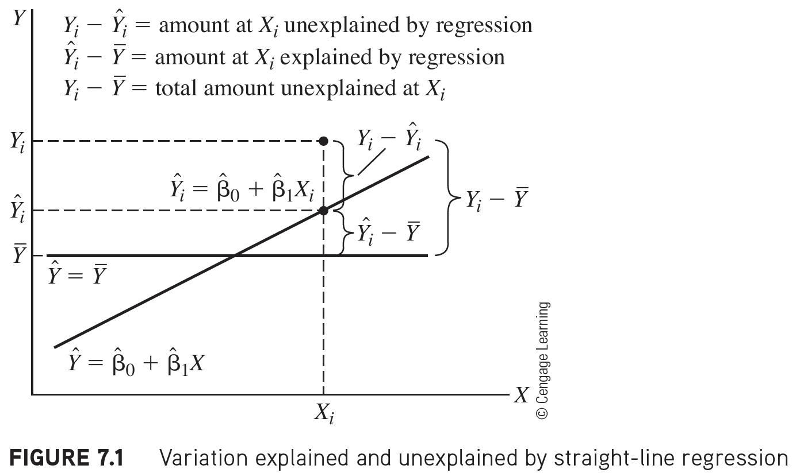
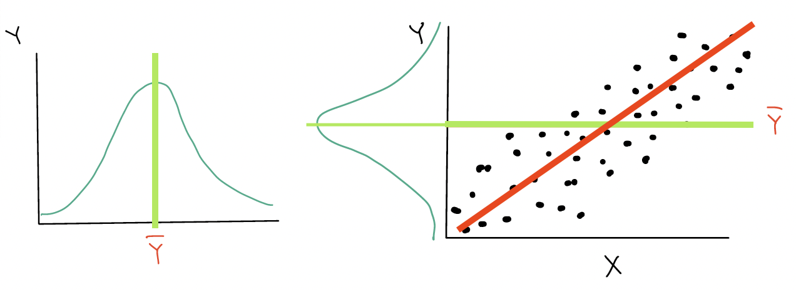
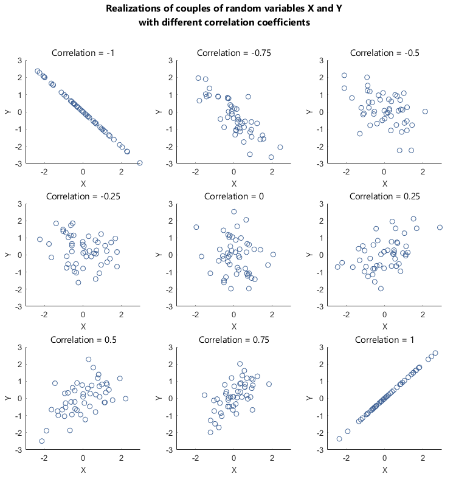
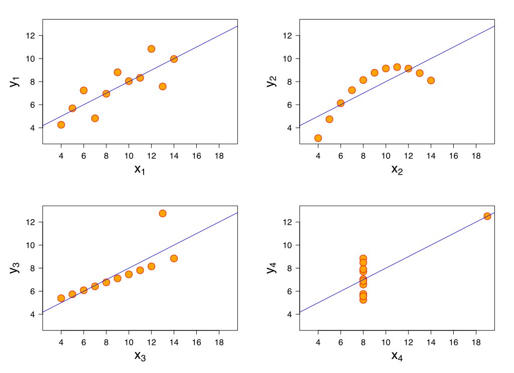

```{r}
#| label: "setup" 
#| include: false
#| message: false
#| warning: false

library(tidyverse)    
library(openintro)
library(janitor)
library(rstatix)
library(knitr)
library(gtsummary)
library(moderndive)
library(gt)
library(broom) 
library(here) 
library(pwr) 
library(gridExtra) # NEW!!!
library(readxl)

# terminal: for icons
# quarto install extension quarto-ext/fontawesome

# set ggplot theme for slides 
theme_set(theme_bw(base_size = 22))
```

```{r}
#| include: false
#| message: false
#| warning: false
load(here("data", "gapminder2022.RData"))
gapm = gapm %>%
  mutate(fs_order = case_when(freedom_status == "F" ~ 3,
                                freedom_status == "PF" ~ 2,
                                freedom_status == "NF" ~ 1), 
         freedom_status = fct_relevel(freedom_status, "NF", "PF", "F"))
```

```{r}
#| include: false
#| message: false
#| warning: false
# Fit regression model:
model1 <- gapm %>% lm(formula = life_exp ~ cell_phones_100)

tidy_model1 = tidy(model1)

reg_table = tidy_model1 %>% gt() %>% 
 tab_options(table.font.size = 40) %>%
 fmt_number(decimals = 3)
```

# Learning Objectives

1.  Identify different sources of variation in an Analysis of Variance
    (ANOVA) table

2.  Using the F-test, determine if there is enough evidence that
    population slope $\beta_1$ is not 0
    
3.  Using the F-test, determine if there is enough evidence for association between an outcome and a categorical variable

4.  Calculate and interpret the coefficient of determination


## So far in our regression example...

::: columns
::: {.column width="49%"}
**Lesson 3: SLR 1**

-   Fit regression line
-   Calculate slope & intercept
-   Interpret slope & intercept

**Lesson 4: SLR 2**

-   Estimate variance of the residuals
-   Inference for slope & intercept: CI, p-value
-   Finding mean value of Y\|X

**Lesson 5: Categorical Covariates**

-   Inference/Interpretation for different categories
:::

::: {.column width="2%"}
:::

::: {.column width="49%"}
```{r}
#| fig-height: 8
#| fig-width: 11
#| echo: false

gapm_slr_plot = gapm %>%
  ggplot(aes(x = cell_phones_100,
             y = life_exp)) +
  geom_point(size = 4) +
  geom_smooth(method = "lm", se = FALSE, size = 3, colour="#F14124") +
  labs(x = "Cell phones per 100 people",
       y = "Life expectancy (years)",
       title = "Relationship between life expectancy and cell phones") +
    theme(axis.title = element_text(size = 27), 
        axis.text = element_text(size = 25), 
        title = element_text(size = 25))

gapm_slr_plot
```

```{=tex}
\begin{aligned}
\widehat{Y} &= \widehat\beta_0 + \widehat\beta_1 \cdot X\\
\widehat{\text{LE}} &=  `r tidy_model1$estimate[1] %>% round(digits=2)` + `r tidy_model1$estimate[2] %>% round(digits=3)`\cdot\text{CP}
\end{aligned}
```
:::
:::


```{css, echo=FALSE}
.reveal code {
  max-height: 100% !important;
}
```
## Process of regression data analysis

::: box
{.absolute top="13.5%" right="62.1%" width="155"} {.absolute top="13.5%" right="28.4%" width="155"}{.absolute top="7.5%" right="30.5%" width="820"} {.absolute top="60.5%" right="48%" width="85"}

::: columns
::: {.column width="30%"}
::: RAP1
::: RAP1-title
Model Selection
:::

::: RAP1-cont
-   Building a model

-   Selecting variables

-   Prediction vs interpretation

-   Comparing potential models
:::
:::
:::

::: {.column width="4%"}
:::

::: {.column width="30%"}
::: RAP2
::: RAP2-title
Model Fitting
:::

::: RAP2-cont
-   Find best fit line

-   Using OLS in this class

-   Parameter estimation

-   Categorical covariates

-   Interactions
:::
:::
:::

::: {.column width="4%"}
:::

::: {.column width="30%"}
::: RAP3
::: RAP3-title
Model Evaluation
:::

::: RAP3-cont
-   Evaluation of model fit
-   Testing model assumptions
-   Residuals
-   Transformations
-   Influential points
-   Multicollinearity
:::
:::
:::
:::
:::

::: RAP4
::: RAP4-title
Model Use (Inference)
:::

::: RAP4-cont
::: columns
::: {.column width="50%"}
-   Inference for coefficients
-   Hypothesis testing for coefficients
:::

::: {.column width="50%"}
-   Inference for expected $Y$ given $X$
-   Prediction of new $Y$ given $X$
:::
:::
:::
:::


# Learning Objectives

::: lob
1.  Identify different sources of variation in an Analysis of Variance
    (ANOVA) table
:::

2.  Using the F-test, determine if there is enough evidence that
    population slope $\beta_1$ is not 0
    
3.  Using the F-test, determine if there is enough evidence for association between an outcome and a categorical variable

4.  Calculate and interpret the coefficient of determination


## Getting to the F-test

The F statistic in linear regression is essentially a proportion of the variance explained by the model vs. the variance not explained by the model

 

1.  Start with visual of explained vs. unexplained variation

 

2.  Figure out the mathematical representations of this variation

 

3.  Look at the ANOVA table to establish key values measuring our
    variance from our model

 

4.  Build the F-test

## Explained vs. Unexplained Variation

```{r}
#| echo: false
#| fig-align: center
#| fig-height: 6
#| fig-width: 8

regression_points <- augment(model1)
# summary(model1)
# sum(model1$residuals^2)

my <- mean(gapm$life_exp, na.rm=T)

ggplot(regression_points, 
       aes(x = cell_phones_100,
                 y = life_exp)) +
  geom_hline(yintercept = my, color = "#A7EA52", size = 2) +
  geom_segment(aes(
    xend = cell_phones_100, 
    yend = .fitted), 
    alpha = 1, 
    color = "#4FADF3", 
    size = 1.5) +
  geom_smooth(method = "lm", se = FALSE, color = "#F14124", size=2) +
  # > Color adjustments made here...
  geom_point(color = "black", size = 3) +  # Color mapped here
  #scale_color_gradient2(low = "#213c96", mid = "white", high = "#F14124") +  # Colors to use here
    #guides(color = "none") +
  geom_point(aes(y = .fitted), shape = 1, size = 3) +
  labs(x = "Cell phones per 100 people",
       y = "Life expectancy (years)",
       title = "Relationship between life expectancy and cell phones") +
    theme(axis.title = element_text(size = 20), 
        axis.text = element_text(size = 20), 
        title = element_text(size = 18))  
```

$$ \begin{aligned}
Y_i - \overline{Y} & = (Y_i - \widehat{Y}_i) + (\widehat{Y}_i- \overline{Y})\\
\text{Total variation} & = \text{Residual variation after regression} + \text{Variation explained by regression}
\end{aligned}$$

## More on the equation

::: columns
::: {.column width="40%"}
$$Y_i - \overline{Y} = (Y_i - \widehat{Y}_i) + (\widehat{Y}_i- \overline{Y})$$

-   $Y_i - \overline{Y}$ = the deviation of $Y_i$ around the mean
    $\overline{Y}$
    -   (the **total** amount deviation)
-   $Y_i - \widehat{Y}_i$ = the deviation of the observation $Y$ around the
    fitted regression line
    -   (the amount deviation **unexplained** by the regression at $X_i$
        ).
-   $\widehat{Y_i}- \overline{Y}$ = the deviation of the fitted value
    $\widehat{Y}_i$ around the mean $\overline{Y}$
    -   (the amount deviation **explained** by the regression at $X_i$ )
:::

::: {.column width="60%"}
   

{fig-align="center"}
:::
:::

## Another way of thinking about the different deviations

::: columns
::: {.column width="50%"}
{fig-align="center" width="1000"}
:::

::: {.column width="50%"}
:::
:::

::: columns
::: {.column width="33%"}
```{r}
#| message: false
#| echo: false
#| fig-height: 8
#| fig-width: 8
#| fig-align: center
# code from https://drsimonj.svbtle.com/visualising-residuals
regression_points <- augment(model1)

ggplot(regression_points, 
       aes(x = cell_phones_100,
                 y = life_exp)) +
    geom_hline(yintercept = my, color = "#A7EA52", size = 3) +
  geom_segment(aes(
    xend = cell_phones_100, 
    yend = .fitted), 
    alpha = 1, 
    color = "#4FADF3", 
    size = 2) +
  geom_smooth(method = "lm", se = FALSE, color = "#F14124", size=3) +
  # > Color adjustments made here...
  geom_point(color = "black", size = 4) +  # Color mapped here
  #scale_color_gradient2(low = "#213c96", mid = "white", high = "#F14124") +  # Colors to use here
    #guides(color = "none") +
  geom_point(aes(y = .fitted), shape = 1, size = 4) +
labs(x = "Cell phones per 100 people", 
       y = "Life expectancy (years)",
       title = "Relationship between life expectancy and cell phones") +
    theme(axis.title = element_text(size = 27), 
        axis.text = element_text(size = 25), 
        title = element_text(size = 25))
```
:::
::: {.column width="33%"}
```{r}
#| message: false
#| echo: false
#| fig-height: 8
#| fig-width: 8
#| fig-align: center

## Make a plot of the residuals from the above plot, but now the best fit line is vertical at 0 and the blue lines showing the residuals are plotted

ggplot(regression_points, 
       aes(x = .resid,
                 y = cell_phones_100)) +
  geom_segment(aes(
    xend = 0, 
    yend = cell_phones_100), 
    alpha = 1, 
    color = "#4FADF3", 
    size = 2) +
  geom_vline(xintercept = 0, color = "#F14124", size=3) +
  geom_point(color = "black", size = 4) +
labs(x = "Residuals", 
       y = "Cell phones per 100 people",
       title = "Residuals from fitted model") +
    theme(axis.title = element_text(size = 27), 
        axis.text = element_text(size = 25), 
        title = element_text(size = 25))
```
:::

::: {.column width="33%"}
```{r}
#| message: false
#| echo: false
#| fig-height: 8
#| fig-width: 8
#| fig-align: center

# plot the residuals
ggplot(regression_points, aes(x = .resid)) +
  geom_histogram() +
  geom_vline(xintercept = 0, color = "#F14124", size=3) +
  labs(x = "Residuals", y = "Count", 
       title = "Residuals from fitted model") +
    theme(axis.title = element_text(size = 27), 
        axis.text = element_text(size = 25), 
        title = element_text(size = 25))
```
:::
:::

## Poll Everywhere Question 1

## How is this actually calculated for our fitted model? (1/2)

$$ \begin{aligned}
Y_i - \overline{Y} & = (Y_i - \widehat{Y}_i) + (\widehat{Y}_i- \overline{Y})\\
\text{Total variation} & = \text{Variation explained by regression} + \text{Residual variation after regression}
\end{aligned}$$

$$\begin{aligned}
\sum_{i=1}^n (Y_i - \overline{Y})^2 & = \sum_{i=1}^n (\widehat{Y}_i- \overline{Y})^2 + \sum_{i=1}^n (Y_i - \widehat{Y}_i)^2 \\
SSY & = SSR + SSE 
\end{aligned}$$
$$\text{Total Sum of Squares} = \text{Sum of Squares explained by Regression} + \text{Sum of Squares due to Error (residuals)}$$

::: columns
::: {.column width="9%"}
:::

::: {.column width="82%"}
ANOVA table:

| Variation Source | df    | SS    | MS                      | test statistic        | p-value |
|------------|------------|------------|------------|------------|------------|
| Regression       | $1$   | $SSR$ | $MSR = \frac{SSR}{1}$   | $F = \frac{MSR}{MSE}$ |         |
| Error            | $n-2$ | $SSE$ | $MSE = \frac{SSE}{n-2}$ |                       |         |
| Total            | $n-1$ | $SSY$ |                         |                       |         |
:::

::: {.column width="9%"}
:::
:::

## How is this actually calculated for our fitted model? (2/2)

$$\begin{aligned}
\sum_{i=1}^n (Y_i - \overline{Y})^2 & = \sum_{i=1}^n (\widehat{Y}_i- \overline{Y})^2 + \sum_{i=1}^n (Y_i - \widehat{Y}_i)^2 \\
SSY & = SSR + SSE 
\end{aligned}$$
$$\text{Total Sum of Squares} = \text{Sum of Squares explained by Regression} + \text{Sum of Squares due to Error (residuals)}$$

::: columns
::: {.column width="9%"}
:::

::: {.column width="82%"}
ANOVA table:

| Variation Source | df    | SS    | MS                      | test statistic        | p-value |
|------------|------------|------------|------------|------------|------------|
| Regression       | $1$   | $SSR$ | $MSR = \frac{SSR}{1}$   | $F = \frac{MSR}{MSE}$ |         |
| Error            | $n-2$ | $SSE$ | $MSE = \frac{SSE}{n-2}$ |                       |         |
| Total            | $n-1$ | $SSY$ |                         |                       |         |
:::

::: {.column width="9%"}
:::
:::

 

::: hl3
**F-statistic**: Proportion of variation that is explained by the model to variation not explained by the model
:::

## Analysis of Variance (ANOVA) table in R

```{r}
# Fit regression model:
model1 <- gapm %>% lm(formula = life_exp ~ cell_phones_100)

anova(model1)
anova(model1) %>% tidy() %>% gt() %>%
   tab_options(table.font.size = 40) %>%
   fmt_number(decimals = 3)
```

# Learning Objectives

1.  Identify different sources of variation in an Analysis of Variance
    (ANOVA) table

::: lob
2.  Using the F-test, determine if there is enough evidence that
    population slope $\beta_1$ is not 0
:::
    
3.  Using the F-test, determine if there is enough evidence for association between an outcome and a categorical variable

4.  Calculate and interpret the coefficient of determination


## What is the F statistic testing?

- The F statistic is testing whether the model with the predictor variable $X$ explains significantly more variation in $Y$ than a model with no predictors (intercept only model)

 

- In general, the F-test has 3 steps:
  1. Define the larger (full) model (more coefficients)
  2. Define the smaller (reduced) model (less coefficients)
  3. Decide whether to reject the reduced model in favor of the full model
  
 
  
- We "decide" by seeing how much **more variation** the **full model explains** compared to the reduced model
  - **If the full model explains significantly more variation, we reject the reduced model**
  
 

- In **simple linear regression**, this is equivalent to testing whether the population slope $\beta_1$ is equal to 0

## F-test vs. t-test for the population slope

The square of a $t$-distribution with $df = \nu$ is an $F$-distribution
with $df = 1, \nu$

$$T_{\nu}^2 \sim F_{1,\nu}$$

-   We can use either F-test or t-test to run the following hypothesis
    test:

```{=tex}
\begin{align}
H_0 &: \beta_1 = 0\\
\text{vs. } H_A&: \beta_1 \neq 0
\end{align}
```

-   Note that the F-test does not support one-sided alternative tests,
    but the t-test does!
    
    - F-test cannot handle alternatives like $\beta_1 > 0$ nor $\beta_2 < 0$

## Planting a seed about the F-test

We can think about the hypothesis test for the slope...

::: columns
::: {.column width="17%"}
:::

::: {.column width="33%"}
::: proof1
::: proof-title
Null $H_0$
:::

::: proof-cont
$\beta_1=0$
:::
:::
:::

::: {.column width="33%"}
::: definition
::: def-title
Alternative $H_1$
:::

::: def-cont
$\beta_1\neq0$
:::
:::
:::
:::

in a slightly different way...

::: columns
::: {.column width="17%"}
:::

::: {.column width="33%"}
::: proof1
::: proof-title
Null model ($\beta_1=0$)
:::

::: proof-cont
-   $Y = \beta_0 + \epsilon$
-   Smaller (reduced) model
:::
:::
:::

::: {.column width="33%"}
::: definition
::: def-title
Alternative model ($\beta_1\neq0$)
:::

::: def-cont
-   $Y = \beta_0 + \beta_1 X + \epsilon$
-   Larger (full) model
:::
:::
:::
:::

-   In multiple linear regression, we can start using this framework to
    test multiple coefficient parameters at once

    -   Decide whether or not to reject the smaller reduced model in
        favor of the larger full model

    -   Cannot do this with the t-test when we have multiple coefficients!

## Poll Everywhere Question 2

## F-test: general steps for hypothesis test for population **slope** $\beta_1$

::: columns
::: {.column width="48%"}
1.  Check the [**assumptions**]{style="color:#4FADF3"}

2.  Set the [**level of significance**]{style="color:#4FADF3"}

    - Often we use $\alpha = 0.05$

3.  Specify the [**null**]{style="color:#4FADF3"} ( $H_0$ ) and [**alternative**]{style="color:#4FADF3"} ( $H_A$ ) [**hypotheses**]{style="color:#4FADF3"}

    - Often, we are curious if the coefficient is 0 or not:

```{=tex}
\begin{align}
H_0 &: \beta_1 = 0\\
\text{vs. } H_A&: \beta_1 \neq 0
\end{align}
```

4.  Specify the test statistic and its [**distribution under the null**]{style="color:#4FADF3"}

    - The test statistic is $F$, and follows an F-distribution with numerator $df=1$ and denominator $df=n-2$.
:::

::: {.column width="4%"}
:::

::: {.column width="48%"}

5.  Calculate the [**test statistic**]{style="color:#4FADF3"}

The calculated **test statistic** for $\widehat\beta_1$ is

$$F = \frac{MSR}{MSE}$$

6.  Calculate the [**p-value**]{style="color:#4FADF3"}

    - We are generally calculating: $P(F_{1, n-2} > F)$

7.  Write a [**conclusion**]{style="color:#4FADF3"}

    - Reject: $P(F_{1, n-2} > F) < \alpha$

We (reject/fail to reject) the null hypothesis that the slope is 0 at the $100\alpha\%$ significance level. There is
(sufficient/insufficient) evidence that there is significant association between ($Y$) and ($X$) (p-value = $P(F_{1, n-2} > F)$).
:::
:::

## Life expectancy example: hypothesis test for population **slope** $\beta_1$

-   Steps 1-4 are setting up our hypothesis test: not much change from
    the general steps

1.  Check the [**assumptions**]{style="color:#4FADF3"}: We have met the underlying assumptions (checked in our Model Evaluation step)

2.  Set the [**level of significance**]{style="color:#4FADF3"}

    - Often we use $\alpha = 0.05$

3.  Specify the [**null**]{style="color:#4FADF3"} ( $H_0$ ) and [**alternative**]{style="color:#4FADF3"} ( $H_A$ ) [**hypotheses**]{style="color:#4FADF3"}

    - Often, we are curious if the coefficient is 0 or not:

```{=tex}
\begin{align}
H_0 &: \beta_1 = 0\\
\text{vs. } H_A&: \beta_1 \neq 0
\end{align}
```

4.  Specify the test statistic and its [**distribution under the null**]{style="color:#4FADF3"}

::: columns
::: {.column width="70%"}
The test statistic is $F$, and follows an F-distribution with numerator
$df=1$ and denominator $df=n-2 = 80-2$.
:::

::: {.column width="30%"}
```{r}
nobs(model1)
```
:::
:::

## Life expectancy example: hypothesis test for population **slope** $\beta_1$ (2/4)

5.  Calculate the [**test statistic**]{style="color:#4FADF3"}

```{r}
anova_tab = anova(model1) %>% tidy()
anova_tab %>% gt() %>% tab_options(table.font.size = 40)
```

::: columns
::: {.column width="49%"}
**Option 1:** Calculate the test statistic using the values in the ANOVA table

$$F = \frac{MSR}{MSE} = \frac{`r anova_tab$meansq[1]`}{`r anova_tab$meansq[2]`} = `r round(anova_tab$meansq[1]/anova_tab$meansq[2],3)`$$
:::

::: {.column width="2%"}
:::

::: {.column width="49%"}
**Option 2:** Get the test statistic value (F) from the ANOVA table

$$F = `r round(anova_tab$statistic[1],3)`$$

```{r}
F_stat = anova_tab$statistic[1]
```
:::
:::

 

::: hl
I tend to skip this step because I can do it all with step 6
:::

## Life expectancy example: hypothesis test for population **slope** $\beta_1$ (3/4)

6.  Calculate the [**p-value**]{style="color:#4FADF3"}

-   As per Step 4, test statistic $F$ can be modeled by a
    $F$-distribution with $df_1 = 1$ and $df_2 = n-2$.

    -   We had `r nobs(model1)` countries' data, so $n=`r nobs(model1)`$

-   **Option 1:** Use `pf()` and our calculated test statistic

```{r}
# p-value is ALWAYS the right tail for F-test
n = nobs(model1)
pf(F_stat, df1 = 1, df2 = n-2, lower.tail = FALSE)
```

-   **Option 2:** Use the ANOVA table

```{r}
anova(model1) %>% tidy() %>% gt() %>%
  tab_options(table.font.size = 40)
```

## Life expectancy example: hypothesis test for population **slope** $\beta_1$ (4/4)

7.  Write a [**conclusion**]{style="color:#4FADF3"}

We reject the null hypothesis that the slope is 0 at the $5\%$ significance level. There is sufficient evidence that there is significant association between life expectancy and cell phones per 100 people (p-value \< 0.0001).

## Did you notice anything about the p-value?

The p-value of the t-test and F-test are the same!!

-   For the t-test:

```{r}
tidy(model1) %>% gt() %>%
  tab_options(table.font.size = 40)
```

-   For the F-test:

```{r}
anova(model1) %>% tidy() %>% gt() %>%
  tab_options(table.font.size = 40)
```

This is true when we use the F-test for a single coefficient!

# Learning Objectives

1.  Identify different sources of variation in an Analysis of Variance
    (ANOVA) table

2.  Using the F-test, determine if there is enough evidence that
    population slope $\beta_1$ is not 0

::: lob
3.  Using the F-test, determine if there is enough evidence for association between an outcome and a categorical variable
:::

4.  Calculate and interpret the coefficient of determination


## Testing association between continuous outcome and categorical variable

- Before we used the F-test (or t-test) to determine association between two continuous variables
- We CANNOT use the t-test to determine association between a continuous outcome and a multi-level categorical variable
- We CAN use the F-test to do this!

 

- We can use the t-test or F-test for a categorical variable with only 2 levels

## Poll Everywhere Question 3
    
## Building a very important toolkit: three types of tests

::: fact
::: fact-title
Overall test (in a couple classes)
:::

::: fact-cont
Does at least one of the covariates/predictors contribute significantly to the prediction of Y?
:::
:::

::: example
::: ex-title
Test for addition of a single variable (covariate subset test)
:::

::: ex-cont
Does the addition of one particular covariate add significantly to the prediction of Y achieved by other covariates already present in the model?
:::
:::

::: proposition
::: prop-title
Test for addition of group of variables (covariate subset test) (in a couple classes)
:::

::: prop-cont
Does the addition of some group of covariates add significantly to the prediction of Y achieved by other covariates already present in the model?
:::
:::

## We can extend our look at the F-test

We can create a hypothesis test for more than one coefficient at a time...

::: columns
::: {.column width="17%"}
:::

::: {.column width="33%"}
::: proof1
::: proof-title
Null $H_0$
:::

::: proof-cont
$\beta_1=\beta_2=0$
:::
:::
:::

::: {.column width="33%"}
::: definition
::: def-title
Alternative $H_1$
:::

::: def-cont
$\beta_1\neq0$ and/or $\beta_2\neq0$
:::
:::
:::
:::

in a slightly different way...

::: columns
::: {.column width="17%"}
:::

::: {.column width="33%"}
::: proof1
::: proof-title
Null model
:::

::: proof-cont
-   $Y = \beta_0 + \epsilon$
-   Smaller (reduced) model
:::
:::
:::

::: {.column width="33%"}
::: definition
::: def-title
Alternative\* model
:::

::: def-cont
-   $Y = \beta_0 + \beta_1 X_1 + \beta_2 X_2 + \epsilon$
-   Larger (full) model
:::
:::
:::
:::

\*This is **not quite** the alternative, but if we reject the null, then this is the model we move forward with

## Let's say we want to test the association between life expectancy and freedom status

```{r}
#| echo: false
means_LE = gapm %>%
  group_by(freedom_status) %>%
  summarise(mean = mean(life_exp))
```

::: columns
::: {.column width="50%"}

$$\begin{aligned}
\widehat{\textrm{LE}} = & \widehat\beta_0 + \widehat\beta_1 \cdot I(\text{PF}) + \\ & \widehat\beta_2 \cdot I(\text{F}) \\
\widehat{\textrm{LE}} = & `r round(means_LE$mean[1], 2)` + `r round(means_LE$mean[2]-means_LE$mean[1], 2)` \cdot I(\text{PF}) + \\ &`r round(means_LE$mean[3]-means_LE$mean[1], 2)` \cdot I(\text{F})
\end{aligned}$$

- We need to figure out if the model with freedom status explains significantly more variation than the model without freedom status!
:::

::: {.column width="50%"}
```{r fig.height=8, fig.width=8, warning=F, fig.align='center'}
#| echo: false
ggplot(gapm, aes(x = freedom_status, y = life_exp)) +
  geom_jitter(size = 1, alpha = .6, width = 0.2) +
  stat_summary(fun = mean, geom = "point", size = 8, shape = 18) +
  labs(x = "Freedom status", 
       y = "Life expectancy (years)",
       title = "Life expectancy vs. freedom status",
       caption = "Diamonds = FS averages") +
  theme(axis.title = element_text(size = 22), 
        axis.text = element_text(size = 22), 
        title = element_text(size = 22))
```
:::
:::

## F-test: general steps for hypothesis test for categorical variable

::: columns
::: {.column width="48%"}
1.  Check the [**assumptions**]{style="color:#4FADF3"}

2.  Set the [**level of significance**]{style="color:#4FADF3"}

    - Often we use $\alpha = 0.05$

3.  Specify the [**null**]{style="color:#4FADF3"} ( $H_0$ ) and [**alternative**]{style="color:#4FADF3"} ( $H_A$ ) [**hypotheses**]{style="color:#4FADF3"}

    - Often, we are curious if the coefficienta are 0 or not:

```{=tex}
\begin{align}
H_0 :& \beta_1 = ... = \beta_k = 0\\
\text{vs. } H_A:& \beta_1 \neq 0 \text{ and/or } \\
&\beta_2 \neq 0 ... \text{ and/or } \beta_k \neq 0
\end{align}
```

4.  Specify the test statistic and its [**distribution under the null**]{style="color:#4FADF3"}

    - The test statistic is $F$, and follows an F-distribution with numerator $df=1$ and denominator $df=n-(k+1)$
:::

::: {.column width="4%"}
:::

::: {.column width="48%"}

5.  Calculate the [**test statistic**]{style="color:#4FADF3"}

The calculated **test statistic** for $\beta$s is

$$F = \frac{MSR}{MSE}$$

6.  Calculate the [**p-value**]{style="color:#4FADF3"}

    - We are generally calculating: $P(F_{1, n-(k+1)} > F)$

7.  Write a [**conclusion**]{style="color:#4FADF3"}

    - Reject: $P(F_{1, n-2} > F) < \alpha$

We (reject/fail to reject) the null hypothesis that the slope is 0 at the $100\alpha\%$ significance level. There is
(sufficient/insufficient) evidence that there is significant association between ($Y$) and ($X$) (p-value = $P(F_{1, n-(k+1)} > F)$).
:::
:::


## Life expectancy example: hypothesis test for freedom status (1/4)

-   Steps 1-4 are setting up our hypothesis test: not much change from
    the general steps

1.  Check the [**assumptions**]{style="color:#4FADF3"}: We have met the underlying assumptions (checked in our Model Evaluation step)

2.  Set the [**level of significance**]{style="color:#4FADF3"}

    - Often we use $\alpha = 0.05$

3.  Specify the [**null**]{style="color:#4FADF3"} ( $H_0$ ) and [**alternative**]{style="color:#4FADF3"} ( $H_A$ ) [**hypotheses**]{style="color:#4FADF3"}

    - We are testing if the FS is associated with life expectancy:

```{=tex}
\begin{align}
H_0 :& \beta_1 = \beta_2 = 0\\
\text{vs. } H_A:& \beta_1 \neq 0 \text{ and/or } \beta_2 \neq 0
\end{align}
```

4.  Specify the test statistic and its [**distribution under the null**]{style="color:#4FADF3"}

::: columns
::: {.column width="70%"}
The test statistic is $F$, and follows an F-distribution with numerator $df=k$ and denominator $df=n-(k+1) = `r nobs(model1)`-(2+1)$
:::

::: {.column width="30%"}
```{r}
nobs(model1)
```
:::
:::

## Life expectancy example: hypothesis test for freedom status (2/4)

5.  Calculate the [**test statistic**]{style="color:#4FADF3"}

```{r}
model2 <- gapm %>% lm(formula = life_exp ~ freedom_status)
anova_tab2 = anova(model2) %>% tidy()
anova_tab2 %>% gt() %>% tab_options(table.font.size = 40)
```

::: columns
::: {.column width="49%"}
**Option 1:** Calculate the test statistic using the values in the ANOVA table

$$F = \frac{MSR}{MSE} = \frac{`r anova_tab2$meansq[1]`}{`r anova_tab2$meansq[2]`} = `r round(anova_tab2$meansq[1]/anova_tab2$meansq[2],3)`$$
:::

::: {.column width="2%"}
:::

::: {.column width="49%"}
**Option 2:** Get the test statistic value (F) from the ANOVA table

$$F = `r round(anova_tab2$statistic[1],3)`$$

```{r}
F_stat2 = anova_tab2$statistic[1]
```
:::
:::

 

::: hl
I tend to skip this step because I can do it all with step 6
:::

## Life expectancy example: hypothesis test for freedom status (3/4)

6.  Calculate the [**p-value**]{style="color:#4FADF3"}

-   As per Step 4, test statistic $F$ can be modeled by a
    $F$-distribution with $df_1 = 2$ and $df_2 = n-3$.

    -   We had `r nobs(model2)` countries' data, so $n=`r nobs(model1)`$

-   **Option 1:** Use `pf()` and our calculated test statistic

```{r}
# p-value is ALWAYS the right tail for F-test
n = nobs(model1)
pf(F_stat2, df1 = 2, df2 = n-3, lower.tail = FALSE)
```

-   **Option 2:** Use the ANOVA table

```{r}
anova(model2) %>% tidy() %>% gt() %>%
  tab_options(table.font.size = 40)
```

## Life expectancy example: hypothesis test for freedom status (4/4)

7.  Write a [**conclusion**]{style="color:#4FADF3"}

We reject the null hypothesis that both coefficients are equal to 0 at the $5\%$ significance level. There is sufficient evidence that there is association between life expectancy and the country's freedom status (p-value = 0.009).


# Learning Objectives

1.  Identify different sources of variation in an Analysis of Variance
    (ANOVA) table

2.  Using the F-test, determine if there is enough evidence that
    population slope $\beta_1$ is not 0
    
3.  Using the F-test, determine if there is enough evidence for association between an outcome and a categorical variable

::: lob
4.  Calculate and interpret the coefficient of determination
:::

## Correlation coefficient from 511

::: columns
::: {.column width="45%"}
Correlation coefficient $r$ can tell us about the strength of a
relationship **between two continuous variables**

-   If $r = -1$, then there is a perfect negative linear relationship
    between $X$ and $Y$

-   If $r = 1$, then there is a perfect positive linear relationship
    between $X$ and $Y$

-   If $r = 0$, then there is no linear relationship between $X$ and $Y$

Note: All other values of $r$ tell us that the relationship between $X$
and $Y$ is not perfect. The closer $r$ is to 0, the weaker the linear
relationship.
:::

::: {.column width="55%"}
{fig-align="center" width="878"}
:::
:::

## Correlation coefficient ($r$ or $R$) {visibility="hidden"}

::: columns
::: column
The (Pearson) correlation coefficient $r$ of variables $X$ and $Y$ can
be computed using the formula:

$$\begin{aligned}
r  & = \frac{\sum_{i=1}^n (X_i - \overline{X})(Y_i - \overline{Y})}{\Big(\sum_{i=1}^n (X_i - \overline{X})^2 \sum_{i=1}^n (Y_i - \overline{Y})^2\Big)^{1/2}} \\
& = \frac{SSXY}{\sqrt{SSX \cdot SSY}}
\end{aligned}$$

we have the relationship

$$\widehat{\beta}_1 = r\frac{SSY}{SSX},\ \ \text{or},\ \  r = \widehat{\beta}_1\frac{SSX}{SSY}$$
:::
::: column
```{r}
#| fig-height: 8
#| fig-width: 11
#| echo: false

mx <- mean(gapm$cell_phones_100, na.rm=T)
my <- mean(gapm$life_exp, na.rm=T)


ggplot(gapm, aes(x = cell_phones_100,
                 y = life_exp)) +
  geom_point(size = 4) +
  geom_vline(xintercept = mx, color = "#FF8021", size = 3) +
   geom_hline(yintercept = my, color = "#A7EA52", size = 3) +
    labs(x = "Cell phones per 100 people",
       y = "Life expectancy (years)",
       title = "Relationship between life expectancy and cell phones") +
    theme(axis.title = element_text(size = 30), 
        axis.text = element_text(size = 25), 
        title = element_text(size = 30))

```
:::
:::

## Coefficient of determination: $R^2$

It can be shown that the square of the correlation coefficient $r$ is
equal to

$$R^2 = \frac{SSR}{SSY} = \frac{SSY - SSE}{SSY}$$

-   $R^2$ is called the **coefficient of determination**.
-   **Interpretation**: The proportion of variation in the $Y$ values explained by the
        regression model
-   $R^2$ measures the strength of the **linear** relationship between $X$
    and $Y$:
    -   $R^2 = \pm 1$: Perfect relationship
        -   Happens when $SSE = 0$, i.e. no error, all points on the
            line
    -   $R^2 = 0$: No relationship
        -   Happens when $SSY = SSE$, i.e. using the line doesn't not
            improve model fit over using $\overline{Y}$ to model the $Y$
            values.

## Life expectancy example: correlation coeffiicent $r$ and coefficient of determination $R^2$

::: columns
::: {.column width="50%"}
We can find the correlation coefficient and square it: 
```{r}
r = cor(x = gapm$life_exp, 
        y = gapm$cell_phones_100, 
        use =  "complete.obs")
r^2
```
:::

::: {.column width="50%"}
We can pull the coefficient of determination from the model summary:
```{r}
model1_sum = summary(model1)
r_squared = model1_sum$r.squared
r_squared
```
:::
:::

::: fact
::: fact-title
Interpretation
:::

::: fact-cont
`r round(r_squared*100, 1)`% of the variation in countries' life expectancy is explained by the linear model with number of cell phones per 100 people as the
independent variable.
:::
:::

## What does $R^2$ not measure?

::: columns
::: {.column width="37%"}
-   $R^2$ is not a measure of the magnitude of the slope of the
    regression line

    -   Example: can have $R^2 = 1$ for many different slopes!!

-   $R^2$ is not a measure of the appropriateness of the straight-line
    model

    -   Example: figure
:::

::: {.column width="63%"}
{fig-align="center"}
:::
:::