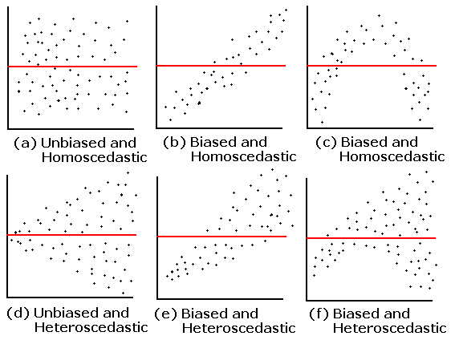
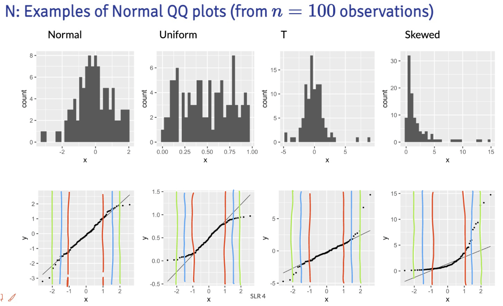
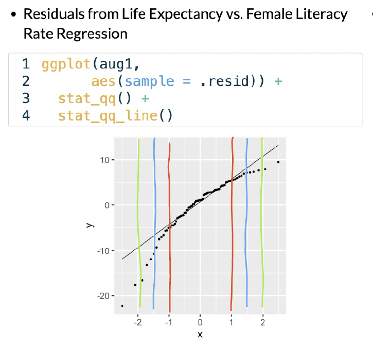

## Muddy Points from Winter 2026

### 1. what do you do when you wanted to fit a linear regression and your data look linear but you find out with the QQ plot the residuals are not normally distributed? or there is not equality of variance of the residuals? and in practice, do people usually check these assumptions before doing linear regression?

If the relationship looks linear, but the QQ plot shows that the residuals are not normal, then we can try transforming the response variable (Y) to see if that helps. Common transformations include log, square root, or Box-Cox transformations. We'll go over this next class! 

If the equality of variance assumption is violated (heteroscedasticity), we can also try transforming Y.

### 2. If the normality assumption is met, would the equality of variance assumption not be automatically met as well? If you have wildly differing variance, then my intuition tells me the normality condition would also fail. 

Not necessarily! It is possible to have normality but still have heteroscedasticity. For example, if the spread of the residuals increases with increasing values of X, the residuals can still be normally distributed at each level of X, but the variance is not constant across all levels of X.

Here is a simulation example in R that shows this:

First, I'll load the needed packages
```{r}
#| message: false

library(tidyverse)
library(ggplot2)
library(broom)
```

I'll set a seed for reproducibility and create a dataset where the variance of Y increases with X. 
```{r}
set.seed(12302)
n = 200
## use tibble to make data frame
sim_ex = tibble(
  X = runif(n, 1, 5), 
  Y = rnorm(n, mean = 2*X, sd = 1.2*X)
)
```

Now, I'll fit a linear model and create the diagnostic plots to check for normality and homoscedasticity.
```{r}
model <- sim_ex %>% lm(formula = Y ~ X)

sim_ex %>% ggplot(aes(x = X, y = Y)) +
  geom_point() +
  geom_smooth(method = "lm", se = FALSE, color = "blue") +
  labs(title = "Heteroscedasticity Example", x = "X", y = "Y")

augmented_model <- augment(model)
```

The following histogram and QQ plot look fairly normal.
```{r}
#| warning: false

# plot histogram of residuals
ggplot(augmented_model, aes(x = .resid)) +
  geom_histogram(aes(y = ..density..), color = "black") +
  geom_density(color = "red", size = 1) +
  labs(title = "Histogram of Residuals", 
       x = "Residuals", 
       y = "Density")

# make a qq plot
ggplot(augmented_model, aes(sample = .resid)) +
  stat_qq() +
  stat_qq_line(color = "red") +
  labs(title = "QQ Plot of Residuals", 
       x = "Theoretical Quantiles", 
       y = "Sample Quantiles")
```

However, the residual plot shows a clear pattern of increasing spread with increasing X, indicating heteroscedasticity.
```{r}
# make residual plot
ggplot(augmented_model, aes(x = X, y = .resid)) +
  geom_point() +
  geom_hline(yintercept = 0, color = "red") +
  labs(title = "Residuals vs X", 
       x = "X", 
       y = "Residuals")
```

#### In addition, don't you need to use the Shapiro-Wilk test to officially determine the normality of the distribution? In an official study, can you just use a QQplot to determine the normality?

The Shapiro-Wilk test is a formal statistical test for normality, but it can be sensitive to sample size. In practice, many researchers use QQ plots as a visual tool to assess normality, especially in larger datasets where minor deviations from normality may not significantly impact the results. 


### 3. "For any fixed value of X, Y has normal distribution. Note: This is not about Y alone, but Y given X. Equivalently, the measurement (random) errors’s normally distributed. This is more often what we check" Why are these equivalent? in my mind these are 2 different things

These two statements are equivalent because they both describe the same underlying assumption about the distribution of the response variable (Y) in relation to the predictor variable (X). When we say "For any fixed value of X, Y has a normal distribution," we are stating that if we were to look at all the observations where X is held constant, the values of Y would follow a normal distribution. This is the big part of the "given X." This is the same as saying that the measurement errors (the differences between the observed Y values and the predicted Y values from the regression model) are normally distributed.

## Muddy Points from Winter 2025

### 1. Probably understanding the independence of residuals

This is just tied to how the study is set up. We are basically saying that our study design does not make our observations inherently correlated to one another.

For example, let's think of a study measuring 5 adults' height every month over a year. We have 12 height measurements for each adult. Since most adults' heights will not change over their adulthood, those measurements are probably pretty close to one another. However, the 5 sets of measurements for each adult are probably different. We cannot assume that all 60 (5x12) measurements are independent from each other. Each adult's 12 measurements will be highly correlated with one another. Thus, we do not have independent outcomes in this study. 

### 2. Residual variance across X values, what conclusions can we draw from residual plot?

For the most part, we will focus on investigating homoscedasticity (equal variance) from the residual plots. We track across the X-axis, and make sure that the spread of the data looks pretty even across x-values. 

### 3. How to add prediction bands to plots?

This is within the `geom_smooth()` function in our ggplot code.

```{r}
#| include: false
#| message: false
#| warning: false

library(readxl)
library(here)
library(tidyverse)

load(here("data", "gapminder2022.RData"))
gapm = gapm %>%
  mutate(fs_order = case_when(freedom_status == "F" ~ 3,
                                freedom_status == "PF" ~ 2,
                                freedom_status == "NF" ~ 1), 
         freedom_status = fct_relevel(freedom_status, "NF", "PF", "F"))
```

Here is the plot without bands:
```{r}
#| warning: false
#| code-line-numbers: "4"

gapm %>% ggplot(aes(x = cell_phones_100, 
                 y = life_exp)) +
  geom_point() +
  geom_smooth(method = "lm", se = FALSE, colour="#F14124") + # <1>
  labs(x = "Cell phones per 100 people", 
       y = "Life expectancy (years)")

```
1. `se = FALSE` tells R to omit the bands

Here is the plot with bands:
```{r}
#| warning: false
#| code-line-numbers: "4"

gapm %>% ggplot(aes(x = cell_phones_100, 
                 y = life_exp)) +
  geom_point() +
  geom_smooth(method = "lm", se = FALSE, colour="#F14124") + # <1>
  labs(x = "Cell phones per 100 people", 
       y = "Life expectancy (years)")

```
1. `se = TRUE` tells R to show the bands

## Muddy Points from Winter 2024

### 1. Equality of the residuals - what’s the bias refer in a residual plot? Is that suggesting a non linear relationship between two variables?

Here is the plot that this question is referring to:

{fig-align="center"}

The answer is already in the question! The residual plot can also be used to look at linearity! The above plots that say "biased" mean they do not follow the linearity assumption.

### 2. QQ Plot: What is it? And can you explain the axes, meaning of "quantiles", and why assuming normality would result in a straight line?

I cannot answer this question better than [this video](https://www.youtube.com/watch?v=okjYjClSjOg&ab_channel=StatQuestwithJoshStarmer)! They go through a smaller dataset of gene expression values and how to make a QQ plot from the data. Remember, our QQ plot is of our residual values!!

### 3. I’m still a little confused on how to determine if a dataset has a normal distribution. Feels like a subjective decision.

First thing that I want to address: when we are talking about normality, we are **not** determining if the **dataset** follows a normal distribution. We are determining if the **fitted model** **violates** the normality assumption that we need to use in our population model. We do this by seeing if the fitted residuals follow a normal distribution. I just want to draw attention to this. There is very particular language being used here.

Second thing... Yes! These diagnostic tools are somewhat subjective. You are welcome to use the Shapiro-Wilk test every time you look at a QQ plot! I realize a test with a conclusion might feel more objective and comfortable as we are learning about the model diagnostics. I suggest trying to make a conclusion visually with a QQ plot, then see if it matches the Shapiro-Wilk test. Remember, even in the Shapiro-Wilk test, the null hypothesis is that the fitted residuals come from a normal distribution. So we have to work to disprove that. You can come to the QQ plot with that same prior. If the QQ plot gives blantent evidence that the fitted residuals are not normally distributed, then we violate the assumption.

We'll keep practicing! As we keep going through regression, we'll realize that model building is very much an art! There is no one answer in statistics!

### 4. What are the small nuances in interpreting the normality through a QQ plot?

Thanks for this question! This helped me realize that I was not articulating very well some of my more subconscious thoughts in a QQ plot.

Below are the distribution samples ant their QQ plots from lecture:

{fig-align="center"}

I drew red, blue and green lines to bracket certain areas of the plots. I basically start by looking within the red brackets. Do all the points seem to stay close to the black line? If this doesn't hold for the red bracketed area, then I would say our fitted residuals are not normal. Then I look at the area from the red lines to the blue lines. This is less definite, but if the points don't seem to stay close to the black line, then I'd say our fitted residuals are not normal. Then I'd look at the are between the blue and green line. If the points aren't close to the black line, then I am likely okay with it and would NOT make the conclusion that the fitted residuals are NOT normal. Notice, that I am not saying I call them normal. They seem to not violate the normal assumption.

Extra note: The t-distribution is similar to a normal, but it includes larger tails. This is to adjust the normal distribution when our sample size of data is small. However, our assumption aims for fitted residuals to follow a normal distribution. We can be a little more flexible with the QQ plot when we have a smaller sample size, but we should not aim for a t-distribution. Both the normal and t-distribution samples "passed" my normality assessment.

We can check out the example:

{fig-align="center" width="475"}

In this example, I would say that the fitted residuals violate the normal assumption. Notice that we have points off the black line between the red and blue lines. And even within the red lines, we have some curve. This is okay for our example! That's because we have not yet included other (likely needed) variables in the model. And what does that mean? The other variables in the model will help explain MORE variance in our Y, which would alter the fitted residuals!!

Draw the red, blue, and green lines on the other QQ plot slides. See what you find, especially when we have different sample sizes!