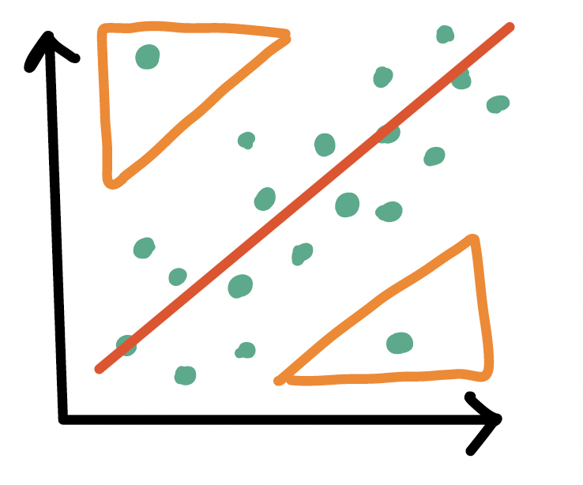
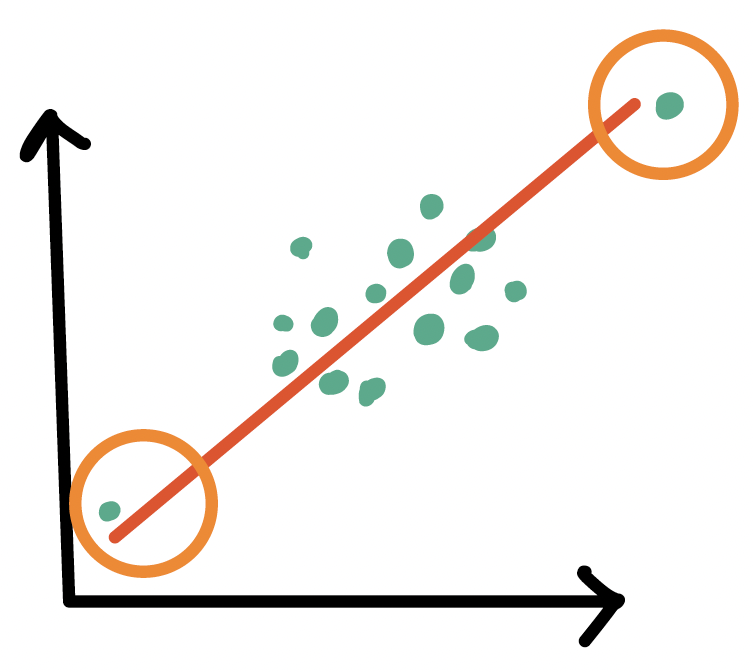
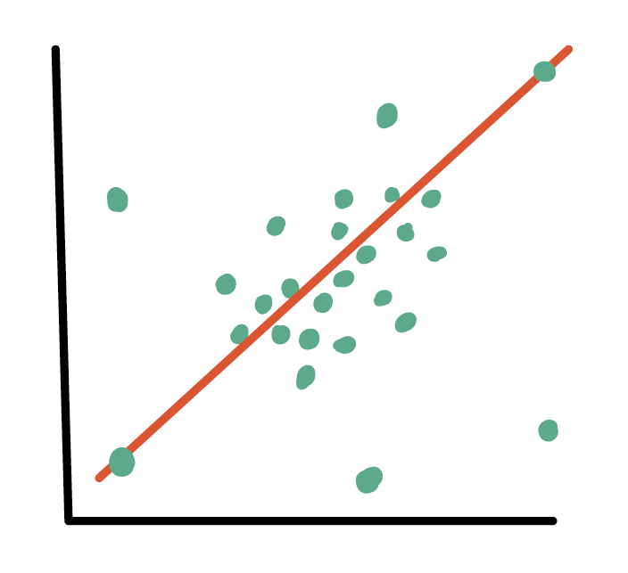

```{r}
#| label: "setup" 
#| include: false
#| message: false
#| warning: false

library(tidyverse)    
library(openintro)
library(janitor)
library(rstatix)
library(knitr)
library(gtsummary)
library(moderndive)
library(gt)
library(broom) 
library(here) 
library(pwr) 
library(gridExtra)   # grid.arrange()
library(readxl)
library(describedata) # gladder()
library(gridExtra)   # grid.arrange()
library(ggfortify)  # autoplot(model)
library(gtsummary)
library(broom.helpers)

knitr::opts_chunk$set(echo = TRUE, fig.height=6, fig.width=8,
                      message = FALSE, warning = FALSE)
theme_set(theme_bw(base_size = 22))

```

```{r}
#| include: false
#| message: false
#| warning: false

load(here("data", "gapminder2022.RData"))
gapm = gapm %>%
  mutate(fs_order = case_when(freedom_status == "F" ~ 3,
                                freedom_status == "PF" ~ 2,
                                freedom_status == "NF" ~ 1), 
         freedom_status = fct_relevel(freedom_status, "NF", "PF", "F"))
```


# Learning Objectives

1.  Implement a model with data transformations to meet LINE assumptions. 

1.  Use visualizations and cut off points to flag potentially
    influential points using residuals, leverage, and Cook's distance

2.  Handle influential points and assumption violations by checking data
    errors, reassessing the model, and making data transformations.
    
```{css, echo=FALSE}
.reveal code {
  max-height: 100% !important;
}
```

## Process of regression data analysis

::: box
{.absolute top="13.5%" right="62.1%" width="155"} {.absolute top="13.5%" right="28.4%" width="155"}{.absolute top="7.5%" right="30.5%" width="820"} {.absolute top="60.5%" right="48%" width="85"}

::: columns
::: {.column width="30%"}
::: RAP1
::: RAP1-title
Model Selection
:::

::: RAP1-cont
-   Building a model

-   Selecting variables

-   Prediction vs interpretation

-   Comparing potential models
:::
:::
:::

::: {.column width="4%"}
:::

::: {.column width="30%"}
::: RAP2
::: RAP2-title
Model Fitting
:::

::: RAP2-cont
-   Find best fit line

-   Using OLS in this class

-   Parameter estimation

-   Categorical covariates

-   Interactions
:::
:::
:::

::: {.column width="4%"}
:::

::: {.column width="30%"}
::: RAP3
::: RAP3-title
Model Evaluation
:::

::: RAP3-cont
-   Evaluation of model fit
-   Testing model assumptions
-   Residuals
-   Transformations
-   Influential points
-   Multicollinearity
:::
:::
:::
:::
:::

::: RAP4
::: RAP4-title
Model Use (Inference)
:::

::: RAP4-cont
::: columns
::: {.column width="50%"}
-   Inference for coefficients
-   Hypothesis testing for coefficients
:::

::: {.column width="50%"}
-   Inference for expected $Y$ given $X$
-   Prediction of new $Y$ given $X$
:::
:::
:::
:::

## Let's remind ourselves of one model we have been working with

-   We have been looking at the association between life expectancy and cell phones

-   We used OLS to find the coefficient estimates of our best-fit line

::: columns
::: {.column width="55%"}
Population model: 

```{=tex}
\begin{aligned}
Y &= \beta_0 + \beta_1 \cdot X + \epsilon \\
\text{LE} &= \beta_0 + \beta_1 \text{CP} + \epsilon
\end{aligned}
```

Estimated model:
```{r}
#| echo: false

model1 <- gapm %>% lm(formula = life_exp ~ cell_phones_100)
# Get regression table:
tidy_model1 = tidy(model1)

reg_table = tidy_model1 %>% gt() %>% 
 tab_options(table.font.size = 40) %>%
 fmt_number(decimals = 3)
reg_table
```

```{=tex}
\begin{aligned}
\widehat{Y} &= \widehat\beta_0 + \widehat\beta_1 \cdot X\\
\widehat{\text{LE}} &=  `r tidy_model1$estimate[1] %>% round(digits=2)` + `r tidy_model1$estimate[2] %>% round(digits=3)`\cdot\text{CP}
\end{aligned}
```
:::

::: {.column width="2%"}
:::

::: {.column width="43%"}
```{r}
#| fig-height: 8
#| fig-width: 11
#| echo: false

# gapm <- read_csv("data/lifeexp_femlit_2011.csv")
gapm_slr_plot = gapm %>%
  ggplot(aes(x = cell_phones_100,
             y = life_exp)) +
  geom_point(size = 4) +
  geom_smooth(method = "lm", se = FALSE, size = 3, colour="#F14124") +
  labs(x = "Cell phones per 100 people",
       y = "Life expectancy (years)",
       title = "Relationship between life expectancy and cell phones") +
    theme(axis.title = element_text(size = 27), 
        axis.text = element_text(size = 25), 
        title = element_text(size = 25))

gapm_slr_plot
```
:::
:::

## Our residuals will help us a lot in our diagnostics!

::: columns
::: {.column width="35%"}
 

-   The **residuals** $\widehat\epsilon_i$ are the vertical distances
    between

    -   the observed data $(X_i, Y_i)$
    -   the fitted values (regression line)
        $\widehat{Y}_i = \widehat\beta_0 + \widehat\beta_1 X_i$
:::

::: {.column width="65%"}
$$
\widehat\epsilon_i =Y_i - \widehat{Y}_i \text{,   for } i=1, 2, ..., n
$$

```{r}
#| message: false
#| echo: false
#| fig-height: 8
#| fig-width: 11
#| fig-align: center
# code from https://drsimonj.svbtle.com/visualising-residuals

model1 <- lm(life_exp ~ cell_phones_100,
                 data = gapm)
regression_points <- augment(model1)
# summary(model1)
# sum(model1$residuals^2)

ggplot(regression_points, 
       aes(x = cell_phones_100,
                 y = life_exp)) +
  geom_segment(aes(
    xend = cell_phones_100, 
    yend = .fitted), 
    alpha = 1, 
    color = "#4FADF3", 
    size = 2) +
  geom_smooth(method = "lm", se = FALSE, color = "#F14124", size=3) +
  # > Color adjustments made here...
  geom_point(color = "black", size = 4) +  # Color mapped here
  #scale_color_gradient2(low = "#213c96", mid = "white", high = "#F14124") +  # Colors to use here
    #guides(color = "none") +
  geom_point(aes(y = .fitted), shape = 1, size = 4) +
labs(x = "Cell phones per 100 people", 
       y = "Life expectancy (years)") +
    theme(axis.title = element_text(size = 30), 
        axis.text = element_text(size = 25), 
        title = element_text(size = 30))  
```
:::
:::

## `augment()`: getting extra information on the fitted model

-   Run `model1` through `augment()` (`model1` is input)

    -   So we assigned `model1` as the output of the `lm()` function
        (`model1` is output)

-   Will give us values about each observation in the context of the
    fitted regression model

    -   cook's distance (`.cooksd`), fitted value (`.fitted`,
        $\widehat{Y}_i$), leverage (`.hat`), residual (`.resid`),
        standardized residuals (`.std.resid`)

```{r}
aug1 <- augment(model1) 
glimpse(aug1)
```

[RDocumentation on the `augment()`
function.](https://www.rdocumentation.org/packages/broom/versions/1.0.4/topics/augment.lm)

## Revisiting our LINE assumptions

::: columns
::: column
::: definition
::: def-title
**\[L\] Linearity** of relationship between variables
:::

::: def-cont
Check if there is a linear relationship between the mean response (Y)
and the explanatory variable (X)
:::
:::
:::

::: column
::: proof1
::: proof-title
**\[I\] Independence** of the $Y$ values
:::

::: proof-cont
Check that the observations are independent
:::
:::
:::

::: column
::: theorem
::: thm-title
**\[N\] Normality** of the $Y$'s given $X$ (residuals)
:::

::: thm-cont
Check that the responses (at each level X) are normally distributed

-   Usually measured through the residuals
:::
:::
:::

::: column
::: fact
::: fact-title
**\[E\] Equality** of variance of the residuals (homoscedasticity)
:::

::: fact-cont
Check that the variance (or standard deviation) of the responses is
equal for all levels of X

-   Usually measured through the residuals
:::
:::
:::
:::

# Learning Objectives

::: lob
1.  Implement a model with data transformations to meet LINE assumptions. 
:::

2.  Use visualizations and cut off points to flag potentially
    influential points using residuals, leverage, and Cook's distance

3.  Handle influential points and assumption violations by checking data
    errors, reassessing the model, and making data transformations.

## Transformations

-   When we have issues with our LINE (mostly linearity, normality, or
    equality of variance) assumptions

    -   We **can** use transformations to improve the fit of the model

-   We can transform the dependent ($Y$) variable and/or the independent
    ($X$) variable

    -   Usually we want to try transforming the $X$ first

 

-   **Requires trial and error!!**
-   **Major drawback:** interpreting the model becomes harder!

-   Tukey's transformation (power) ladder

    -   Use `R`'s `gladder()` command from the `describedata` package

| Power p | -3              | -2              | -1            | -1/2                 | 0         | 1/2        | 1   | 2     | 3     |
|--------|--------|--------|--------|--------|--------|--------|--------|--------|--------|
|         | $\frac{1}{x^3}$ | $\frac{1}{x^2}$ | $\frac{1}{x}$ | $\frac{1}{\sqrt{x}}$ | $\log(x)$ | $\sqrt{x}$ | $x$ | $x^2$ | $x^3$ |

## Common transformations

::: columns

::: {.column width="33%"}

::: definition
::: def-title
If relationship does not look linear
:::
::: def-cont
- Transform X or Y
- We will need to investigate the scatterplot to see if it worked
:::
:::
:::

::: {.column width="33%"}

::: theorem
::: thm-title
If residuals are not normal
:::
::: thm-cont
- Transform Y
  
-   If $Y$ skewed left, we need to compress smaller values
        towards the rest of the data

    -   We use transformations of $Y$ with power \> 1

-   If $Y$ skewed right, we need to compress larger values
        towards the rest of the data

    -   We use transformations of $Y$ with power \< 1
:::
:::
:::

::: {.column width="34%"}

::: fact
::: fact-title
If residuals have non-constant variance
:::
::: fact-cont
  - Transform Y
  
-   If higher $X$ values have more spread in $Y$

    -   We use transformations of $Y$ with power \< 1

-   If lower $X$ values have more spread in $Y$

    -   We are transformations of $Y$ with power \> 1
:::
:::
:::
:::


## Three cases to explore different transformations

::: columns

::: {.column width="31%"}

::: definition
::: def-title
If relationship does not look linear
:::
::: def-cont
```{r}
#| echo: false

ggplot(gapm, aes(x = basic_sani,
                 y = life_exp)) +
  geom_point() +
  geom_smooth(method = "lm", color = "#F14124", se=F) +
  geom_smooth(method = "loess", color = "#34AC8B", se=F) +
  labs(x = "Basic sanitation (% population with access)",
       y = "Life Expectancy (years)") +
  theme_bw(base_size = 22)
```
:::
:::
:::

::: {.column width="2%"}
:::

::: {.column width="31%"}

::: theorem
::: thm-title
If residuals are not normal
:::
::: thm-cont
```{r}
#| echo: false
#| fig-height: 5
#| fig-width: 8

ggplot(gapm, aes(x = vax_rate,
                 y = life_exp)) +
  geom_point() +
  geom_smooth(method = "lm", color = "#F14124", se=F) +
  geom_smooth(method = "loess", color = "#34AC8B", se=F) +
  labs(x = "Vaccination rate (%)",
       y = "Life Expectancy (years)") +
  theme_bw(base_size = 22)
```

```{r}
#| echo: false

ex2_model = lm(life_exp ~ vax_rate, data = gapm)
ex2_aug = augment(ex2_model)
ggplot(ex2_aug, aes(sample = .resid)) + 
  stat_qq() +     # points
  stat_qq_line() + # line
  labs(title = "QQ plot") +
  labs(x = "Theoretical quantiles", 
       y = "Data quantiles")
```
:::
:::
:::

::: {.column width="2%"}
:::

::: {.column width="29%"}

::: fact
::: fact-title
If residuals have non-constant variance
:::
::: fact-cont
```{r}
#| echo: false
#| fig-height: 5
#| fig-width: 8

ggplot(gapm, aes(x = vax_rate,
                 y = life_exp)) +
  geom_point() +
  geom_smooth(method = "lm", color = "#F14124", se=F) +
  geom_smooth(method = "loess", color = "#34AC8B", se=F) +
  labs(x = "Vaccination rate (%)",
       y = "Life Expectancy (years)") +
  theme_bw(base_size = 22)
```

```{r}
#| echo: false

ex2_model = gapm %>% lm(formula = life_exp ~ vax_rate)
ex2_aug = augment(ex2_model)
ggplot(ex2_aug, 
       aes(x = vax_rate, 
           y = .resid)) + 
  geom_point(size = 2) +
  geom_abline( intercept = 0, slope = 0,
    size = 2, color = "#FF8021") +
  labs(title = "Residual plot")
```
:::
:::
:::
:::

## [Case 1: Relationship does not look linear]{style="color: #4FADF3;"}

-  Transform independent variable (X)

```{r fig.width=7, fig.height=5}
#| fig-align: center
gladder(gapm$basic_sani)
```

## Poll Everywhere Question 1

## [Case 1: Relationship does not look linear]{style="color: #4FADF3;"}

-  Transform dependent/response variable (Y)

```{r fig.width=7, fig.height=5}
#| fig-align: center
gladder(gapm$life_exp)
```

## [Case 1:]{style="color: #4FADF3;"} Add quadratic and cubic transformations to dataset

-   Helpful to make a new variable with the transformation in your dataset

```{r}
gapm <- gapm %>% 
  mutate(LE_2 = life_exp^2,
         LE_3 = life_exp^3,
         BS_2 = basic_sani^2,
         BS_3 = basic_sani^3)

colnames(gapm)
```

## [Case 1:]{style="color: #4FADF3;"} We are going to compare a few different models with transformations

We are going to call life expectancy $LE$ and cell phones per 100 people $CP$

-   Model 1: $LE = \beta_0 + \beta_1 BS + \epsilon$
-   Model 2: $LE^2 = \beta_0 + \beta_1 BS + \epsilon$
-   Model 3: $LE^3 = \beta_0 + \beta_1 BS + \epsilon$
-   Model 4: $LE = \beta_0 + \beta_1 BS + \beta_2 BS^2 +\epsilon$
-   Model 5:
    $LE = \beta_0 + \beta_1 BS + \beta_2 BS^2 +\beta_3 BS^3 +\epsilon$
-   Model 6:
    $LE^3 = \beta_0 + \beta_1 BS + \beta_2 BS^2 +\beta_3 BS^3 +\epsilon$

## Poll Everywhere Question 2

## [Case 1:]{style="color: #4FADF3;"} Compare Scatterplots: does linearity improve?

```{r fig.width=10, fig.height=5}
#| echo: false

plot_m1 <- ggplot(gapm, aes(x = basic_sani,
                 y = life_exp)) +
  geom_point() +
  geom_smooth() +
  geom_smooth(method = "lm", color = "darkgreen") +
  labs(title = "Mod1: LE ~ BS") +
  theme_bw(base_size = 10)

plot_m2 <- ggplot(gapm, aes(x = basic_sani,
                 y = LE_2)) +
  geom_point() +
  geom_smooth() +
  geom_smooth(method = "lm", color = "darkgreen") +
  labs(title = "Mod2: LE^2 ~ BS") +
  theme_bw(base_size = 10)

plot_m3 <- ggplot(gapm, aes(x = basic_sani,
                 y = LE_3)) +
  geom_point() +
  geom_smooth() +
  geom_smooth(method = "lm", color = "darkgreen") +
  labs(title = "Mod3: LE^3 ~ BS") +
  theme_bw(base_size = 10)

plot_m4 <- ggplot(gapm, aes(x = BS_2,
                 y = life_exp)) +
  geom_point() +
  geom_smooth() +
  geom_smooth(method = "lm", color = "darkgreen") +
  labs(title = "Mod4: LE ~ BS + BS^2") +
  theme_bw(base_size = 10)

plot_m5 <- ggplot(gapm, aes(x = BS_3,
                 y = life_exp)) +
  geom_point() +
  geom_smooth() +
  geom_smooth(method = "lm", color = "darkgreen") +
  labs(title = "Mod5: LE ~ BS + BS^2 + BS^3") +
  theme_bw(base_size = 10)

plot_m6 <- ggplot(gapm, aes(x = BS_3,
                 y = LE_3)) +
  geom_point() +
  geom_smooth() +
  geom_smooth(method = "lm", color = "darkgreen") +
  labs(title = "Mod6: LE^3 ~ BS + BS^2 + BS^3") +
  theme_bw(base_size = 10)

grid.arrange(plot_m1, plot_m2, plot_m3, 
             plot_m4, plot_m5, plot_m6,
             nrow = 2)

```

## [Case 1:]{style="color: #4FADF3;"} Run models with transformations: examples

**Model 1:** $LE = \beta_0 + \beta_1 BS + \epsilon$

```{r}
model1 <- lm(life_exp ~ basic_sani,
             data = gapm)
```

```{r}
#| echo: false
tidy(model1) %>% gt() %>%
  tab_options(table.font.size = 40) %>%
  fmt_number(decimals = 3)
```

**Model 5:**
$LE = \beta_0 + \beta_1 BS + \beta_2 BS^2 +\beta_3 BS^3 +\epsilon$

```{r}
model5 <- lm(life_exp ~ basic_sani + BS_2 + BS_3,
             data = gapm)
```

```{r}
#| echo: false
tidy(model5) %>% gt() %>%
  tab_options(table.font.size = 40) %>%
  fmt_number(decimals = 3)
```


## [Case 1:]{style="color: #4FADF3;"} Issues with interpretability

-   When we transform variables, interpreting the coefficients becomes
    more difficult
    
-  For example, in Model 5: $$LE = \beta_0 + \beta_1 BS + \beta_2 BS^2 +\beta_3 BS^3 +\epsilon$$ 
    -  The effect of basic sanitation on life expectancy is not constant
        anymore
    -  The effect of a one unit increase in basic sanitation on life expectancy
        depends on the current level of basic sanitation
    - $\beta_1$ cannot be interpreted on its own anymore

## Three cases to explore different transformations

::: columns

::: {.column width="31%"}

::: definition
::: def-title
If relationship does not look linear
:::
::: def-cont
```{r}
#| echo: false

ggplot(gapm, aes(x = basic_sani,
                 y = life_exp)) +
  geom_point() +
  geom_smooth(method = "lm", color = "#F14124", se=F) +
  geom_smooth(method = "loess", color = "#34AC8B", se=F) +
  labs(x = "Basic sanitation (% population with access)",
       y = "Life Expectancy (years)") +
  theme_bw(base_size = 22)
```
:::
:::
:::

::: {.column width="2%"}
:::

::: {.column width="31%"}

::: theorem
::: thm-title
If residuals are not normal
:::
::: thm-cont
```{r}
#| echo: false
#| fig-height: 5
#| fig-width: 8

ggplot(gapm, aes(x = vax_rate,
                 y = life_exp)) +
  geom_point() +
  geom_smooth(method = "lm", color = "#F14124", se=F) +
  geom_smooth(method = "loess", color = "#34AC8B", se=F) +
  labs(x = "Vaccination rate (%)",
       y = "Life Expectancy (years)") +
  theme_bw(base_size = 22)
```

```{r}
#| echo: false

ex2_model = lm(life_exp ~ vax_rate, data = gapm)
ex2_aug = augment(ex2_model)
ggplot(ex2_aug, aes(sample = .resid)) + 
  stat_qq() +     # points
  stat_qq_line() + # line
  labs(title = "QQ plot") +
  labs(x = "Theoretical quantiles", 
       y = "Data quantiles")
```
:::
:::
:::

::: {.column width="2%"}
:::

::: {.column width="29%"}

::: fact
::: fact-title
If residuals have non-constant variance
:::
::: fact-cont
```{r}
#| echo: false
#| fig-height: 5
#| fig-width: 8

ggplot(gapm, aes(x = vax_rate,
                 y = life_exp)) +
  geom_point() +
  geom_smooth(method = "lm", color = "#F14124", se=F) +
  geom_smooth(method = "loess", color = "#34AC8B", se=F) +
  labs(x = "Vaccination rate (%)",
       y = "Life Expectancy (years)") +
  theme_bw(base_size = 22)
```

```{r}
#| echo: false

ex2_model = gapm %>% lm(formula = life_exp ~ vax_rate)
ex2_aug = augment(ex2_model)
ggplot(ex2_aug, 
       aes(x = vax_rate, 
           y = .resid)) + 
  geom_point(size = 2) +
  geom_abline( intercept = 0, slope = 0,
    size = 2, color = "#FF8021") +
  labs(title = "Residual plot")
```
:::
:::
:::
:::


## Case [2]{style="color: #A7EA52;"}/[3]{style="color: #34AC8B;"}: [Residuals are not normal]{style="color: #A7EA52;"} or [non-constant variance]{style="color: #34AC8B;"}

-  Transform dependent/response variable (Y)

```{r fig.width=7, fig.height=5}
#| fig-align: center
gladder(gapm$life_exp)
```

## Case [2]{style="color: #A7EA52;"}/[3]{style="color: #34AC8B;"}: Run models with transformations: examples

```{r}
gapm <- gapm %>% 
  mutate(VR_2 = vax_rate^2,
         VR_3 = vax_rate^3)
```

```{r}
#| echo: false
model1 = gapm %>% lm(formula = life_exp ~ vax_rate)
model2 = gapm %>% lm(formula = LE_2 ~ vax_rate)
model3 = gapm %>% lm(formula = LE_3 ~ vax_rate)
model4 = gapm %>% lm(formula = life_exp ~ vax_rate + VR_2)
model5 = gapm %>% lm(formula = life_exp ~ vax_rate + VR_2 + VR_3)
model6 = gapm %>% lm(formula = LE_3 ~ vax_rate + VR_2 + VR_3)
m1_aug = augment(model1)
m2_aug = augment(model2)
m3_aug = augment(model3)
m4_aug = augment(model4)
m5_aug = augment(model5)
m6_aug = augment(model6)
```

**Model 1:** $LE = \beta_0 + \beta_1 VR + \epsilon$

```{r}
model1 = gapm %>% lm(formula = life_exp ~ vax_rate)
```

```{r}
#| echo: false
tidy(model1) %>% gt() %>%
  tab_options(table.font.size = 40) %>%
  fmt_number(decimals = 3)
```

**Model 4:**
$LE = \beta_0 + \beta_1 VR + \beta_2 VR^2 +\epsilon$

```{r}
model4 = gapm %>% lm(formula = life_exp ~ vax_rate + VR_2)
```

```{r}
#| echo: false
tidy(model4) %>% gt() %>%
  tab_options(table.font.size = 40) %>%
  fmt_number(decimals = 3)
```

## Case [2]{style="color: #A7EA52;"}/[3]{style="color: #34AC8B;"}: Normal Q-Q plots comparison

- All QQ plots look roughly the same... some improvement on lower tail in model 2, 3, 6

```{r fig.width=10, fig.height=5}
#| echo: false

plot_m1 <- ggplot(m1_aug, aes(sample = .resid)) + 
  stat_qq() +     # points
  stat_qq_line() + # line
  labs(title = "Mod1: LE ~ VR") +
  labs(x = "Theoretical quantiles", 
       y = "Data quantiles") +
  theme_bw(base_size = 10)

plot_m2 = ggplot(m2_aug, aes(sample = .resid)) + 
  stat_qq() +     # points
  stat_qq_line() + # line
  labs(title = "Mod2: LE^2 ~ VR") +
  labs(x = "Theoretical quantiles", 
       y = "Data quantiles") +
  theme_bw(base_size = 10)

plot_m3 = ggplot(m3_aug, aes(sample = .resid)) +
  stat_qq() +     # points
  stat_qq_line() + # line
  labs(title = "Mod3: LE^3 ~ VR") +
  labs(x = "Theoretical quantiles", 
       y = "Data quantiles") +
  theme_bw(base_size = 10)

plot_m4 = ggplot(m4_aug, aes(sample = .resid)) +
  stat_qq() +     # points
  stat_qq_line() + # line
  labs(title = "Mod4: LE ~ VR + VR^2") +
  labs(x = "Theoretical quantiles",
       y = "Data quantiles") +
  theme_bw(base_size = 10)

plot_m5 = ggplot(m5_aug, aes(sample = .resid)) +
  stat_qq() +     # points
  stat_qq_line() + # line
  labs(title = "Mod5: LE ~ VR + VR^2 + VR^3") +
  labs(x = "Theoretical quantiles",
       y = "Data quantiles") +
  theme_bw(base_size = 10)

plot_m6 = ggplot(m6_aug, aes(sample = .resid)) +
  stat_qq() +     # points
  stat_qq_line() + # line
  labs(title = "Mod6: LE^3 ~ VR + VR^2 + VR^3") +
  labs(x = "Theoretical quantiles",
       y = "Data quantiles") +
  theme_bw(base_size = 10)

grid.arrange(plot_m1, plot_m2, plot_m3, 
             plot_m4, plot_m5, plot_m6,
             nrow = 2)

```

## Case [2]{style="color: #A7EA52;"}/[3]{style="color: #34AC8B;"}:Residual plots comparison

- Models 4-6 have more homoskedasticity

```{r fig.width=10, fig.height=5}
#| echo: false

plot_m1 = ggplot(m1_aug, 
       aes(x = .fitted, 
           y = .resid)) + 
  geom_point() +
  geom_abline( intercept = 0, slope = 0,
    color = "#FF8021") +
  labs(title = "Mod1: LE ~ VR") +
  theme_bw(base_size = 10)

plot_m2 = ggplot(m2_aug, 
       aes(x = .fitted,  
           y = .resid)) +
  geom_point() +
  geom_abline( intercept = 0, slope = 0,
    color = "#FF8021") +
  labs(title = "Mod2: LE^2 ~ VR") +
  theme_bw(base_size = 10)

plot_m3 = ggplot(m3_aug, 
       aes(x = .fitted,  
           y = .resid)) +
  geom_point() +
  geom_abline( intercept = 0, slope = 0,
    color = "#FF8021") +
  labs(title = "Mod3: LE^3 ~ VR") +
  theme_bw(base_size = 10)

plot_m4 = ggplot(m4_aug, 
       aes(x = .fitted,  
           y = .resid)) +
  geom_point() +
  geom_abline( intercept = 0, slope = 0,
    color = "#FF8021") +
  labs(title = "Mod4: LE ~ VR + VR^2") +
  theme_bw(base_size = 10)

plot_m5 = ggplot(m5_aug, 
       aes(x = .fitted,  
           y = .resid)) +
  geom_point() +
  geom_abline( intercept = 0, slope = 0,
    color = "#FF8021") +
  labs(title = "Mod5: LE ~ VR + VR^2 + VR^3") +
  theme_bw(base_size = 10)

plot_m6 = ggplot(m6_aug, 
       aes(x = .fitted, 
           y = .resid)) +
  geom_point() +
  geom_abline( intercept = 0, slope = 0,
    color = "#FF8021") +
  labs(title = "Mod6: LE^3 ~ VR + VR^2 + VR^3") +
  theme_bw(base_size = 10)

grid.arrange(plot_m1, plot_m2, plot_m3, 
             plot_m4, plot_m5, plot_m6,
             nrow = 2)
```


## Tips on transformations 

-   Recall, assessing our LINE assumptions are not on $Y$ alone!! (it's $Y|X$, aka $\epislon$)

    -   We can use `gladder()` to get a sense of what our
        transformations will do to the data, but we need to check with
        our scatterplots, QQ plots, and residual plots again!!

-   Transformations usually work better if **all original values** are positive (or
    negative)

-   If observation has a 0, then we cannot perform certain
    transformations

-   Log function only defined for positive values

    -   We might take the $log(X+1)$ if $X$ includes a 0 value

-   When we make cubic or square transformations, we MUST include the
    original $X$ in the model

    -   We do not do this for $Y$ though


## Choosing to transform or not

-   If the model without the transformation is **blatantly violating a
    LINE assumption**
    
    -   Then a transformation is a good idea
    -   If transformations do not help, then keep it untransformed

 

-   If the model without a transformation is **not following the LINE assumptions very well, but is mostly okay**

    -   Then try to avoid a transformation
    -   Think about what predictors might need to be added
    -   Especially if you keep seeing the same points as influential
    
 

-   If **interpretability** is important in your final work, then **transformations are not a great solution**

## Models comparison {visibility="hidden"}

```{r}
# library(gtsummary) for tbl_regression() and tbl_merge()

tbl_model1 <- tbl_regression(model1)

tbl_model2 <- tbl_regression(model2)

tbl_model3 <- tbl_regression(model3)

tbl_model4 <- tbl_regression(model4)

tbl_model5 <- tbl_regression(model5)

tbl_model6 <- tbl_regression(model6)

# Compare models 1-3
tbl_merge(
  tbls = list(tbl_model1, tbl_model2, tbl_model3),
  tab_spanner = c("Model 1: y=LE", "Model 2: y=LE^2", "Model 3: y=LE^3")
  )

# Compare models 4-6
tbl_merge(
  tbls = list(tbl_model4, tbl_model5, tbl_model6),
  tab_spanner = c("Model 4: y=LE", "Model 5: y=LE", "Model 6: y=LE^3")
  )
```

## Other fit statistics comparison {visibility="hidden"}

```{r}
glance(model1) %>% gt()
glance(model2) %>% gt()
glance(model3) %>% gt()
glance(model4) %>% gt()
glance(model5) %>% gt()
glance(model6) %>% gt()
```

## Example: Chapter 5 Problem 9 {visibility="hidden"}

-   In an experiment designed to describe the dose–response curve for
    vitamin K, individual rats were depleted of their vitamin K reserves
    and then fed dried liver for 4 days at different dosage levels.
-   The response of each rat was measured as the concentration of a
    clotting agent needed to clot a sample of its blood in 3 minutes.
-   The results of the experiment on 12 rats are given in the following
    table; **values are expressed in common logarithms for both dose and
    response**.
    -   *Note: by "common logarithm" the authors mean a base 10
        logarithm*

> Question: why did they choose a log-log transformation?

```{r}
rats <- read_excel("data/CH05Q09.xls")
glimpse(rats)

loglog_plot <- ggplot(rats, aes(x = LOGDOSE, y = LOGCONC)) +
  geom_point() +
  geom_smooth() +
  geom_smooth(method = "lm", color = "darkgreen") +
  labs(title = "Transformed variables")
loglog_plot
```

# Learning Objectives

1.  Implement a model with data transformations to meet LINE assumptions. 

::: lob
2.  Use visualizations and cut off points to flag potentially
    influential points using residuals, leverage, and Cook's distance
:::

3.  Handle influential points and assumption violations by checking data
    errors, reassessing the model, and making data transformations.

## Types of influential points

::: columns
::: column
::: fact
::: fact-title
**Outliers**
:::

::: fact-cont
-   An observation ($X_i, Y_i$) whose response $Y_i$ does not follow the
    general trend of the rest of the data
    
{fig-align="center" width="450"}
:::
:::

 

 
:::

::: column
::: definition
::: def-title
**High leverage observations**
:::

::: def-cont
-   An observation ($X_i, Y_i$) whose predictor $X_i$ has an extreme
    value
-   $X_i$ can be an extremely high or low value compared to the rest of
    the observations

{fig-align="center" width="450"}
:::
:::
:::
:::

## Tools to measure influential points

- Internally standardized residual (outlier)

 

- Leverage (high leverage point)

 

- Cook's distance (overall influence, both)

## Poll Everywhere Question 3

## Outliers

::: columns
::: {.column width="60%"}
-   An observation ($X_i, Y_i$) whose response $Y_i$ does not follow the
    general trend of the rest of the data
    
 

-   How do we determine if a point is an outlier?

    -   Scatterplot of $Y$ vs. $X$
    -   Followed by evaluation of its residual (and standardized
        residual)
          - Typically use the **internally standardized residual** (aka studentized residual)
:::
::: {.column width="40%"}
{fig-align="center" width="500"}
:::
:::

## Identifying outliers

::: columns
::: {.column width="37%"}
::: theorem
::: thm-title
Internally standardized residual
:::

::: thm-cont
$$
r_i = \frac{\widehat\epsilon_i}{\sqrt{\widehat\sigma^2(1-h_{ii})}}
$$
:::
:::
:::

::: {.column width="63%"}
-   We flag an observation if the standardized residual is "large"

    -   Different sources will define "large" differently

    -   **PennState site uses $|r_i| > 3$**

    -   `autoplot()` shows the 3 observations with the highest
        standardized residuals

    -   Other sources use $|r_i| > 2$, which is a little more
        conservative
:::
:::

::: columns
::: {.column width="55%"}
 

```{r}
#| fig-height: 4.5
#| fig-width: 7
#| fig-align: center
#| eval: false
ggplot(data = aug1) + 
  geom_histogram(aes(x = .std.resid))
```
:::

::: {.column width="45%"}
```{r}
#| fig-height: 5
#| fig-width: 7.5
#| fig-align: center
#| echo: false

ggplot(data = aug1) + 
  geom_histogram(aes(x = .std.resid))  +
    theme(axis.title = element_text(size = 30), 
        axis.text = element_text(size = 25))  
```
:::
:::

## Countries that are outliers ($|r_i| > 3$)

-   We can identify the countries that are outliers
- This is the usual cut off that I use

```{r}
#| echo: false

# names(gapm)
# names(aug1)
```

```{r}
#| echo: false

aug1 = left_join(aug1, gapm, 
                 by = c("life_exp", 
                        "cell_phones_100"))
aug1 = aug1 %>%
  relocate(territory, .before = life_exp) %>%
  relocate(.std.resid, .after = cell_phones_100)
```

```{r}
aug1 %>% 
  filter(abs(.std.resid) > 3)
```

## Countries that are outliers ($|r_i| > 2$)

-   For teaching purposes, I will use the cut off of 2

```{r}
#| echo: false

# names(gapm)
# names(aug1)
```

```{r}
aug1 %>% 
  filter(abs(.std.resid) > 2)
```

## Visual: Countries that are outliers ($|r_i| > 2$)

Label only countries with large internally standardized residuals:

```{r}
#| fig-align: center

ggplot(aug1, aes(x = cell_phones_100, y = life_exp,
                 label = territory)) +
  geom_point() +
  geom_smooth(method = "lm", color = "darkgreen") +
  geom_text(aes(label = ifelse(abs(.std.resid) > 2, as.character(territory), ''))) +
  geom_vline(xintercept = mean(aug1$cell_phones_100), color = "grey") +
  geom_hline(yintercept = mean(aug1$life_exp), color = "grey")
```

## What does the model look like without outliers?

- When we remove outliers, how do our coefficient estimates change?
- We can compare the model with and without outliers

::: columns
::: column

::: proof1
::: proof-title
Model with outliers
:::
::: proof-cont
```{r}
#| code-fold: true

tidy(model1) %>% gt() %>% # With outliers
 tab_options(table.font.size = 40) %>% 
  fmt_number(decimals = 3)
```

$$
\widehat{Y} = `r tidy(model1)$estimate[1] %>% round(digits=2)` + `r tidy(model1)$estimate[2] %>% round(digits=3)`\cdot X
$$
:::
:::
:::
::: column

::: proposition
::: prop-title
Model without outliers
:::

::: prop-cont
```{r}
#| code-fold: true
aug1_no_out <- aug1 %>% filter(abs(.std.resid) <= 2) 

model1_no_out <- aug1_no_out %>% 
  lm(formula = life_exp ~ cell_phones_100)
tidy(model1_no_out) %>% gt() %>% # Without outliers
 tab_options(table.font.size = 40) %>% 
  fmt_number(decimals = 3)
```

$$
\widehat{Y} = `r tidy(model1_no_out)$estimate[1] %>% round(digits=2)` + `r tidy(model1_no_out)$estimate[2] %>% round(digits=3)`\cdot X
$$
:::
:::
:::
:::

- Models have similar coefficient estimates, but standard errors are smaller for model without outliers
  - This is not a reason to exclude outliers!! 

## High leverage observations
    
::: columns
::: {.column width="60%"}
-   An observation ($X_i, Y_i$) whose response $X_i$ is considered
    "extreme" compared to the other values of $X$

 

-   How do we determine if a point has high leverage?

    -   Scatterplot of $Y$ vs. $X$
    -   Calculating the **leverage** of each observation
:::
::: {.column width="40%"}
{fig-align="center" width="500"}
:::
:::


## Leverage $h_i$

::: definition
::: def-title
Leverage
:::
::: def-cont
Measure of the distance between the x value ($X_i$) for the data point ($i$) and the mean of the x values ($\overline{X}$) for all $n$ data points
:::
:::
-   Values of leverage are: $0 \leq h_i \leq 1$
-   We flag an observation if the leverage is "high"
    -   Different sources will define "high" differently

    -   Some textbooks use $h_i > 4/n$ where $n$ = sample size

    -   Some people suggest $h_i > 6/n$

    -   PennState site uses $h_i > 3p/n$ where $p$ = number of
        regression coefficients

## Countries with high leverage ($h_i > 4/n$)

-   We can look at the countries that have high leverage

```{r}
#| echo: false

# names(gapm)
# names(aug1)
#gapm = gapm %>% mutate(.rownames = 1:n() %>% as.character())
```

```{r}
aug1 = aug1 %>% relocate(.hat, .after = cell_phones_100)

aug1 %>% filter(.hat > 4/80) %>% arrange(desc(.hat))
```

## Poll Everywhere Question 4

## Visual: Countries with high leverage ($h_i > 4/n$)

Label only countries with large leverage:

```{r}
#| fig-align: center

ggplot(aug1, aes(x = cell_phones_100, y = life_exp,
                 label = territory)) +
  geom_point() +
  geom_smooth(method = "lm", color = "darkgreen") +
  geom_text(aes(label = ifelse(.hat > 4/80, as.character(territory), ''))) +
  geom_vline(xintercept = mean(aug1$cell_phones_100), color = "grey") +
  geom_hline(yintercept = mean(aug1$life_exp), color = "grey")
```

## What does the model look like without the high leverage points?

- When we remove high leverage points, how do our coefficient estimates and their standard error change?
- We can compare the model with and without high leverage observations

::: columns
::: column

::: proof1
::: proof-title
Model with high leverage observations
:::
::: proof-cont
```{r}
#| code-fold: true

tidy(model1) %>% gt() %>% # With high leverage points
 tab_options(table.font.size = 40) %>% 
  fmt_number(decimals = 3)
```

$$
\widehat{Y} = `r tidy(model1)$estimate[1] %>% round(digits=2)` + `r tidy(model1)$estimate[2] %>% round(digits=3)`\cdot X
$$
:::
:::
:::
::: column

::: proposition
::: prop-title
Model without high leverage observations
:::

::: prop-cont
```{r}
#| code-fold: true
aug1_lowlev <- aug1 %>% filter(.hat <= 4/80)

model1_lowlev <- aug1_lowlev %>% 
  lm(formula = life_exp ~ cell_phones_100)
tidy(model1_lowlev) %>% gt() %>% # Without high-leverage points
 tab_options(table.font.size = 40) %>% 
  fmt_number(decimals = 3)
```

$$
\widehat{Y} = `r tidy(model1_lowlev)$estimate[1] %>% round(digits=2)` + `r tidy(model1_lowlev)$estimate[2] %>% round(digits=3)`\cdot X
$$
:::
:::
:::
:::

- High leverage points can change your coefficient estimate, but not necessarily

## Cook's distance

-   Measures the overall influence of an observation

-   Attempts to measure how much **influence a single observation has** over the fitted model

    -   Measures **how coefficient estimates change** when the $ith$ observation is removed from the model

    -   Combines leverage and outlier information
    
::: columns
::: column
::: definition
::: def-title
The Cook's distance for the $i^{th}$ observation
:::
::: def-cont
$$d_i = \frac{h_i}{2(1-h_i)} \cdot r_i^2$$ where $h_i$ is the leverage
and $r_i$ is the studentized residual
:::
:::
:::

::: column

 

-   Another rule for Cook's distance that is not strict:
    -   Investigate observations that have $d_i > 1$
-   Cook's distance values are already in the augment tibble: `.cooksd`
:::
:::

## Countries with high Cook's distance

```{r}
aug1 = aug1 %>% relocate(.cooksd, .after = cell_phones_100)
aug1 %>% arrange(desc(.cooksd))
```

## Plotting Cook's Distance

- `plot(model)` shows figures similar to `autoplot()`
  - 4th plot is Cook's distance (not available in `autoplot()`)
```{r fig.height=4}
#| fig-align: center

plot(model1, which = 4)
```

## What does the model look like without the high Cook's distance points?

- When we remove high Cook's distance, how do our coefficient estimates and their standard error change?
- We can compare the model with and without high Cook's distance points

::: columns
::: column

::: proof1
::: proof-title
Model with high Cook's distance observations
:::
::: proof-cont
```{r}
#| code-fold: true

tidy(model1) %>% gt() %>% # With high Cook's distance points
 tab_options(table.font.size = 40) %>% 
  fmt_number(decimals = 3)
```

$$
\widehat{Y} = `r tidy(model1)$estimate[1] %>% round(digits=2)` + `r tidy(model1)$estimate[2] %>% round(digits=3)`\cdot X
$$
:::
:::
:::
::: column

::: proposition
::: prop-title
Model without high Cook's distance observations
:::

::: prop-cont
```{r}
#| code-fold: true
aug1_lowcd <- aug1 %>% filter(.cooksd <= 0.1)
model1_lowcd <- aug1_lowcd %>% lm(formula = life_exp ~ cell_phones_100)
tidy(model1_lowcd) %>% gt() %>% # Without high Cook's distance points
 tab_options(table.font.size = 40) %>% 
  fmt_number(decimals = 3)
```

$$
\widehat{Y} = `r tidy(model1_lowcd)$estimate[1] %>% round(digits=2)` + `r tidy(model1_lowcd)$estimate[2] %>% round(digits=3)`\cdot X
$$
:::
:::
:::
:::

- High Cook's distance points **can** change your coefficient estimate or standard errors

## Model without those 4 points: QQ Plot, Residual plot {visibility="hidden"}

::: columns
::: column
```{r}
#| fig.width: 7.5
#| fig.height: 7
#| fig.align: center
#| echo: false

ggplot(aug1_lowcd, aes(sample = .resid)) + 
  stat_qq() +     # points
  stat_qq_line() + # line
  labs(title = "QQ plot") +
  theme(axis.title = element_text(size = 30), 
        axis.text = element_text(size = 30), 
        title = element_text(size = 30)) +
  labs(x = "Theoretical quantiles", 
       y = "Data quantiles")
```
:::

::: column
```{r}
#| fig.width: 7.5
#| fig.height: 7
#| fig.align: center
#| echo: false
ggplot(aug1_lowcd, 
       aes(x = cell_phones_100, 
           y = .resid)) + 
  geom_point(size = 2) +
  geom_abline( intercept = 0, slope = 0,
    size = 2, color = "#FF8021") +
  labs(title = "Residual plot") +
  theme(axis.title = element_text(size = 30), 
        axis.text = element_text(size = 30), 
        title = element_text(size = 30)) 
```
:::
:::

I am okay with this!

-   And don't forget: we may want more variables in our model!

-   You do not need to produce plots with the influential points taken
    out

## Summary of how we identify influential points

1.  Use scatterplot of $Y$ vs. $X$ to see if any points fall outside of
    range we expect
    
 

2.  Use standardized residuals, leverage, and Cook's distance to further
    identify those points
    
 

3.  Look at the models run with and without the identified points to
    check for drastic changes

    - Look at QQ plot and residuals to see if assumptions hold without
      those points

    - Look at coefficient estimates to see if they change in sign and
      large magnitude

 

-   Next: how to handle? *It's a little wishy washy*

# Learning Objectives

1.  Implement a model with data transformations to meet LINE assumptions. 

2.  Use visualizations and cut off points to flag potentially
    influential points using residuals, leverage, and Cook's distance

::: lob
3.  Handle influential points and assumption violations by checking data
    errors, reassessing the model, and making data transformations.
:::

## How do we deal with influential points?
    
-   If an observation is influential, **we perform a sensitivity analysis**:
    - We took out the influential points we identified then reran the model
    - Often, you'll see that the "influential points" have not drastically changed your estimates
        - A change in sign (for example: positive slope to negative slope)
        - A really large increase (think more than 2x the original value)

-   If an observation is influential, **we check data errors**:

    -   Was there a data entry or collection problem?

    -   If you have reason to believe that the observation does not hold
        within the population (or gives you cause to redefine your
        population)

-   If an observation is influential, **we check our model**:

    -   Did you leave out any important predictors?

    -   Should you consider adding some interaction terms?

    -   Is there any nonlinearity that needs to be modeled?
    
## Important note on influential observations

-   It's always weird to be using numbers to help you diagnose an issue,
    but the issue kinda gets unresolved

 

-   Basically, deleting an observation should be justified outside of
    the numbers!

    -   If it's an honest data point, then it's giving us important
        information!
        
 

-   [A really well thought out explanation from
    StackExchange](https://stats.stackexchange.com/questions/81058/how-to-handle-leverage-values)
    
    

## Checking our model

-   An observation **may be** influential if the model is not correctly specified
    -   We may also see issues with the LINE assumptions

-   What are our options to specify the model "correctly?"

    -   See if we need to add predictors to our model

        -   Nicky's thought for our life expectancy example

    -   Try a transformation if there is an issue with linearity or
    normality

    -   Try a transformation if there is unequal variance

    -   Try a weighted least squares approach if unequal variance (might be
    lesson at end of course)

    -   Try a robust estimation procedure if we have a lot of outlier issues
    (outside scope of class)
