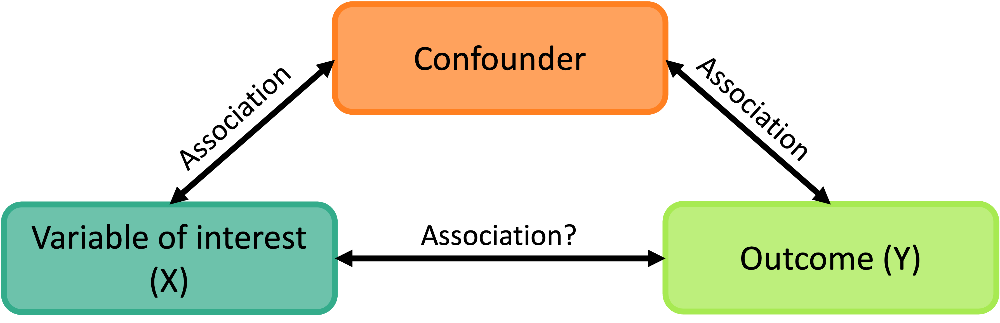
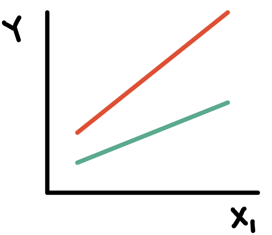
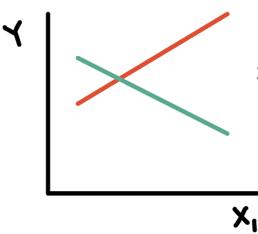
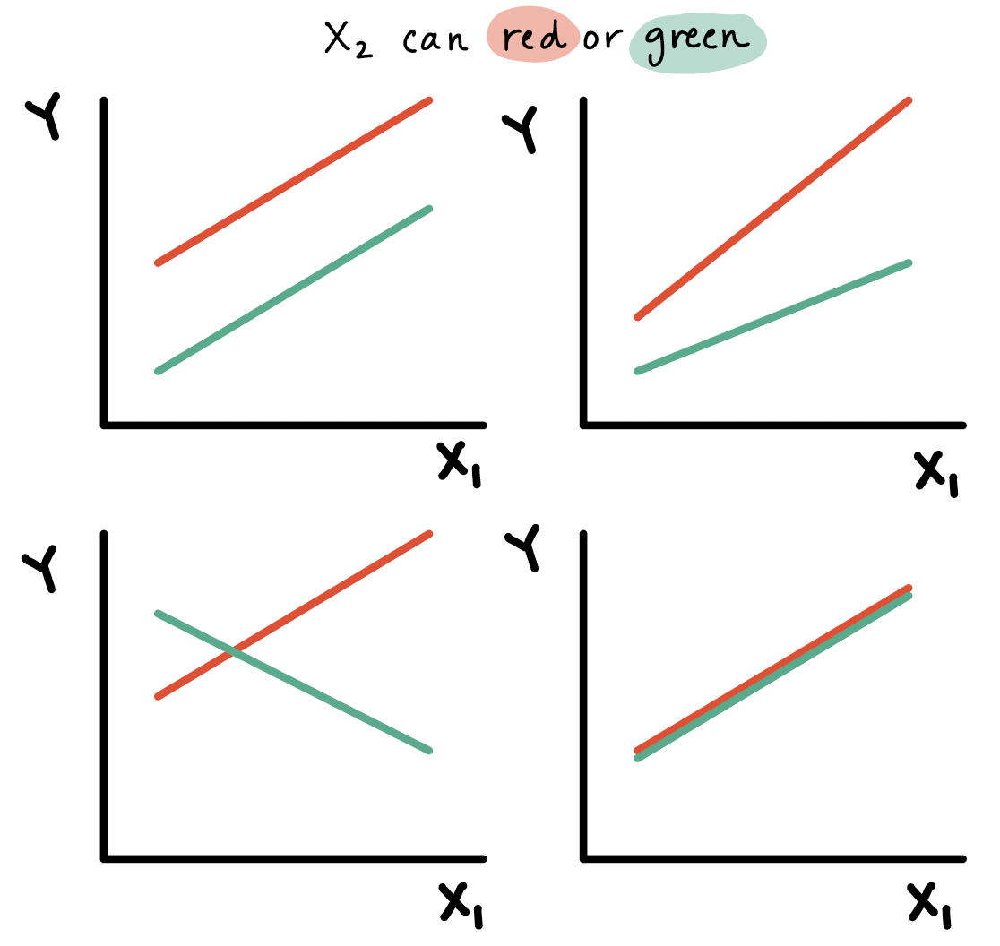

```{r}
#| label: "setup" 
#| include: false
#| message: false
#| warning: false

library(tidyverse)
library(janitor)
library(knitr)
library(broom)
library(rstatix)
library(gt)
library(readxl)
#----------
# new packages
# install.packages("describedata")
library(describedata) # gladder()
library(gridExtra)   # grid.arrange()
library(ggfortify)  # autoplot(model)
# New Day 6
library(gtsummary)

# New Day 7
library(plotly) # for plot_ly() command
library(GGally) # for ggpairs() command 
library(ggiraphExtra)   # for ggPredict() command
library(here)

# Load the data - update code if the csv file is not in the same location on your computer
# If you need to download the file, please go to ur shared folder under Data > Slides
load(here("data", "gapminder2022.RData"))
gapm = gapm %>%
  mutate(fs_order = case_when(freedom_status == "F" ~ 3,
                                freedom_status == "PF" ~ 2,
                                freedom_status == "NF" ~ 1), 
         freedom_status = fct_relevel(freedom_status, "NF", "PF", "F")) %>%
  mutate(income_level_4 = fct_relevel(income_level_4, 
                                      "Low income", 
                                      "Lower middle income",
                                      "Upper middle income",
                                      "High income")) %>%
  mutate(income_level_2 = case_when(income_level_4 %in% c("Low income", "Lower middle income") ~ "Lower income",
                                      income_level_4 %in% c("Upper middle income", "High income") ~ "Higher income")) %>%
  mutate(income_level_2 = fct_relevel(income_level_2, "Lower income", "Higher income")) %>%
  mutate(CP_c = cell_phones_100 - mean(cell_phones_100, na.rm=T))

mlr1 <- gapm %>% lm(formula = life_exp ~ cell_phones_100 + vax_rate)

gapm2 = gapm %>% select(cell_phones_100, life_exp, vax_rate, freedom_status, income_level_4, basic_sani)
```

# Learning Objectives

**This time:**

1.  Define confounders and effect modifiers, and how they interact with the main relationship we model.
2.  Interpret the interaction component of a model with **a binary categorical covariate and continuous covariate**, and how the main variable's effect changes.
3.  Interpret the interaction component of a model with **a multi-level categorical covariate and continuous covariate**, and how the main variable's effect changes.

**Next time:**

4.  Interpret the interaction component of a model with **two categorical covariates**, and how the main variable's effect changes.
5.  Interpret the interaction component of a model with **two continuous covariates**, and how the main variable's effect changes.

## A fun example of an interaction model {visibility="hidden"}

<https://academic.oup.com/jrssig/article/22/6/30/8275180?searchresult=1>

[pdf in folder](lessons/11_Interactions_01/kiss_interactions_model.pdf)

[And a nice tutorial on interrupted time series regression](https://academic.oup.com/ije/article/46/1/348/2622842)

## Regression analysis process

:::::::::::::::::: box
{.absolute top="13.5%" right="62.1%" width="155"} {.absolute top="13.5%" right="28.4%" width="155"}{.absolute top="7.5%" right="30.5%" width="820"} {.absolute top="60.5%" right="48%" width="85"}

::::::::::::::::: columns
:::::: {.column width="30%"}
::::: RAP1
::: RAP1-title
Model Selection
:::

::: RAP1-cont
-   Building a model

-   Selecting variables

-   Prediction vs interpretation

-   Comparing potential models
:::
:::::
::::::

::: {.column width="4%"}
:::

:::::: {.column width="30%"}
::::: RAP2
::: RAP2-title
Model Fitting
:::

::: RAP2-cont
-   Find best fit line

-   Using OLS in this class

-   Parameter estimation

-   Categorical covariates

-   Interactions
:::
:::::
::::::

::: {.column width="4%"}
:::

:::::: {.column width="30%"}
::::: RAP3
::: RAP3-title
Model Evaluation
:::

::: RAP3-cont
-   Evaluation of model fit
-   Testing model assumptions
-   Residuals
-   Transformations
-   Influential points
-   Multicollinearity
:::
:::::
::::::
:::::::::::::::::
::::::::::::::::::

:::::::: RAP4
::: RAP4-title
Model Use (Inference)
:::

:::::: RAP4-cont
::::: columns
::: {.column width="50%"}
-   Inference for coefficients
-   Hypothesis testing for coefficients
:::

::: {.column width="50%"}
-   Inference for expected $Y$ given $X$
-   Prediction of new $Y$ given $X$
:::
:::::
::::::
::::::::

## Recall our data and the main relationship

```{r}
#| fig-height: 8
#| fig-width: 11
#| echo: false
#| fig-align: center 

gapm_slr_plot = gapm %>%
  ggplot(aes(x = cell_phones_100,
             y = life_exp)) +
  geom_point(size = 4) +
  geom_smooth(method = "lm", se = FALSE, size = 3, colour="#F14124") +
  labs(x = "Cell phones per 100 people",
       y = "Life expectancy (years)",
       title = "Relationship between life expectancy and cell phones") +
    theme(axis.title = element_text(size = 27), 
        axis.text = element_text(size = 25), 
        title = element_text(size = 25))

gapm_slr_plot

```

# Learning Objectives

**This time:**

::: lob
1.  Define confounders and effect modifiers, and how they interact with the main relationship we model.
:::

2.  Interpret the interaction component of a model with **a binary categorical covariate and continuous covariate**, and how the main variable's effect changes.
3.  Interpret the interaction component of a model with **a multi-level categorical covariate and continuous covariate**, and how the main variable's effect changes.

**Next time:**

4.  Interpret the interaction component of a model with **two categorical covariates**, and how the main variable's effect changes.
5.  Interpret the interaction component of a model with **two continuous covariates**, and how the main variable's effect changes.

## What is a confounder?

-   A **confounding variable**, or **confounder**, is a factor/variable that wholly or partially *accounts for the observed effect of the risk factor on the outcome*

::::: columns
::: {.column width="40%"}
-   A confounder must be...

    -   Related to the outcome Y, but not a consequence of Y
    -   Related to the explanatory variable X, but not a consequence of X
:::

::: {.column width="60%"}
{fig-align="center" width="1200"}
:::
:::::

-   A classic example: We found an association between ice cream consumption and sunburn!
    -   If we adjust for a potential confounder, temperature/hot weather, we may see that the association between ice and sunburn is not as large
-   Another example: We found an association between socioeconomic status (SES) and lung cancer!
    -   If we adjust for a potential confounder, exposure to air pollution, we may see that the association between SES and lung cancer decreases

## Proxies and confounders: the good and the harmful

-   *This is totally my own tangent*
-   A **proxy variable** is used to stand-in or represent another variable that is harder to measure
-   Sometimes a confounder can be used as a proxy if it is hard to measure you explanatory variable/variable of interest
-   Proxies can be helpful statistically while harmful socially OR helpful for both!

 

-   Examples
    -   Bad: BMI serving as a measurement for physical health or diet
        -   Many studies show how harmful, mentally and physically, it is to equate BMI to health
    -   Interesting: [Using occurrence of online search queries as a proxy for public health risk perception](https://pmc.ncbi.nlm.nih.gov/articles/PMC3713924/)
    -   Helpful contextualization: [Using race as a proxy for systemic racism, and thus a way to identify how to and who needs resources](https://pmc.ncbi.nlm.nih.gov/articles/PMC8959750/#:~:text=Conceptualizing%20race%20as%20a%20proxy,racialized%20groups%20through%20multiple%20pathways.)
-   In our lab, I discuss using sex assigned at birth in our model

## Exploratory approach to identifying confounders

```{r}
#| fig-align: center
#| echo: true

gapm2 %>% ggpairs()
```

## Including a confounder in the model

-   In the following model we have two variables, $X_1$ and $X_2$

$$Y= \beta_0 + \beta_1X_{1}+ \beta_2X_{2} + \epsilon$$

-   And we assume that every level of the confounder, there is parallel slopes

-   Note: to interpret $\beta_1$, we did not specify any value of $X_2$; only specified that it be held constant

    -   Implicit assumption: effect of $X_1$ is equal across all values of $X_2$

-   The above model assumes that $X_{1}$ and $X_{2}$ do not *interact* (with respect to their effect on $Y$)

    -   Epidemiology: no "effect modification"

    -   Meaning the effect of $X_{1}$ is the same regardless of the values of $X_{2}$

    -   This model is often called a **"main effects model"**

## Where have we modeled a confounder before?

::::: columns
::: column
-   We have seen a plot of life expectancy vs. cell phones with different levels of food supply colored (Lesson 8)

-   In our plot and the model, we treat food supply as a **confounder**

-   If food supply is a confounder in the relationship between life expectancy and cell phones, then we only use main effects in the model:

$$\text{LE} = \beta_0 + \beta_1 \text{CP} + \beta_2 \text{VR} + \epsilon$$
:::

::: column
```{r}
#| fig-width: 6
#| fig-height: 4
#| fig-align: center

mr1 <- lm(life_exp ~ cell_phones_100 + vax_rate, 
          data = gapm)
(mr1_2d = ggPredict(mr1, interactive = T))
```
:::
:::::

## Poll everywhere question 1

## What is an effect modifier?

::::: columns
::: column
-   An additional variable in the model

    -   Outside of the main relationship between $Y$ and $X_1$ that we are studying

-   An effect modifier will change the effect of $X_1$ on $Y$ depending on its value

    -   Aka: as the effect modifier's values change, so does the association between $Y$ and $X_1$

    -   So the coefficient estimating the relationship between $Y$ and $X_1$ changes with another variable

-   [Example:](https://sph.unc.edu/wp-content/uploads/sites/112/2015/07/nciph_ERIC12.pdf) A breast cancer education program (the exposure) that is much more effective in reducing breast cancer (outcome) in rural areas than urban areas.

    -   Location (rural vs. urban) is the EMM
:::

::: column
{fig-align="center" width="497"}

{fig-align="center" width="474"}
:::
:::::

## How do we include an effect modifier in the model?

-   Interactions!!

-   We can incorporate interactions into our model through product terms: $$Y  =  \beta_0 + \beta_1X_{1}+ \beta_2X_{2} +
    \beta_3X_{1}X_{2} + \epsilon$$

-   Terminology:

    -   main effect parameters: $\beta_1,\beta_2$

        -   The main effect models estimate the *average* $X_{1}$ and $X_{2}$ effects

    -   interaction parameter: $\beta_3$

## Types of interactions / non-interactions

::::: columns
::: column
-   Common types of interactions:

    -   Synergism: $X_{2}$ strengthens the $X_{1}$ effect

    -   Antagonism:$X_{2}$ weakens the $X_{1}$ effect

 

-   If the interaction coefficient is not significant

    -   No evidence of effect modification, i.e., the effect of $X_{1}$ does not vary with $X_{2}$

 

-   If the main effect of $X_2$ is also not significant

    -   No evidence that $X_2$ is a confounder
:::

::: column
{fig-align="center"}
:::
:::::

# Learning Objectives

**This time:**

1.  Define confounders and effect modifiers, and how they interact with the main relationship we model.

::: lob
2.  Interpret the interaction component of a model with **a binary categorical covariate and continuous covariate**, and how the main variable's effect changes.
:::

3.  Interpret the interaction component of a model with **a multi-level categorical covariate and continuous covariate**, and how the main variable's effect changes.

**Next time:**

4.  Interpret the interaction component of a model with **two categorical covariates**, and how the main variable's effect changes.
5.  Interpret the interaction component of a model with **two continuous covariates**, and how the main variable's effect changes.

## Do we think income level is an effect modifier for cell phones?

::::: columns
::: {.column width="45%"}
-   Let's say we only have two income groups: low income and high income

-   We can start by visualizing the relationship between life expectancy and cell phones *by income level*

-   Questions of interest: Is the effect of number of cell phones on life expectancy differ depending on income level?

    -   This is the same as: Is income level is an effect modifier for cell phones?
    -   "effect of cell phones" differing = different slopes between CP and LE depending on the income group

-   Let's run an interaction model to see!
:::

::: {.column width="55%"}
```{r fig.height=7, fig.width=10, warning=F, fig.align='center'}
#| echo: false
ggplot(gapm, aes(x = cell_phones_100, y = life_exp, 
                  color = income_level_2)) +
  geom_point(size = 3) +
  geom_smooth(method = lm, se = FALSE, size=2) + 
  labs(x = "Number of cell phones per 100 people", 
       y = "Life expectancy (years)",
       title = "Life expectancy vs. Cell phones", 
       color = "Income levels") +
  theme(axis.title = element_text(size = 20), 
        axis.text = element_text(size = 20), 
        title = element_text(size = 20), 
        legend.text=element_text(size= 18)) +
  scale_color_manual(values=c("#FF8021", "#34AC8B"))
```
:::
:::::

## Model with interaction between a *binary categorical and continuous variables*

Model we are fitting:

$$ LE = \beta_0 + \beta_1 CP + \beta_2 I(\text{high income}) + \beta_3 CP \cdot I(\text{high income}) + \epsilon$$

-   $LE$ as outcome
-   $CP$ as continuous variable that is our main variable of interest
-   $I(\text{high income})$ as the indicator that income level is "high income" (binary categorical variable)

```{r}
#| echo: true

m_int_inc2 = gapm %>% 
  lm(formula = life_exp ~ cell_phones_100 + income_level_2 +
       cell_phones_100*income_level_2)
```

OR

```{r}
#| echo: true

m_int_inc2 = gapm %>% 
  lm(formula = life_exp ~ cell_phones_100*income_level_2)
```

## Displaying the regression table and writing fitted regression equation

```{r}
#| echo: true
#| code-fold: true
#| code-summary: "Code to display regression table with interaction"

tidy_m_int_inc2 = tidy(m_int_inc2, conf.int=T)

tidy_m_int_inc2 %>% gt() %>% tab_options(table.font.size = 35) %>%
  fmt_number(decimals = 3)
```

$$ \begin{aligned}
\widehat{LE} = & \widehat\beta_0 + \widehat\beta_1 CP + \widehat\beta_2 I(\text{high income}) + \widehat\beta_3 CP \cdot I(\text{high income}) \\
\widehat{LE} = & `r round(tidy_m_int_inc2$estimate[1], 2)` + `r round(tidy_m_int_inc2$estimate[2], 3)` \cdot CP + `r round(tidy_m_int_inc2$estimate[3], 3)` \cdot I(\text{high income}) `r round(tidy_m_int_inc2$estimate[4], 3)` \cdot CP \cdot I(\text{high income})
\end{aligned}$$

## Poll Everywhere Question 2

## Comparing fitted regression lines for each income level

$$ \begin{aligned}
\widehat{LE} = & \widehat\beta_0 + \widehat\beta_1 CP + \widehat\beta_2 I(\text{high income}) + \widehat\beta_3 CP \cdot I(\text{high income}) \\
\widehat{LE} = & `r round(tidy_m_int_inc2$estimate[1], 2)` + `r round(tidy_m_int_inc2$estimate[2], 3)` \cdot CP + `r round(tidy_m_int_inc2$estimate[3], 3)` \cdot I(\text{high income}) `r round(tidy_m_int_inc2$estimate[4], 3)` \cdot CP \cdot I(\text{high income})
\end{aligned}$$

::::::::::: columns
:::::: column
::::: proof1
::: proof-title
For lower income countries: $I(\text{high income}) =0$
:::

::: proof-cont
$$ \begin{aligned}
\widehat{LE} = & \widehat\beta_0 + \widehat\beta_1 CP + \widehat\beta_2 \cdot 0 + \widehat\beta_3 CP \cdot 0 \\
\widehat{LE} = & `r round(tidy_m_int_inc2$estimate[1], 2)` + `r round(tidy_m_int_inc2$estimate[2], 3)` \cdot CP + `r round(tidy_m_int_inc2$estimate[3], 3)` \cdot 0 \\ 
& `r round(tidy_m_int_inc2$estimate[4], 3)` \cdot CP \cdot 0 \\
\widehat{LE} = & `r round(tidy_m_int_inc2$estimate[1], 2)` + `r round(tidy_m_int_inc2$estimate[2], 3)` \cdot CP
\end{aligned}$$
:::
:::::
::::::

:::::: column
::::: fact
::: fact-title
For higher income countries: $I(\text{high income}) =1$
:::

::: fact-cont
$$ \begin{aligned}
\widehat{LE} = & \widehat\beta_0 + \widehat\beta_1 CP + \widehat\beta_2 \cdot 1 + \widehat\beta_3 CP \cdot 1 \\
\widehat{LE} = & `r round(tidy_m_int_inc2$estimate[1], 2)` + `r round(tidy_m_int_inc2$estimate[2], 3)` \cdot CP + `r round(tidy_m_int_inc2$estimate[3], 3)` \cdot 1 \\
& `r round(tidy_m_int_inc2$estimate[4], 3)` CP \cdot 1 \\
\widehat{LE} = & (`r round(tidy_m_int_inc2$estimate[1], 2)` + `r round(tidy_m_int_inc2$estimate[3], 3)`) + (`r round(tidy_m_int_inc2$estimate[2], 3)` `r round(tidy_m_int_inc2$estimate[4], 3)`) \cdot CP \\
\widehat{LE} = & `r round(tidy_m_int_inc2$estimate[1] + tidy_m_int_inc2$estimate[3], 2)` + `r round(tidy_m_int_inc2$estimate[2] +tidy_m_int_inc2$estimate[4], 3)` \cdot CP
\end{aligned}$$
:::
:::::
::::::
:::::::::::

## Let's take a look back at the plot

::::::::::: columns
::::::::: {.column width="50%"}
::::: proof1
::: proof-title
For lower income countries: $I(\text{high income}) =0$
:::

::: proof-cont
$$ \begin{aligned}
\widehat{LE} = & \widehat\beta_0 + \widehat\beta_1 CP\\
\widehat{LE} = & `r round(tidy_m_int_inc2$estimate[1], 2)` + `r round(tidy_m_int_inc2$estimate[2], 3)` \cdot CP
\end{aligned}$$
:::
:::::

::::: fact
::: fact-title
For higher income countries: $I(\text{high income}) =1$
:::

::: fact-cont
$$ \begin{aligned}
\widehat{LE} = & (\widehat\beta_0 +\widehat\beta_2) + (\widehat\beta_1 +\widehat\beta_3) CP \\
\widehat{LE} = & (`r round(tidy_m_int_inc2$estimate[1], 2)` + `r round(tidy_m_int_inc2$estimate[3], 3)`) + (`r round(tidy_m_int_inc2$estimate[2], 3)` `r round(tidy_m_int_inc2$estimate[4], 3)`) \cdot CP \\
\widehat{LE} = & `r round(tidy_m_int_inc2$estimate[1] + tidy_m_int_inc2$estimate[3], 2)` + `r round(tidy_m_int_inc2$estimate[2] +tidy_m_int_inc2$estimate[4], 3)` \cdot CP
\end{aligned}$$
:::
:::::
:::::::::

::: {.column width="50%"}
```{r fig.height=8.5, fig.width=8.5, warning=F, fig.align='center'}
#| echo: false
ggplot(gapm, aes(x = cell_phones_100, y = life_exp, 
                  color = income_level_2)) +
  geom_point(size = 3) +
  geom_smooth(method = lm, se = FALSE, size=2) + ylim(30, 84) +
  labs(x = "Number of cell phones per 100 people", 
       y = "Life expectancy (years)",
       title = "Life expectancy vs. Number of Cell Phones", 
       color = "Income levels") +
  theme(axis.title = element_text(size = 22), 
        axis.text = element_text(size = 22), 
        title = element_text(size = 22), 
        legend.text=element_text(size= 20), legend.position="bottom") +
  scale_color_manual(values=c("#FF8021", "#34AC8B"))
```
:::
:::::::::::

## Poll Everywhere Question 3

## PAUSE: Centering continuous variables when including interactions

{.absolute top="83%" right="0%" width="120" height="120"}

-   For the high income group, the mean life expectancy had a regression line with a small intercept

$$ \begin{aligned}
\widehat{LE} = & (\widehat\beta_0 +\widehat\beta_2) + (\widehat\beta_1 +\widehat\beta_3) CP \\
\widehat{LE} = & (`r round(tidy_m_int_inc2$estimate[1], 2)` + `r round(tidy_m_int_inc2$estimate[3], 3)`) + (`r round(tidy_m_int_inc2$estimate[2], 3)` `r round(tidy_m_int_inc2$estimate[4], 3)`) \cdot CP \\
\widehat{LE} = & `r round(tidy_m_int_inc2$estimate[1] + tidy_m_int_inc2$estimate[3], 2)` + `r round(tidy_m_int_inc2$estimate[2] +tidy_m_int_inc2$estimate[4], 3)` \cdot CP
\end{aligned}$$

-   Intercept of `r round(tidy_m_int_inc2$estimate[1] + tidy_m_int_inc2$estimate[3], 2)` is misleading because

    -   Makes you think some of the life expectancies for high income countries are lower than that of low income countries (depending on the CP)
    -   There are no high income countries with CP less than \~80

-   Other online sources about when and when not to center:

    -   [The why and when of centering continuous predictors in regression modeling](https://www.goldsteinepi.com/blog/thewhyandwhenofcenteringcontinuouspredictorsinregressionmodeling/index.html)
    -   [When not to center a predictor variable in regression](https://www.theanalysisfactor.com/when-not-to-center-a-predictor-variable-in-regression/)

## Centering a variable

{.absolute top="83%" right="0%" width="120" height="120"}

-   Centering a variable means that we will subtract the mean or median (or other measurement of center) from the measured value

-   Mean centered: $$X_i^c = X_i - \overline{X}$$

-   Median centered: $$X_i^c = X_i - \text{median } X$$

-   Centering the continuous variables in a model (when they are involved in interactions) helps with:

    -   Interpretations of the coefficient estimates

    -   Correlation between the main effect for the variable and the interaction that it is involved with

        -   To be discussed in future lecture: leads to multicollinearity issues

## It'll be helpful to center number of cell phones

{.absolute top="83%" right="0%" width="120" height="120"}

-   Centering number of cell phones: $$ CP^c = CP - \overline{CP}$$
-   Centering in R:

```{r}
#| echo: true 
gapm = gapm %>% 
  mutate(CP_c = cell_phones_100 - mean(cell_phones_100))
```

-   I'm going to print the mean so I can use it for my interpretations

```{r}
#| echo: true
(mean_CP = mean(gapm$cell_phones_100))
```

-   Now all intercept values (in each respective freedom status) will be the mean life expectancy when number of cell phones per 100 people is `r round(mean_CP, 2)`

-   We will used center CP for the rest of the lecture

## Displaying the regression table and writing fitted regression equation AGAIN

```{r}
#| echo: true

m_int_inc2 = gapm %>% 
  lm(formula = life_exp ~ CP_c*income_level_2)
```

```{r}
#| echo: false

coef_centered = tidy(m_int_inc2, conf.int=T)
```

```{r}
#| echo: true
#| code-fold: true
#| code-summary: "Code to display regression table with interaction"

tidy(m_int_inc2, conf.int=T) %>% gt() %>% tab_options(table.font.size = 35) %>% fmt_number(decimals = 3)
```

$$ \begin{aligned}
\widehat{LE} = & \widehat\beta_0 + \widehat\beta_1 CP^c + \widehat\beta_2 I(\text{high income}) + \widehat\beta_3 CP^c \cdot I(\text{high income}) \\
\widehat{LE} = & `r round(coef_centered$estimate[1], 3)` + `r round(coef_centered$estimate[2], 3)` \cdot CP^c + `r round(coef_centered$estimate[3], 3)` \cdot I(\text{high income}) `r round(coef_centered$estimate[4], 3)` \cdot CP^c \cdot I(\text{high income})
\end{aligned}$$

## Interpretation for interaction between binary categorical and continuous variables

$$ \begin{aligned}
\widehat{LE} = & \widehat\beta_0 + \widehat\beta_1 CP^c + \widehat\beta_2 I(\text{high income}) + \widehat\beta_3 CP^c \cdot I(\text{high income}) \\
\widehat{LE} = & \bigg[\widehat\beta_0 + \widehat\beta_2 \cdot I(\text{high income})\bigg] + \underbrace{\bigg[\widehat\beta_1 + \widehat\beta_3 \cdot I(\text{high income}) \bigg]}_\text{CP's effect} CP^c \\
\end{aligned}$$

-   Interpretation:

    -   $\beta_3$ = mean change in number of cell phones's effect, comparing higher income to lower income levels

        -   AKA: the change in slopes (for line between CP and LE) comparing high income to low income

    -   where the "number of cell phones effect" = change in mean life expectancy per one additional cell phone (slope) with income level held constant, i.e. "adjusted number of cell phones effect"

-   In summary, the interaction term can be interpreted as "difference in adjusted cell phones' effect comparing higher income to lower income levels"

-   It will be helpful to test the interaction to round out this interpretation!!

## Poll Everywhere Question 4

## Test interaction between binary categorical and continuous variables

-   We run an F-test for a single coefficient ($\beta_3$) in the below model (see Lesson 10, MLR: Using the F-test)

$$ LE = \beta_0 + \beta_1 CP^c + \beta_2 I(\text{high income}) + \beta_3 CP^c \cdot I(\text{high income}) + \epsilon$$

::::::::::::: columns
::: {.column width="5%"}
:::

:::::: {.column width="45%"}
::::: proof1
::: proof-title
Null $H_0$
:::

::: proof-cont
$\beta_3=0$
:::
:::::
::::::

:::::: {.column width="45%"}
::::: definition
::: def-title
Alternative $H_1$
:::

::: def-cont
$\beta_3\neq0$
:::
:::::
::::::

::: {.column width="5%"}
:::
:::::::::::::

::::::::::::: columns
::: {.column width="5%"}
:::

:::::: {.column width="45%"}
::::: proof1
::: proof-title
Null / Smaller / Reduced model
:::

::: proof-cont
$$\begin{aligned}
LE = & \beta_0 + \beta_1 CP^c + \beta_2 I(\text{high income}) + \\ &\epsilon
\end{aligned}$$
:::
:::::
::::::

:::::: {.column width="45%"}
::::: definition
::: def-title
Alternative / Larger / Full model
:::

::: def-cont
$$\begin{aligned}
LE = & \beta_0 + \beta_1 CP^c + \beta_2 I(\text{high income}) + \\ &\beta_3 CP^c \cdot I(\text{high income}) + \epsilon
\end{aligned}$$
:::
:::::
::::::

::: {.column width="5%"}
:::
:::::::::::::

-   I'm going to be skipping steps so please look back at Lesson 10 for full steps (required in HW 4)

## Test interaction between binary categorical and continuous variables

-   Fit the reduced and full model

```{r}
#| echo: true

m_int_inc_red = gapm %>% lm(formula = life_exp ~ CP_c + income_level_2)
m_int_inc_full = gapm %>% 
  lm(formula = life_exp ~ CP_c + income_level_2 + CP_c*income_level_2)
```

```{r}
#| echo: true
#| code-fold: true
#| code-summary: "Code to display ANOVA table for testing interaction"

anova_int = anova(m_int_inc_red, m_int_inc_full)
anova_int %>% tidy() %>% gt() %>% tab_options(table.font.size = 35) %>% fmt_number(decimals = 3)
```

```{r}
m_int_inc_full_tidy = tidy(m_int_inc_full, conf.int=T)
```

-   **Conclusion:** There is not a significant interaction between cell phones and income level (p = `r round(anova_int[2, 6], 3)`)

    -   **If significant, we say more:** For higher income levels, for every one additional cell phone per 100 people, the mean life expectancy increases `r round(m_int_inc_full_tidy$estimate[2] + m_int_inc_full_tidy$estimate[4], 3)` years. For lower income levels, for every one additional cell phone per 100 people, the mean life expectancy increases `r round(m_int_inc_full_tidy$estimate[2], 3)` years. Thus, the effect of cell phones is seven times more for high income than low income levels.

# Learning Objectives

**This time:**

1.  Define confounders and effect modifiers, and how they interact with the main relationship we model.
2.  Interpret the interaction component of a model with **a binary categorical covariate and continuous covariate**, and how the main variable's effect changes.

::: lob
3.  Interpret the interaction component of a model with **a multi-level categorical covariate and continuous covariate**, and how the main variable's effect changes.
:::

**Next time:**

4.  Interpret the interaction component of a model with **two categorical covariates**, and how the main variable's effect changes.
5.  Interpret the interaction component of a model with **two continuous covariates**, and how the main variable's effect changes.

## Do we think freedom status is an effect modifier for cell phones?

::::: columns
::: {.column width="40%"}
-   We can start by visualizing the relationship between life expectancy and cell phones *by freedom status*

-   Questions of interest: Does the effect of number of cell phones on life expectancy differ depending on freedom status?

    -   This is the same as: Is freedom status is an effect modifier for number of cell phones?

-   Let's run an interaction model to see!
:::

::: {.column width="60%"}
```{r fig.height=7, fig.width=10, warning=F, fig.align='center'}
#| echo: false
ggplot(gapm, aes(x = cell_phones_100, y = life_exp, 
                  color = freedom_status)) +
  geom_point(size = 3) +
  geom_smooth(method = lm, se = FALSE, size=2) + 
  labs(x = "Number of cell phones per 100 people", 
       y = "Life expectancy (years)",
       title = "Life expectancy vs. Cell Phones", 
       color = "Freedom Status") +
  theme(axis.title = element_text(size = 20), 
        axis.text = element_text(size = 20), 
        title = element_text(size = 20), 
        legend.text=element_text(size= 18)) +
  scale_color_manual(values=c("#FF8021", "#34AC8B", "#4FADF3"))
```
:::
:::::

## Model with interaction between a *multi-level categorical and continuous variables*

Model we are fitting:

$$\begin{aligned}LE = &\beta_0 + \beta_1 CP^c + \beta_2 I(\text{FS} = \text{PF}) + \beta_3 I(\text{FS} = \text{F}) + \\ & \beta_4 CP^c \cdot I(\text{FS} = \text{PF}) + \beta_5 CP^c \cdot I(\text{FS} = \text{F}) + \epsilon\end{aligned}$$

-   $LE$ as life expectancy
-   $CP^c$ as centered number of cell phones (continuous variable)
-   $I(\text{FS} = \text{PF})$ and $I(\text{FS} = \text{F})$ as the indicator for freedom status (with NF as reference group)

In R:

```{r}
#| echo: true

m_int_wr = gapm %>% 
  lm(formula = life_exp ~ CP_c + freedom_status + CP_c*freedom_status)
```

OR

```{r}
#| echo: true

m_int_wr = gapm %>% lm(formula = life_exp ~ CP_c * freedom_status)
```

## Displaying the regression table and writing fitted regression equation

```{r}
#| echo: false

m_int_fs_fit = tidy(m_int_wr, conf.int=T)
```

```{r}
#| echo: true
#| code-fold: true
#| code-summary: "Code to display regression table with interaction"

tidy(m_int_wr, conf.int=T) %>% gt() %>% 
  tab_options(table.font.size = 35) %>% fmt_number(decimals = 3)
```

$$\begin{aligned} 
\widehat{LE} = & \widehat\beta_0 + \widehat\beta_1 CP^c + \widehat\beta_2 I(\text{FS} = \text{PF}) + \widehat\beta_3 I(\text{FS} = \text{F}) + \\ & \widehat\beta_4 CP^c \cdot I(\text{FS} = \text{PF}) + \widehat\beta_5 CP^c \cdot I(\text{FS} = \text{F}) \\
\widehat{LE} = & `r round(m_int_fs_fit$estimate[1], 3)` + `r round(m_int_fs_fit$estimate[2], 3)` \cdot CP^c + `r round(m_int_fs_fit$estimate[3], 3)` \cdot I(\text{FS} = \text{PF}) + `r round(m_int_fs_fit$estimate[4], 3)` \cdot I(\text{FS} = \text{F}) + \\ & `r round(m_int_fs_fit$estimate[5], 3)`  \cdot CP^c \cdot I(\text{FS} = \text{PF}) + `r round(m_int_fs_fit$estimate[6], 3)` \cdot CP^c \cdot I(\text{FS} = \text{PF})
\end{aligned}$$

## Comparing fitted regression lines for each freedom status

$$\begin{aligned} 
\widehat{LE} = & \widehat\beta_0 + \widehat\beta_1 CP^c + \widehat\beta_2 I(\text{FS} = \text{PF}) + \widehat\beta_3 I(\text{FS} = \text{F}) + \\ & \widehat\beta_4 CP^c \cdot I(\text{FS} = \text{PF}) + \widehat\beta_5 CP^c \cdot I(\text{FS} = \text{F}) \\
\widehat{LE} = & `r round(m_int_fs_fit$estimate[1], 3)` + `r round(m_int_fs_fit$estimate[2], 3)` \cdot CP^c + `r round(m_int_fs_fit$estimate[3], 3)` \cdot I(\text{FS} = \text{PF}) + `r round(m_int_fs_fit$estimate[4], 3)` \cdot I(\text{FS} = \text{F}) + \\ & `r round(m_int_fs_fit$estimate[5], 3)`  \cdot CP^c \cdot I(\text{FS} = \text{PF}) + `r round(m_int_fs_fit$estimate[6], 3)` \cdot CP^c \cdot I(\text{FS} = \text{PF})
\end{aligned}$$

::::::::::::::::::: columns
:::::: {.column width="30%"}
::::: proof1
::: proof-title
Not free
:::

::: proof-cont
$$\begin{aligned} 
\widehat{LE} = & \widehat\beta_0 + \widehat\beta_1 CP^c + \widehat\beta_2 \cdot 0 + \\ & \widehat\beta_3 \cdot 0 +  \widehat\beta_4 CP^c \cdot 0 + \\& \widehat\beta_5 CP^c \cdot 0 \\
\widehat{LE} = &\widehat\beta_0 + \widehat\beta_1 CP^c\\
\end{aligned}$$
:::
:::::
::::::

:::::: {.column width="35%"}
::::: fact
::: fact-title
Partly free
:::

::: fact-cont
$$\begin{aligned} 
\widehat{LE} = & \widehat\beta_0 + \widehat\beta_1 CP^c + \widehat\beta_2 \cdot 1 + \\ & \widehat\beta_3 \cdot 0 + \widehat\beta_4 CP^c \cdot 1 + \\&  \widehat\beta_5 CP^c \cdot 0 \\
\widehat{LE} = & \big(\widehat\beta_0 + \widehat\beta_2\big) + \big(\widehat\beta_1 + \widehat\beta_4\big) CP^c\\
\end{aligned}$$
:::
:::::
::::::


:::::: {.column width="35%"}
::::: definition
::: def-title
Free
:::

::: def-cont
$$\begin{aligned} 
\widehat{LE} = & \widehat\beta_0 + \widehat\beta_1 CP^c + \widehat\beta_2 \cdot 0 + \\ & \widehat\beta_3 \cdot 1 + \widehat\beta_4 CP^c \cdot 0 + \\& \widehat\beta_5 CP^c \cdot 1 \\
\widehat{LE} = & \big(\widehat\beta_0 + \widehat\beta_3\big) + \big(\widehat\beta_1 + \widehat\beta_5\big) CP^c\\
\end{aligned}$$
:::
:::::
::::::
:::::::::::::::::::

## Interpretation for interaction between multi-level categorical and continuous variables

$$\begin{aligned} 
\widehat{LE} = & \widehat\beta_0 + \widehat\beta_1 CP^c + \widehat\beta_2 I(\text{FS} = \text{PF}) + \widehat\beta_3 I(\text{FS} = \text{F}) + \\ & \widehat\beta_4 CP^c \cdot I(\text{FS} = \text{PF}) + \widehat\beta_5 CP^c \cdot I(\text{FS} = \text{F}) \\
\widehat{LE} = & \bigg[\widehat\beta_0 + \widehat\beta_2 I(\text{FS} = \text{PF}) + \widehat\beta_3 I(\text{FS} = \text{F})\bigg] + \\ &\underbrace{\bigg[\widehat\beta_1 +  \widehat\beta_4 \cdot I(\text{FS} = \text{F}) + \widehat\beta_5 \cdot I(\text{FS} = \text{F}) \bigg]}_\text{CP's effect} CP^c \\
\end{aligned}$$

-   Interpretation:

    -   $\beta_4$ = mean change in cell phones's effect, comparing countries that are partly free to countries that are not free
    -   $\beta_5$ = mean change in cell phones's effect, comparing countries that are free to countries that are not free

-   It will be helpful to test the interaction to round out this interpretation!!

## Test interaction between multi-level categorical & continuous variables

-   We run an F-test for a group of coefficients ($\beta_4$ and $\beta_5$) in the below model

$$\begin{aligned}LE = &\beta_0 + \beta_1 CP^c + \beta_2 I(\text{FS} = \text{PF}) + \beta_3 I(\text{FS} = \text{F}) + \\ & \beta_4 CP^c \cdot I(\text{FS} = \text{PF}) + \beta_5 CP^c \cdot I(\text{FS} = \text{F}) + \epsilon\end{aligned}$$

::::::::::: columns
:::::: {.column width="45%"}
::::: proof1
::: proof-title
Null $H_0$
:::

::: proof-cont
$\beta_4= \beta_5 =0$
:::
:::::
::::::

:::::: {.column width="55%"}
::::: definition
::: def-title
Alternative $H_1$
:::

::: def-cont
$\beta_4\neq0$ and/or $\beta_5\neq0$$
:::
:::::
::::::
:::::::::::

::::::::::: columns
:::::: {.column width="45%"}
::::: proof1
::: proof-title
Null / Smaller / Reduced model
:::

::: proof-cont
$$\begin{aligned}LE = &\beta_0 + \beta_1 CP^c + \beta_2 I(\text{FS} = \text{PF}) + \\ &\beta_3 I(\text{FS} = \text{F}) +  \epsilon\end{aligned}$$
:::
:::::
::::::

:::::: {.column width="55%"}
::::: definition
::: def-title
Alternative / Larger / Full model
:::

::: def-cont
$$\begin{aligned}LE = &\beta_0 + \beta_1 CP^c + \beta_2 I(\text{FS} = \text{PF}) + \beta_3 I(\text{FS} = \text{F}) + \\ & \beta_4 CP^c \cdot I(\text{FS} = \text{PF}) + \beta_5 CP^c \cdot I(\text{FS} = \text{F}) + \epsilon\end{aligned}$$
:::
:::::
::::::
:::::::::::

## Test interaction between multi-level categorical & continuous variables

-   Fit the reduced and full model

```{r}
#| echo: true
m_int_fs_red = gapm %>% lm(formula = life_exp ~ CP_c + freedom_status)
m_int_fs_full = gapm %>% 
  lm(formula = life_exp ~ CP_c + freedom_status + CP_c*freedom_status)
```

```{r}
#| echo: true
#| code-fold: true
#| code-summary: "Code to display ANOVA table for testing interaction"

anova_int_fs = anova(m_int_fs_red, m_int_fs_full)
anova_int_fs %>% tidy() %>% gt() %>%
  tab_options(table.font.size = 35) %>% fmt_number(decimals = 3)
```

-   Conclusion: There is not a significant interaction between number of cell phones and freedom status (p = `r round(anova_int_fs[2, 6], 3)`)

-   Freedom status is NOT an effect measure modifier of CP on LE
