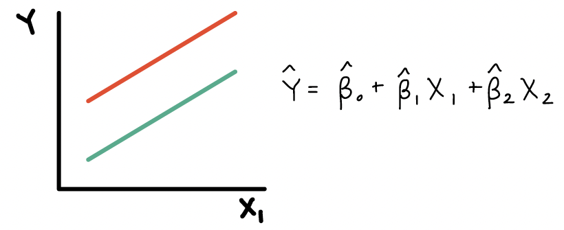
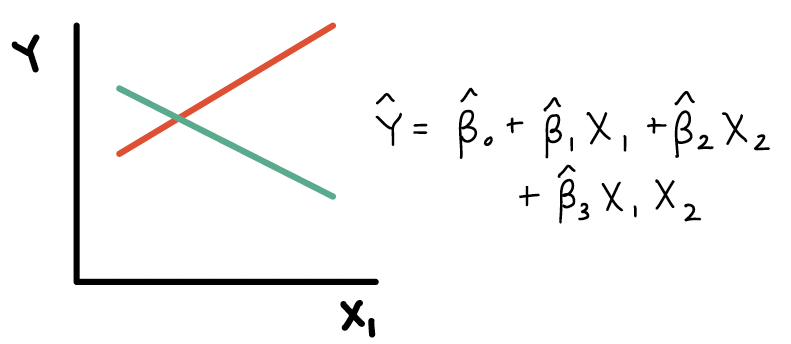
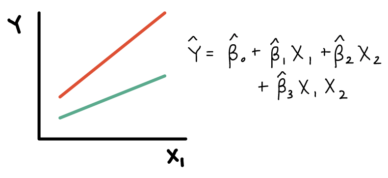
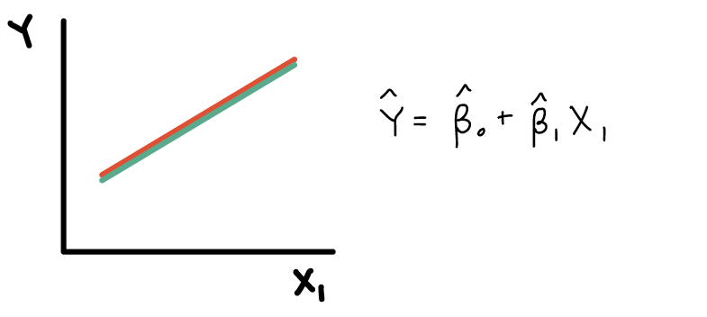

## Muddy Points from Winter 2026

### 1. I'm still a little unclear on the difference between confounders and effect modifiers. Right now, I am imagining confounders as variables that modify the Y-axis intercept while effect modifiers alter slopes, but I don't think this is correct.

This is pretty close! 

The main difference is that confounders are associated with both the exposure and the outcome, but they do not modify the effect of the exposure on the outcome. So like you said, they can shift the Y-axis intercept, but they do not change the slope of the line.

Effect modifiers, on the other hand, do modify the effect of the exposure on the outcome. This means that they can change the slope of the line, and **they can also change the Y-axis intercept**. 

### 2. how to make the models - which variables do we pick and why???

This is a great question! The variables we include in our models depend on our research question, our hypothesis on how they are related, and some statistical tests! We will cover this more in depth when we get to the lesson on Model Selection!

### 3. I had a hard time wrapping my head around the existence of both the "confounder" variable term in conjunction with the interaction term. I understand the interpretation of those coefficients, but in terms of significance, does that mean only the confounder term or the interaction term can be significant? If you have $\widehat{Y} = \widehat\beta_0 + \widehat\beta_1 \cdot X_1 + \widehat\beta_2 \cdot X_2 + \widehat\beta_3 \cdot X_1 \cdot X_2$, is it either $\widehat\beta_2$ is significant or $\widehat\beta_3$ is significant? Because a covariate can never be both a confounder AND an effect modifier, right? It has to only be one?

Nope, we don't really distinguish between confounders and effect modifiers in the above model. So we're not really saying that $\widehat\beta_2$ or $\widehat\beta_3$ are significant. 

If $X_2$ is a **confounder** then we use the following model (calling it Model C) to represent it: $$\widehat{Y} = \widehat\beta_0 + \widehat\beta_1 \cdot X_1 + \widehat\beta_2 \cdot X_2$$

If $X_2$ is an **effect modifier** then we use the following model (calling it Model EM) to represent it: $$\widehat{Y} = \widehat\beta_0 + \widehat\beta_1 \cdot X_1 + \widehat\beta_2 \cdot X_2 + \widehat\beta_3 \cdot X_1 \cdot X_2$$

We cannot go right to testing both coefficients in the interaction model (Model EM) above. We would first test the interaction term ($\widehat\beta_3$) to see if there is evidence of effect modification. If there is no evidence of effect modification, then we would need to run the model (Model C) without the interaction term. In that model, we would then test the confounder term ($\widehat\beta_2$) to see if there is evidence of confounding.

### 4. I'm a little muddy on the steps/approach you should take when identifying effect modifiers vs confounders. Do you just try running the linear model with the interaction and see if it's significant?

See above answer. We'll also talk about this more in depth when we get to the lesson on Model Selection!

## Muddy Points from Winter 2024

### 1. Can we use continuous covariates in an interaction model?

Yes! Here are the four types of interactions we'll discuss:

1.  binary categorical and continuous

2.  multi-level categorical and continuous

3.  binary categorical and multi-level categorical

4.  continuous and continuous

### 2. Synergerism vs. antagonism: how does $\beta_3$ relate to each?

-   Synergerism means the sign of interaction's coefficient ($\beta_3$) matches that of main effect of $X_1$, so the effect of $X_1$ is strengthened as $X_2$ increases

    -   In the case that we're looking at $X_2$ as an effect modifier of $X_1$

    -   It's a little hard to think about this when we've only discussed $X_2$ as a binary covariate, but our "increase" for an indicator is going from 0 to 1.

-   Antagonism means the sign of interaction's coefficient ($\beta_3$) is flipped from that of main effect of $X_1$, so the effect of $X_1$ is weakened as $X_2$ increases

    -   In the case that we're looking at $X_2$ as an effect modifier of $X_1$

    -   It's a little hard to think about this when we've only discussed $X_2$ as a binary covariate, but our "increase" for an indicator is going from 0 to 1

### 3. The red and green lines example. I'm not totally sure why the lines would be parallel if an interaction affects the slope of a line?

The lines should not be parallel if there is an interaction. Let me show the equation for each of those examples:

-   Here is the plot and equation when $X_2$ is a confounder:

    

-   Here is the plot and equation when $X_2$ is an effect modifier:

    

-   Here is the plot and equation when $X_2$ is a effect modifier:

    

-   Here is the plot and equation when $X_2$ should not be in the model:

    

```{r}
#| echo: false

g=3
```
