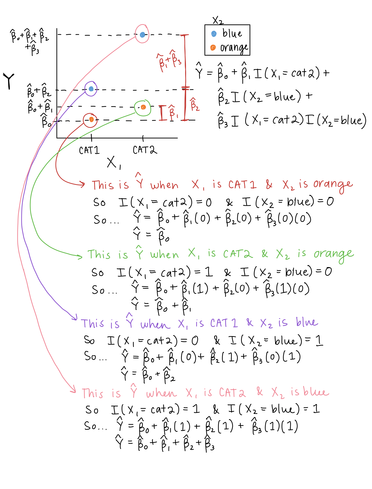

## Muddy Points from Winter 2026

### 1. I'm confused about the difference between confounders and effect modifiers and how to identify them

Confounders are variables that are associated with both the exposure and the outcome and can create a spurious association between them. Confounders are something we need to adjust for in the model with a main effect. For example, if we are interested in the association between $Y$ and $X_1$, and we want to model $X_2$ as a confounder, we would include $X_2$ in the model as a main effect. The model would look like: $$Y = \beta_0 + \beta_1 X_1 + \beta_2 X_2 + \epsilon$$

Effect modifiers, on the other hand, are variables that modify the effect of the exposure on the outcome. We need to model how the effect modifier will **change** the exposure's effect. Thus, we need an interaction term between the exposure and the effect modifier. For example, if we are interested in the association between $Y$ and $X_1$, and we want to model $X_2$ as an effect modifier, we would include an interaction term between $X_1$ and $X_2$ in the model. The model would look like: $$Y = \beta_0 + \beta_1 X_1 + \beta_2 X_2 + \beta_3 X_1 X_2 + \epsilon$$

### 2. The end part of interactions with getting the confidence intervals for the slope and intercept and interpreting them was confusing to me. I don't understand why the intercept wouldn't be $\widehat\beta_0 + 5 \cdot \widehat\beta_2$ based on the formula provided, but when Nicky wrote it out, it was $\widehat\beta_0 + 5 \cdot \widehat\beta_1$

Oops! That's because I wrote it wrong. Will correct on the slides.

### 3. I got a little confused by the visual representation on slide 10

Let's go through some visualization for an interaction between two binary variables $X_1$ and $X_2$:



## Muddy Points from Winter 2024

### 1. Interactions in general

#### 1.1 Why is it not an effect modifier if p-value is 0.4? Or why is it not significant? Is it because it is not = 0?

#### 1.2 What are some reasons why we would think an effect modifier might exist in our data? or are we testing indiscriminately/ based on our own perspective of the associations in the data

#### 1.3 I'm still not entirely sure I know how to do all the steps of interaction models, but I think part of that may just be me needing to look at my previous notes.

### 2. Centering the continuous covariate

#### 2.1 How does centering help with interpretation?

I think [this blog post](https://www.theanalysisfactor.com/when-not-to-center-a-predictor-variable-in-regression/) has a nice explanation.

But for an example from our class... centering female literacy rate can help us interpret the... randomly stopped typing...

#### 2.2 Why do some values of $\beta$ change after centering the mean and others don't?

```{r}
#| echo: false

g=3
```
