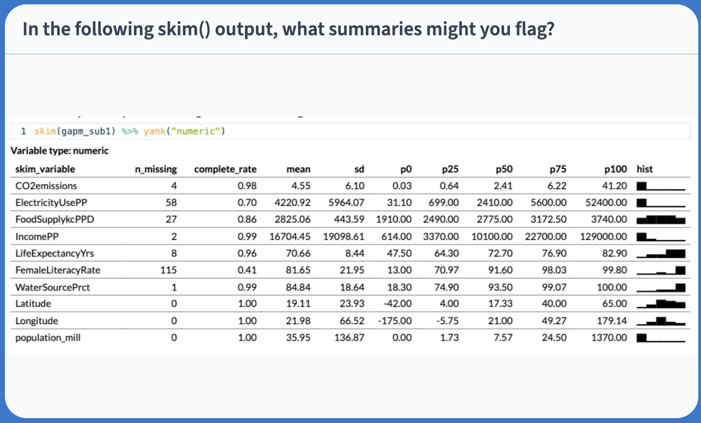
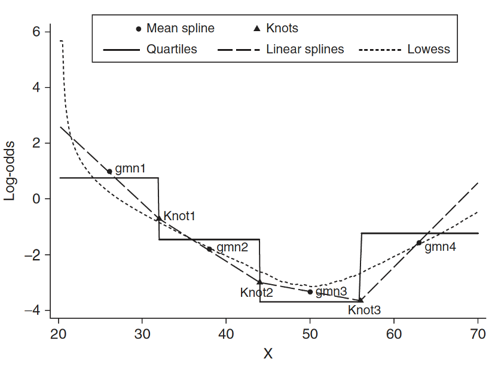

```{r}
#| label: "setup" 
#| include: false
#| message: false
#| warning: false

library(tidyverse)
library(here)
library(janitor)
library(knitr)
library(broom)
library(rstatix)
library(gt)
library(readxl)
library(describedata) # gladder()
library(gridExtra)   # grid.arrange()
library(ggfortify)  # autoplot(model)
# New Day 6
library(gtsummary)
library(plotly) # for plot_ly() command
library(GGally) # for ggpairs() command 
library(ggiraphExtra)   # for ggPredict() command

load(here("data", "gapminder2022.RData"))
gapm = gapm %>%
  mutate(fs_order = case_when(freedom_status == "F" ~ 3,
                                freedom_status == "PF" ~ 2,
                                freedom_status == "NF" ~ 1), 
         freedom_status = fct_relevel(freedom_status, "NF", "PF", "F")) %>%
  mutate(income_level_4 = fct_relevel(income_level_4, 
                                      "Low income", 
                                      "Lower middle income",
                                      "Upper middle income",
                                      "High income")) %>%
  mutate(income_level_2 = case_when(income_level_4 %in% c("Low income", "Lower middle income") ~ "Lower income",
                                      income_level_4 %in% c("Upper middle income", "High income") ~ "Higher income")) %>%
  mutate(income_level_2 = fct_relevel(income_level_2, "Lower income", "Higher income")) %>%
  mutate(CP_c = cell_phones_100 - mean(cell_phones_100, na.rm=T)) %>%
  mutate(co2_emissions = co2_emissions/1000/1000)

mlr1 <- gapm %>% lm(formula = life_exp ~ cell_phones_100 + vax_rate)

gapm2 = gapm %>% select(cell_phones_100, life_exp, vax_rate, freedom_status, income_level_4, basic_sani,  co2_emissions, happiness_score)
```

# Learning Objectives

1.  Understand the overall steps for purposeful selection as a model building strategy

2.  Apply purposeful selection to a dataset using R

3.  Use different approaches to assess the linear scale of continuous variables in linear regression


## Regression analysis process

```{css, echo=FALSE}
.reveal code {
  max-height: 100% !important;
}
```

::: box
{.absolute top="13.5%" right="62.1%" width="155"} {.absolute top="13.5%" right="28.4%" width="155"}{.absolute top="7.5%" right="30.5%" width="820"} {.absolute top="60.5%" right="48%" width="85"}

::: columns
::: {.column width="30%"}
::: RAP1
::: RAP1-title
Model Selection
:::

::: RAP1-cont
-   Building a model

-   Selecting variables

-   Prediction vs interpretation

-   Comparing potential models
:::
:::
:::

::: {.column width="4%"}
:::

::: {.column width="30%"}
::: RAP2
::: RAP2-title
Model Fitting
:::

::: RAP2-cont
-   Find best fit line

-   Using OLS in this class

-   Parameter estimation

-   Categorical covariates

-   Interactions
:::
:::
:::

::: {.column width="4%"}
:::

::: {.column width="30%"}
::: RAP3
::: RAP3-title
Model Evaluation
:::

::: RAP3-cont
-   Evaluation of model fit
-   Testing model assumptions
-   Residuals
-   Transformations
-   Influential points
-   Multicollinearity
:::
:::
:::
:::
:::

::: RAP4
::: RAP4-title
Model Use (Inference)
:::

::: RAP4-cont
::: columns
::: {.column width="50%"}
-   Inference for coefficients
-   Hypothesis testing for coefficients
:::

::: {.column width="50%"}
-   Inference for expected $Y$ given $X$
-   Prediction of new $Y$ given $X$
:::
:::
:::
:::

# Learning Objectives

::: lob
1.  Understand the overall steps for purposeful selection as a model building strategy
:::

2.  Apply purposeful selection to a dataset using R

3.  Use different approaches to assess the linear scale of continuous variables in linear regression

## 

 

 

::: columns
::: {.column width="20%"}
:::

::: {.column width="60%"}
::: qt
["Successful modeling of a complex data set is [**part science**]{style="color:#FF8021;"}, [**part statistical methods**]{style="color:#34AC8B;"}, and [**part experience and common sense**]{style="color:#4FADF3;"}."]{style="font-size:60px;"}
:::

 

::: qt-t
Hosmer, Lemeshow, and Sturdivant Textbook, pg. 101
:::
:::
:::

## Overall Process

0.  Exploratory data analysis

1.  Check unadjusted associations in simple linear regression

2.  Enter all covariates in model that meet some threshold

    -   [One textbook](https://onlinelibrary.wiley.com/doi/book/10.1002/9781118548387) suggest $p<0.2$ or $p<0.25$: great for modest sized datasets
    -   PLEASE keep in mind sample size in your study
    -   Can also use magnitude of association rather than, or along with, p-value

3.  Remove those that no longer reach some threshold

    -   Compare magnitude of associations to unadjusted version (univariable)

4.  Check scaling of continuous and coding of categorical covariates

5.  Check for interactions

6.  Assess model fit

    -   Model assumptions, diagnostics, overall fit

## Process with snappier step names

::: columns
::: {.column width="10%"}
**Pre-step:**

 

**Step 1:**

 

**Step 2:**

 

**Step 3:**

 

**Step 4:**

 

**Step 5:**

 

**Step 6:**
:::

::: {.column width="50%"}
Exploratory data analysis (EDA)

 

Simple linear regressions / analysis

 

Preliminary variable selection

 

Assess change in coefficients

 

Assess scale for continuous variables

 

Check for interactions

 

Assess model fit
:::
:::

# Learning Objectives

1.  Understand the overall steps for purposeful selection as a model building strategy

::: lob
2.  Apply purposeful selection to a dataset using R
:::

3.  Use different approaches to assess the linear scale of continuous variables in linear regression

## Pre-step: Exploratory data analysis

- The following slides are all reference until we get to Step 1
- We have covered exploratory data analysis in other classes and have completed it in our previous labs

## Pre-step: Exploratory data analysis

-   Things we have been doing over the quarter in class and in our project

-   I will not discuss some of the methods mentioned in our lab and data management class

    -   I am only going to introduce additional exploratory functions

 

A few things we can do:

-   Check the data
-   Study your variables
-   Missing data?
-   Explore simple relationships and assumptions

## Pre-step: Exploratory data analysis: Check the data

::: columns
::: {.column width="50%"}
-   Get to know the potential values for the data

    -   Categories

    -   Units

-   Make yourself a [codebook](https://nwakim.github.io/BSTA_512_26W/lessons/gapminder_codebook.html) for reference

-   Then make sure the summary of values makes sense

    -   If minimum or maximum look outside appropriate range
    -   For example: a negative value for a measurement that is inherently positive (like population or income)
:::

::: {.column width="50%"}
[{fig-align="center"}](https://www.gapminder.org/data/documentation/)
:::
:::

## Pre-step: Exploratory data analysis: Check the data

::: columns
::: {.column width="25%"}
-   Look at a summary for the raw data

-   Typical use:

```{r}
#| echo: true
#| output: false
library(skimr)
skim(gapm)
```

-   [Some `skim()` help](https://cran.r-project.org/web/packages/skimr/vignettes/skimr.html)
:::

::: {.column width="1%"}
:::

::: {.column width="74%"}
:::
:::

## Pre-step: Exploratory data analysis: Check the data

::: columns
::: {.column width="25%"}
-   Look at a summary for the raw data

-   Typical use:

```{r}
#| echo: true
#| output: false
library(skimr)
skim(gapm2)
```

-   [Some `skim()` help](https://cran.r-project.org/web/packages/skimr/vignettes/skimr.html)

-   Note that `skim(gapm)` looks different because I had to create factors

-   I am breaking down the `skim()` function into the categorical and continuous variables only because I want to show them on the slides
:::

::: {.column width="1%"}
:::

::: {.column width="74%"}
```{r}
#| echo: true
#| size: small 
skim(gapm2) %>% yank("factor")
```
:::
:::

## Pre-step: Exploratory data analysis: Check the data {.smaller}

```{r}
#| echo: true
#| size: small 
#| skimr_digits: 2

skim(gapm2) %>% yank("numeric")
```

## Poll Everywhere Question 1



## Pre-step: Exploratory data analysis: Study your variables

-   Started this a little bit in previous slide (`skim()`), but you may want to look at things like:

    -   Sample size
    -   Counts of missing data
    -   Means and standard deviations
    -   IQRs
    -   Medians
    -   Minimums and maximums

-   Can also look at visuals

    -   Continuous variables: histograms (in \`skimr() a little)
    -   Categorical variables: frequency plots

## Pre-step: Exploratory data analysis: Study your variables {.smaller}

```{r}
#| echo: true

library(Hmisc)
hist.data.frame(gapm2)
```

## Poll Everywhere Question 2

## Pre-step: Exploratory data analysis: Missing data

-   Why are there missing data?
-   Which variables and observations should be excluded because of missing data?
-   Will I impute missing data?

 

-   Unfortunately, we don’t have time to discuss missing data more thoroughly\
-   I will try to cover this topic more thoroughly in BSTA 513

 

-   For the Gapminder dataset, we chose to use complete cases

## Pre-step / Step 1 : Explore simple relationships and assumptions {.smaller}

```{r}
#| fig-align: center
#| echo: true

gapm2 %>% ggpairs() # gapm2 is a new dataset with some variables selected
```

## Step 1: Simple linear regressions / analysis

-   For each covariate, we want to see how it relates to the outcome (without adjusting for other covariates)

-   We can partially do this with **visualizations**

    -   Helps us see the data we throw it into regression that makes assumptions (like our LINE assumptions)

    -   `ggpairs()` can be a quick way to do it

    -   `ggplot()` can make each plot

        -   `+ geom_boxplot()` to make boxplots by groups for categorical covariates
        -   `+ geom_jitter() + stat_summary()` to make non-overlaping points with group means for categorical covariates
        -   `+ geom_point()` to make scatterplots for continuous covariates

-   We need to run **simple linear regression**

    -   We're calling regression with multi-level categories "simple" even though there are multiple coefficients

## Step 1: Simple linear regressions / analysis

-   Let's think back to our Gapminder dataset

-   Always good to start with our main relationship: life expectancy vs. cell phones

    -   *Throwback to Lesson 3 SLR when we first visualized and ran `lm()` for this relationship*

```{r}
#| echo: true
#| eval: false

model_CP = gapm2 %>% lm(formula = life_exp ~ cell_phones_100)
```

 

::: columns
::: {.column width="45%"}
```{r}
#| fig-height: 8
#| fig-width: 11
#| echo: false

gapm_slr_plot = gapm %>%
  ggplot(aes(x = cell_phones_100,
             y = life_exp)) +
  geom_point(size = 4) +
  geom_smooth(method = "lm", se = FALSE, size = 3, colour="#F14124") +
  labs(x = "Cell phones per 100 people",
       y = "Life expectancy (years)",
       title = "Relationship between life expectancy and cell phones") +
    theme(axis.title = element_text(size = 27), 
        axis.text = element_text(size = 25), 
        title = element_text(size = 25))

gapm_slr_plot
```
:::

::: {.column width="55%"}
```{r}
model_CP = gapm2 %>% lm(formula = life_exp ~ cell_phones_100)
tidy(model_CP) %>% gt() %>% tab_options(table.font.size = 40) %>%
  fmt_number(decimals = 2)
```
:::
:::

## Poll Everywhere Question 3

## Step 1: Simple linear regressions / analysis

-   Let's do this with one other variable before I show you a streamlined version of SLR

```{r}
#| echo: true

model_FS = gapm2 %>% lm(formula = life_exp ~ freedom_status)
```

::: columns
::: {.column width="45%"}
```{r fig.height=7, fig.width=7, warning=F, fig.align='center'}
#| echo: true
#| code-fold: true
ggplot(gapm, aes(x = freedom_status, y = life_exp)) +
  geom_jitter(size = 1, alpha = .6, width = 0.2) +
  stat_summary(fun = mean, geom = "point", size = 8, shape = 18) +
  labs(x = "Freedom status", 
       y = "Country life expectancy (years)",
       title = "Life expectancy vs. Freedom status",
       caption = "Diamonds = FS averages") +
  theme(axis.title = element_text(size = 20), 
        axis.text = element_text(size = 20), 
        title = element_text(size = 20))
```
:::

::: {.column width="55%"}
```{r}
#| echo: true

anova(model_FS) %>% tidy() %>% gt() %>%
   tab_options(table.font.size = 40) %>%
   fmt_number(decimals = 2)

```

 

-   Recall from Lesson 5 (and Lesson 10):

    -   `anova()` with one model name will compare the model (`model_FS`) to the intercept model
:::
:::

## Step 1: Simple linear regressions / analysis

-   If we do a good job visualizing the relationship between our outcome and each covariate, then we can proceed to a streamlined version of the F-test for each relationship
-   Run `add1()` to add each variable one at a time and separately
- Output will include hypothesis test (using F-test) if coefficient(s) is 0 or not
  - Null: intercept model
  - Alternative: model with single variable
  
## Step 1: Simple linear regressions / analysis

- Output from `add1()`

```{r}
#| echo: true

intercept_model = gapm2 %>% lm(formula = life_exp ~ 1)
add1(intercept_model, 
     scope = ~ cell_phones_100 + freedom_status + income_level_4 + basic_sani + 
       vax_rate + co2_emissions + happiness_score, 
     test = "F")
```

## Step 2: Preliminary variable selection

-   Identify candidates for your first multivariable model by performing an F-test on each covariate's SLR

    -   Using p-values from previous slide
    -   If the p-value of the test is less than 0.25, then consider the variable a candidate

 

-   Candidates for first multivariable model

    -   All clinically important variables (regardless of p-value)
    -   Variables with univariate test with p-value \< 0.25

 

-   With more experience, you won’t need to rely on these strict rules as much

## Step 2: Preliminary variable selection

-   From the previous p-values from the F-test on each covariate's SLR

    -   Decision: we keep all the covariates since they all have a p-value \< 0.25

```{r}
#| echo: true

add1(intercept_model, 
     scope = ~ cell_phones_100 + freedom_status + income_level_4 + basic_sani + vax_rate + co2_emissions + happiness_score, 
     test = "F")
```

## Step 2: Preliminary variable selection

-   Fit an **initial model** including any independent variable with p-value \< 0.25 and clinically important variables


```{r}
#| echo: true
#| output-location: column

init_model = gapm2 %>% 
  lm(formula = 
       life_exp ~ cell_phones_100 + 
       freedom_status + 
       income_level_4 + 
       basic_sani + 
       vax_rate + 
       co2_emissions + 
       happiness_score)
tbl_regression(
  init_model, 
  label = list(
    cell_phones_100 ~ "Cell phones per 100 people",
    freedom_status ~ "Freedom status",
    income_level_4 ~ "Income level",
    basic_sani ~ "Basic sanitation (%)",
    vax_rate ~ "Vaccination rate (%)",
    co2_emissions ~ "CO2 emissions",
    happiness_score ~ "Happiness score"
    )) %>% 
  as_gt() %>% tab_options(table.font.size = 26) 
```


## Step 3: Assess change in coefficient

-  We have our initial model with all the covariates that we want to consider
    -  We want to see if we can remove any of the covariates without changing the coefficient of our main explanatory variable (cell phones) by more than 10%

 

-   One variable at a time, we run the multivariable model with and without a variable

    -   We look at the p-value of the F-test for the coefficients of said variable
    -   We look at the percent change for the coefficient ($\Delta\%$) of our **explanatory variable** (CP in our example)

 

-   General rule: We can remove a variable if...

    -   p-value \> 0.05 for the F-test of its own coefficients
    -   AND change in coefficient ($\Delta\%$) of our explanatory variable is \< 10%

## Step 3: F-test on dropping each covariate

- Function `drop1()`: If we put in our initial model, the function will remove each covariate and perform the respective F-test to test if the coefficients are 0 (null) or not (alternative).
```{r}
#| echo: true

drop1(init_model, test="F")
```

## Step 3: F-test on dropping each covariate

Let's consider an example of a hypothesis test from `drop1()` for `income_level_4`

::: columns
::: {.column width="40%"}
::: proof1
::: proof-title
Null $H_0$
:::

::: proof-cont
$\beta_8= \beta_9 = \beta_{10}=0$
:::
:::
:::

::: {.column width="60%"}
::: definition
::: def-title
Alternative $H_1$
:::

::: def-cont
$\beta_8\neq0$ and/or $\beta_9\neq0$ and/or $\beta_{10}\neq0$
:::
:::
:::
:::

::: columns

::: {.column width="40%"}
::: proof1
::: proof-title
Null / Smaller / Reduced model
:::

::: proof-cont
$$\begin{aligned}
LE = & \beta_0 + \beta_1 \text{CP} + \beta_2 I(\text{FS} = \text{PF}) + \\
& \beta_3 I(\text{FS} = \text{F}) + \beta_4 \text{BS} + \beta_5 \text{VR} + \\
& \beta_6 \text{CO2} + \beta_7 \text{HS} + \epsilon \end{aligned}$$
:::
:::
:::

::: {.column width="60%"}
::: definition
::: def-title
Alternative / Larger / Full model
:::

::: def-cont
$$\begin{aligned}
LE = & \beta_0 + \beta_1 \text{CP} + \beta_2 I(\text{FS} = \text{PF}) + \\
& \beta_3 I(\text{FS} = \text{F}) + \beta_4 \text{BS} + \beta_5 \text{VR} + \\
& \beta_6 \text{CO2} + \beta_7 \text{HS} + \beta_8 I(\text{IL} = \text{lower middle}) + \\
& \beta_9 I(\text{IL} = \text{upper middle}) + \beta_{10} I(\text{IL} = \text{upper}) + \epsilon \end{aligned}$$
:::
:::
:::

:::

-   From the output of `drop1()`, we can see that the p-value for dropping `income_level_4` is 0.006, which is < 0.05, so there is sufficient evidence that the coefficients are not 0

## Step 3: Testing for percent change ( $\Delta\%$) in a coefficient

-   Our F-test in `drop1()` concluded that we should drop a variable (e.g. freedom status)
    - We then need to check if the change in coefficient for the main variable is less than 10% or not

-   Generic form: If we are only considering $X_1$ and $X_2$, then we need to run the following two models:

    -   Fitted model 1 / reduced model (`mod1`): $\widehat{Y} = \widehat\beta_0 + \widehat\beta_1X_1$

        -   We call the above $\widehat\beta_1$ the reduced model coefficient: $\widehat\beta_{1, \text{mod1}}$ or $\widehat\beta_{1, \text{red}}$

    -   Fitted model 2 / Full model (`mod2`): $\widehat{Y} = \widehat\beta_0 + \widehat\beta_1X_1 +\widehat\beta_2X_2$

        -   We call this $\widehat\beta_1$ the full model coefficient: $\widehat\beta_{1, \text{mod2}}$ or $\widehat\beta_{1, \text{full}}$

::: columns
::: {.column width="15%"}
:::

::: {.column width="70%"}
::: fact
::: fact-title
Calculation for % change in coefficient
:::

::: fact-cont
$$
\Delta\% = 100\% \cdot\frac{\lvert \widehat\beta_{1, \text{mod1}} - \widehat\beta_{1, \text{mod2}} \rvert }{\widehat\beta_{1, \text{mod2}}} = 100\% \cdot \frac{\lvert \widehat\beta_{1, \text{red}} - \widehat\beta_{1, \text{full}} \rvert }{\widehat\beta_{1, \text{full}}}
$$
:::
:::
:::

::: {.column width="15%"}
:::
:::


## Step 3: Assess change in coefficient

-   Let's try this out on freedom status

```{r}
#| echo: true
#| code-fold: true
#| code-summary: "Display the ANOVA table with F-statistic and p-value"

model_full = init_model
model_red = gapm2 %>% lm(formula = life_exp ~ cell_phones_100 + basic_sani + vax_rate + co2_emissions + happiness_score + income_level_4)
anova(model_full, model_red) %>% tidy() %>% 
  gt() %>% tab_options(table.font.size = 35) %>% fmt_number(decimals = 3)
```

```{r}
#| echo: true
#| code-fold: true
#| code-summary: "Display the CP coefficient for both models"
#| include: false

tidy(model_full) %>% 
  gt() %>% tab_options(table.font.size = 35) %>% fmt_number(decimals = 3)
tidy(model_red) %>% 
  gt() %>% tab_options(table.font.size = 35) %>% fmt_number(decimals = 3)
```

-   $\widehat\beta_{CP, full} = `r round(tidy(model_full)[2,2], 4)`$, $\widehat\beta_{CP, red} = `r round(tidy(model_red)[2,2], 4)`$

$$
\Delta\% = 100\% \cdot \frac{\lvert \widehat\beta_{CP, full} - \widehat\beta_{CP, red} \rvert}{\widehat\beta_{CP, full}} = 100\% \cdot \frac{\lvert `r round(tidy(model_full)[2,2], 4)` - `r round(tidy(model_red)[2,2], 4)`\rvert}{`r round(tidy(model_full)[2,2], 4)`} = `r abs(round(100*(tidy(model_full)[2,2] - tidy(model_red)[2,2])/tidy(model_full)[2,2], 2))`\%
$$

-   Based off the percent change, I would keep this in the model

## Step 3: Assess change in coefficient (Reference only)

-   Let's try this out on vaccination rate

```{r}
#| echo: true
#| code-fold: true
#| code-summary: "Display the ANOVA table with F-statistic and p-value"

model_full = init_model
model_red = gapm2 %>% lm(formula = life_exp ~ cell_phones_100 + freedom_status + income_level_4 +
                 basic_sani + co2_emissions + happiness_score)
anova(model_full, model_red) %>% tidy() %>% 
  gt() %>% tab_options(table.font.size = 35) %>% fmt_number(decimals = 3)
```

```{r}
#| echo: true
#| code-fold: true
#| code-summary: "Display the CP coefficient for both models"
#| include: false

tidy(model_full) %>% 
  gt() %>% tab_options(table.font.size = 35) %>% fmt_number(decimals = 3)
tidy(model_red) %>% 
  gt() %>% tab_options(table.font.size = 35) %>% fmt_number(decimals = 3)
```

-   $\widehat\beta_{CP, full} = `r round(tidy(model_full)[2,2], 4)`$, $\widehat\beta_{CP, red} = `r round(tidy(model_red)[2,2], 4)`$

$$
\Delta\% = 100\% \cdot \frac{\lvert \widehat\beta_{CP, full} - \widehat\beta_{CP, red} \rvert}{\widehat\beta_{CP, full}} = 100\% \cdot \frac{\lvert `r round(tidy(model_full)[2,2], 4)` - `r round(tidy(model_red)[2,2], 4)`\rvert}{`r round(tidy(model_full)[2,2], 4)`} = `r abs(round(100*(tidy(model_full)[2,2] - tidy(model_red)[2,2])/tidy(model_full)[2,2], 2))`\%
$$

-   Based off the percent change, I would keep this in the model

## Step 3: Assess change in coefficient (Reference only)

-   Let's try this out on CO2 emissions

```{r}
#| echo: true
#| code-fold: true
#| code-summary: "Display the ANOVA table with F-statistic and p-value"

model_full = init_model
model_red = gapm2 %>% lm(formula = life_exp ~ cell_phones_100 + freedom_status + income_level_4 +
                 basic_sani + vax_rate + happiness_score)
anova(model_full, model_red) %>% tidy() %>% 
  gt() %>% tab_options(table.font.size = 35) %>% fmt_number(decimals = 3)
```

```{r}
#| echo: true
#| code-fold: true
#| code-summary: "Display the CP coefficient for both models"
#| include: false

tidy(model_full) %>% 
  gt() %>% tab_options(table.font.size = 35) %>% fmt_number(decimals = 3)
tidy(model_red) %>% 
  gt() %>% tab_options(table.font.size = 35) %>% fmt_number(decimals = 3)
```

-   $\widehat\beta_{CP, full} = `r round(tidy(model_full)[2,2], 4)`$, $\widehat\beta_{CP, red} = `r round(tidy(model_red)[2,2], 4)`$

$$
\Delta\% = 100\% \cdot \frac{\lvert \widehat\beta_{CP, full} - \widehat\beta_{CP, red} \rvert}{\widehat\beta_{CP, full}} = 100\% \cdot \frac{\lvert `r round(tidy(model_full)[2,2], 4)` - `r round(tidy(model_red)[2,2], 4)`\rvert}{`r round(tidy(model_full)[2,2], 4)`} = `r abs(round(100*(tidy(model_full)[2,2] - tidy(model_red)[2,2])/tidy(model_full)[2,2], 2))`\%
$$

-   Based off the percent change, I would remove CO2 emissions from the model

## Poll Everywhere Question 4

## Step 3: Assess change in coefficient: Summary

-   At the end of this step, we have a **preliminary main effects model**

-   Where the variables are excluded that met the following criteria:

    -   P-value \> 0.05 for the F-test of its own coefficients
    -   Change in coefficient ($\Delta\%$) of our explanatory variable is \< 10%

-   In our example, the **preliminary main effects model** (end of Step 3) has one less variable than the **initial model** (end of Step 2)

-   Preliminary main effects model includes:

    -   `cell_phones_100`
    -   `freedom_status`
    -   `income_level_4`
    -   `basic_sani`
    -   `vax_rate`
    -   `happiness_score`
    
    
## Recap of Steps 1-3

-   Pre-step: Exploratory data analysis

-   Step 1: Simple linear regressions / analysis

    -   Look at each covariate with outcome

    -   Perform SLR for each covariate

-   Step 2: Preliminary variable selection

    -   From SLR, decide which variables go into the initial model

    -   Use F-test to see if each covariate (on its own) explains enough variation in outcome

    -   End with **initial model**
        
-   Step 3: Assess change in coefficients

    -   From the initial model at end of step 2, we take a variable out of the model if:

        -   P-value \> 0.05 for the F-test of its own coefficients

        -   Change in coefficient ($\Delta\%$) of our explanatory variable is \< 10%
        
    -   End with **preliminary main effects model**

# Learning Objectives

1.  Understand the overall steps for purposeful selection as a model building strategy

2.  Apply purposeful selection to a dataset using R

::: lob
3.  Use different approaches to assess the linear scale of continuous variables in linear regression
:::

## Step 4: Assess scale for continuous variables

-   We assume the linear regression model is linear for **each continuous variable**

-   We need to assess linearity for continuous variables in the model

    -   Do this through smoothed scatterplots that we introduced in Lesson 6 (SLR Diagnostics)
    -   Residual plots (can be used in SLR) does not help us in MLR
    -   Each term in MLR model needs to have linearity with outcome

-   Three methods/approaches to address the violation of linearity assumption:

    -   **Approach 1:** Categorize continuous variable
    -   **Approach 2:** Transformation of variable
    -   **Approach 3:** Spline functions
    
-   Approach will depend on the covariate!!

-   For our class, only implement **Approach 1 or 2**

-   Model at the end of Step 4 is the **main effects model**

## Step 4: Assess scale for continuous variables {visibility="hidden"}

```{r}
#| echo: true
#| code-fold: true
#| code-summary: "Residual plot does not help us with linearity in MLR"
#| fig-width: 10
#| fig-height: 6
#| fig-align: center

library(ggfortify)
autoplot(model_full) + theme(text=element_text(size=14))
```

## Step 4: Assess scale for continuous variables: Smoothed scatterplots

-   Smoother scatterplots **only check linearity**, not addressing linearity issues

 

-   Can also identify extreme observations

    -   Again, just want to flag these values 

    -   Can influence the assessment of linearity when using fractional polynomials or spline functions

 

-   Helps us decide if the continuous variable can stay **as is** in the model

    -   **Problem:** if not linear, then we need to represent the variable in a new way (Approaches 1-3)

## Step 4: Assess scale for continuous variables: Smoothed scatterplots

-   In Gapminder dataset, we have 5 continuous variables:

    -   Cell phones
    -   Basic sanitation
    -   Vaccination rate
    -   CO2 emissions
    -   Happiness score

-   Plot each of these agains the outcome, life expectancy

## Step 4: Assess scale for continuous variables: Smoothed scatterplots

```{r, fig.height=6, fig.width=11, fig.align='center'}
#| echo: true
#| code-fold: true
#| code-summary: "We can quickly look at ggpairs() to identify variables"

gapm2 %>% select(where(is.numeric)) %>% 
  relocate(life_exp, .after = last_col()) %>% ggpairs()
```

## Step 4: Assess scale for continuous variables: Smoothed scatterplots

```{r}
#| echo: true
#| code-fold: true
#| code-summary: "Take a look at happiness score, vaccination rate, and basic sanitation"
#| fig-width: 10
#| fig-height: 3.5
#| fig-align: center

HS = ggplot(data = gapm2, aes(y = life_exp, x = happiness_score)) + 
  geom_point() +
  geom_smooth(se=F) + labs(x = "Happiness Score", y = "Life Expectancy (yrs)")

VR = ggplot(data = gapm2, aes(y = life_exp, x = vax_rate)) + 
  geom_point() +
  geom_smooth(se=F) + labs(x = "Vaccination rate (%)", y = "Life Expectancy (yrs)")

BS = ggplot(data = gapm2, aes(y = life_exp, x = basic_sani)) + 
  geom_point() +
  geom_smooth(se=F) + labs(x = "Basic sanitation (%)", y = "Life Expectancy (yrs)")

grid.arrange(HS, VR, BS, nrow=1)
```

-   Happiness score looks pretty linear, vaccination rate looks admissible
- Basic sanitation looks non-linear

## Step 4: Assess scale for continuous variables

-   Three methods/approaches to address the violation of linearity assumption:

     

    -   **Approach 1:** Categorize continuous variable

     

    -   **Approach 2:** Transformation of variable
    
     

    -   **Approach 3:** Spline functions
    


## Step 4: Approach 1: Categorize continuous variable

-   Categorize continuous variables

    -   Percentiles, quartiles, quantiles
    
        -   Create indicator variables corresponding to each quartile
        
    -   Meaningful thresholds
    
        -   Example: [income level groups](https://www.gapminder.org/fw/income-levels/) discussed by Gapminder
        
-   Disadvantages:

    -   Takes some time to create new variables, especially with multiple continuous covariates

    -   Start with quartiles, but might be more appropriate to use different splits

        -   No set rules on this

-   Advantage: graphical and visually helps

## Step 4: Approach 1: Categorize continuous variable

::: columns
::: column
-   For income, I would use [Gapminder's income level groups](https://www.gapminder.org/fw/income-levels/) 

    -   Discussed in Lesson 10 Categorical Covariates (slide 43)

 

-   Experts in the field have developed these income groups

    -   I think this is best solution for income (that was not meeting linearity as a continuous variable)
:::

::: column
```{r fig.height=9, fig.width=8, warning=F, fig.align='center'}
#| echo: false
level_order <- c("Low income", "Lower middle income", 
                 "Upper middle income", "High income") 
ggplot(gapm2, aes(x = income_level_4, y = life_exp)) +
  geom_jitter(size = 1, alpha = .6, width = 0.2) +
  stat_summary(fun = mean, geom = "point", size = 8, shape = 18) +
  labs(x = "Income levels", 
       y = "Life expectancy (years)",
       title = "Life expectancy vs. income levels",
       caption = "Diamonds = Income level averages") +
  theme(axis.title = element_text(size = 20), 
        axis.text = element_text(size = 20), 
        title = element_text(size = 20)) +
  scale_x_discrete(labels = function(x) str_wrap(x, width = 10))
```
:::
:::

## Step 4: Approach 1: Categorize continuous variable

::: columns
::: {.column width="40%"} 
-   Let's still try it out with basic sanitation

-   I have plotted the quartile lines of basic sanitation with red lines
:::

::: {.column width="60%"} 
```{r}
#| echo: true
#| code-fold: true
#| code-summary: "Take a look at the quartiles within the scatterplot"
#| fig-width: 12
#| fig-height: 8
#| fig-align: center

vline_coordinates= data.frame(Quantile_Name=names(quantile(gapm2$basic_sani)),
                          quantile_values=as.numeric(quantile(gapm2$basic_sani)))

ggplot(data = gapm2, aes(y = life_exp, x = basic_sani)) + 
  geom_point(size = 3) +
  #geom_smooth(se=F) + 
  labs(x = "Basic sanitation (%)", y = "Life Expectancy (yrs)") +
  geom_vline(data = vline_coordinates, aes(xintercept = quantile_values), 
             color = "red", linetype = "dashed", size = 2) +
    theme(axis.title = element_text(size = 25), 
        axis.text = element_text(size = 25), 
        title = element_text(size = 25))
  
```

```{r}
#| echo: false
#| eval: false
#| 
vline_coordinates= data.frame(Quantile_Name=names(quantile(gapm2$basic_sani)),
                          quantile_values=as.numeric(quantile(gapm2$basic_sani)))

basic_sani = ggplot(data = gapm2, aes(y = life_exp, x = basic_sani)) +
  geom_point(size = 1) +
  #geom_smooth(se=F) +
  labs(x = "Income (GDP per capita)", y = "Life Expectancy (yrs)")  +
  geom_vline(data = vline_coordinates, aes(xintercept = quantile_values),
             color = "red", linetype = "dashed", size = .9)

grid.arrange(CO2, basic_sani, nrow=1)
```
:::

:::

## Step 4: Approach 1: Categorize continuous variable

-   Let's make the quartiles for basic sanitation:

```{r}
#| echo: true
library(dvmisc)
gapm2 = gapm2 %>% 
  mutate(BS_q = quant_groups(basic_sani, groups = 4) %>% factor())
```

```{r}
#| echo: true
#| code-fold: true
#| code-summary: "Take a look at the quartile means within the scatterplot"
#| fig-width: 12
#| fig-height: 8
#| fig-align: center


ggplot(data = gapm2, aes(y = life_exp, x = BS_q)) + 
  # geom_point(size = 3, aes(y = life_exp, x = co2_emissions)) +
  stat_summary(fun = mean, geom = "point", size = 8, shape = 18) +
  labs(x = "Basic sanitation (%)", y = "Life Expectancy (yrs)") +
    theme(axis.title = element_text(size = 25), 
        axis.text = element_text(size = 25), 
        title = element_text(size = 25))
```

## Step 4: Approach 1: Categorize continuous variable

::: columns
::: {.column width="45%"}

 

-   Let's fit a new model with new representation for basic sanitation

 

-   Remember, this is the **main effects model** if we decide to make basic sanitation into quartiles

```{r}
main_eff_model = gapm2 %>% lm(formula = life_exp ~ cell_phones_100 + BS_q + freedom_status + income_level_4 + vax_rate + happiness_score)
```
:::

::: {.column width="55%"}
```{r}
tbl_regression(
  main_eff_model, 
  label = list(
    cell_phones_100 ~ "Cell phones per 100 people", 
    BS_q ~ "Basic sanitation (%)",
    freedom_status ~ "Freedom status",
    income_level_4 ~ "Income level",
    vax_rate ~ "Vaccination rate (%)",
    happiness_score ~ "Happiness score"
    )) %>% 
  as_gt() %>% 
  tab_options(table.font.size = 22) 
```
:::
:::

## Step 4: Approach 2: Transformation of variable

-   Main concepts and transformations presented in Lesson 7 SLR: Model Evaluation and Diagnostics (slide 33 on)

-   Idea: test many transformations of a continuous covariate

    -   [Based on Royston and Altman, Applied Statistics, 1994](https://www.jstor.org/stable/2986270)

 

-   Recall Tukey's transformation (power) ladder

    -   And can use `R`'s `gladder()` to see the transformations

| Power p | -3              | -2              | -1            | -1/2                 | 0         | 1/2        | 1   | 2     | 3     |
|--------|--------|--------|--------|--------|--------|--------|--------|--------|--------|
|         | $\frac{1}{x^3}$ | $\frac{1}{x^2}$ | $\frac{1}{x}$ | $\frac{1}{\sqrt{x}}$ | $\log(x)$ | $\sqrt{x}$ | $x$ | $x^2$ | $x^3$ |

 

-   We can run through each and test different models, or use the approach from Lesson 7

-   There is also a package we can use!

    -   [mfp package in R](https://cran.r-project.org/web/packages/mfp/mfp.pdf) contains the fp() function

## Step 4: Approach 2: Transformation of variable

```{r}
#| echo: true

library(mfp)

model_fp_BS = mfp(life_exp ~ cell_phones_100 + freedom_status + income_level_4 + 
                     vax_rate + happiness_score + fp(basic_sani, df = 4),
               data = gapm2, family = "gaussian")

model_fp_BS$fptable %>% gt(rownames_to_stub = T) %>% tab_options(table.font.size = 24)
```

## Step 4: Approach 2: Transformation of variable

::: columns
::: column
```{r}
#| echo: false

model_fp_BS$fptable %>% gt(rownames_to_stub = T) %>% tab_options(table.font.size = 24)
```
:::

::: column 

-   Conclusion from fractional polynomial is that basic sanitation needs to be transformed
    - Use square root transformation for basic sanitation

- `fp()` does NOT test for linearity assumption, just tells you best fit
    - Sometimes, it will conclude that something does NOT need to be transformed
    - A little counter-intuitive from what we saw in plots
:::

:::

## Step 4: Approach 3: Spline functions

-   Spline function is to fit a series of smooth curves that joined at specific points (called knots)

::: columns
::: column 
{fig-align="center"}
:::

::: column 
```{r}
#| fig-width: 7
#| fig-height: 6
BS + theme(axis.title = element_text(size = 25), 
        axis.text = element_text(size = 25), 
        title = element_text(size = 25)) + 
  geom_vline(xintercept = c(50), color = "red", linetype = "dashed", size = 2)
```
:::
:::

## Step 4: Approach 3: Spline functions

-   Need to specify knots for spline functions

    -   More knots are flexible, but requires more parameters to estimate
    -   In most applications three to five knots are sufficient

 

-   Within our class, fractional polynomials will be sufficient (more in Longitudinal Data Analysis)

 

-   If you think this is cool, I highly suggest you look into Functional Data Analysis (FDA) or Functional Regression

    -   Jeffrey Morris is a big name in that field

 

-   In R there are a few options to incorporate splines

    -   `pspline( )`: [More information](https://cran.r-project.org/web/packages/survival/vignettes/splines.pdf) 

    -   `smoothHR()`: [More information](https://www.ncbi.nlm.nih.gov/pmc/articles/PMC3876718/) 

## Step 4 Conclusion: main effects model

::: columns
::: {.column width="50%"}
-   We concluded that we will use:

    -   Income levels (categorical) that Gapminder created
    -   Quartiles for basic sanitation

::: definition
::: def-title
Note
:::
::: def-cont
This is also a good step to decide if you would like to score a categorical variable (Lesson 5)
:::
:::

- Question: Do you see any visual issues with my regression table?
:::

::: {.column width="50%"}
```{r}
tbl_regression(
  main_eff_model, 
  label = list(
    cell_phones_100 ~ "Cell phones per 100 people", 
    BS_q ~ "Basic sanitation (%)",
    freedom_status ~ "Freedom status",
    income_level_4 ~ "Income level",
    vax_rate ~ "Vaccination rate (%)",
    happiness_score ~ "Happiness score"
    )) %>% 
  as_gt() %>% 
  tab_options(table.font.size = 24) 
```
:::
:::


# Learning Objectives

1.  Understand the overall steps for purposeful selection as a model building strategy

::: lob
2.  Apply purposeful selection to a dataset using R
:::

3.  Use different approaches to assess the linear scale of continuous variables in linear regression

## Step 5: Check for interactions

-   Create a list of interaction terms from variables in the "main effects model" that has clinical plausibility

 

-   Add the interaction variables, one at a time, to the main effects model, and assess the significance using a F-test

    -   May keep interaction terms with p-value \< 0.10 (or 0.05)

 

-   Keep the main effects untouched, only simplify the interaction terms

 

-   Use methods from Step 2 (comparing model with no interactions to a larger model with 1 interaction) to determine which interactions to keep

 

-   The model by the end of Step 5 is called the **preliminary final model**

## Step 5: Check for interactions

-   We test with $\alpha = 0.10$

-   Follow the F-test procedure in [Lesson 10 (MLR: Using the F-test)](.\lessons\10_MLR_F-test\10_MLR_F-test.qmd)

    -   This means we need to follow the 7 steps of the general F-test in previous slide (taken from Lesson 10)

-   Use the hypothesis tests for the specific variable combo:

::: columns
::: column
::: fact
::: fact-title
Binary & continuous variable (Lesson 11, LOB 2)
:::

::: fact-cont
Testing a single coefficient for the interaction term using F-test comparing full model to reduced model
:::
:::
:::

::: column
::: definition
::: def-title
Multi-level & continuous variables (Lesson 11, LOB 3)
:::

::: def-cont
Testing group of coefficients for the interaction terms using F-test comparing full to reduced model
:::
:::
:::
:::

::: columns
::: column
::: proposition
::: prop-title
Binary & multi-level variable (Lesson 12, LOB 4)
:::

::: prop-cont
Testing group of coefficients for the interaction terms using F-test comparing full to reduced model
:::
:::
:::

::: column
::: proof1
::: proof-title
Two continuous variables (Lesson 12, LOB 5)
:::

::: proof-cont
Testing a single coefficient for the interaction term using F-test comparing full to reduced model
:::
:::
:::
:::

## Poll Everywhere Questions 5-7

## Poll Everywhere Questions 5-7

## Poll Everywhere Questions 5-7

## Step 5: Check for interactions

- Use `add1()` function to compare a full model (interactions with CP) and reduced model (main effects model)

```{r}
#| echo: true

add1(main_eff_model, scope = ~ cell_phones_100 * . ,  test = "F")
```

-   No significant interactions with cell phones per 100 people (p-value > 0.1), so we would not include any interactions with that variable
    
-   **Think about it:** does that track with what we saw in our interactions lecture?

## Step 5: Example test in `add1()` for `income_level_4` {.smaller}

::: columns
::: {.column width="40%"}
::: proof1
::: proof-title
Null $H_0$
:::

::: proof-cont
$\beta_8= \beta_9 = \beta_{10}=0$
:::
:::
:::

::: {.column width="60%"}
::: definition
::: def-title
Alternative $H_1$
:::

::: def-cont
$\beta_{10}\neq0$ and/or $\beta_{11}\neq0$ and/or $\beta_{12}\neq0$
:::
:::
:::
:::

::: columns

::: {.column width="40%"}
::: proof1
::: proof-title
Null / Smaller / Reduced model
:::

::: proof-cont
$$\begin{aligned}
LE = & \beta_0 + \beta_1 \text{CP} + \beta_2 I(\text{FS} = \text{PF}) + \\
& \beta_3 I(\text{FS} = \text{F}) + \beta_4 \text{BS} + \beta_5 \text{VR} + \\
& \beta_6 \text{HS} + \beta_7 I(\text{IL} = \text{lower middle}) + \\
& \beta_8 I(\text{IL} = \text{upper middle}) + \\
& \beta_{9} I(\text{IL} = \text{upper}) + \epsilon
\end{aligned}$$
:::
:::
:::

::: {.column width="60%"}
::: definition
::: def-title
Alternative / Larger / Full model
:::

::: def-cont
$$\begin{aligned}
LE = & \beta_0 + \beta_1 \text{CP} + \beta_2 I(\text{FS} = \text{PF}) + \beta_3 I(\text{FS} = \text{F}) + \\
& \beta_4 \text{BS} + \beta_5 \text{VR} + \beta_6 \text{HS} + \beta_7 I(\text{IL} = \text{lower middle}) + \\
& \beta_8 I(\text{IL} = \text{upper middle}) + \beta_{9} I(\text{IL} = \text{upper}) + \\
& \beta_{10} \text{CP} \cdot I(\text{IL} = \text{lower middle}) + \\
& \beta_{11} \text{CP} \cdot I(\text{IL} = \text{upper middle}) + \\
& \beta_{12} \text{CP} \cdot I(\text{IL} = \text{upper}) + \epsilon
\end{aligned}$$
:::
:::
:::

:::

-   From the output of `add1()`, we can see that the p-value for dropping `income_level_4` is 0.165, which is > 0.1, so we do not reject the null, aka no interaction

## Step 6: Assess model fit

-   Assess the adequacy of the model (diagnostics) and check its fit

 

-   Methods for diagnostics will be discussed next class

    -   Combination of diagnostics and model fit statistics!
    
    -   Looked at model fit statistics in last lesson
    
    -   Look at diagnostics in Lesson 15: MLR Diagnostics

 

-   If the model is adequate and fits well, then it is the **Final model**

## Step 6: Assess model fit

```{r}
final_model = main_eff_model
prelim_me_model = model_full
save(final_model, prelim_me_model, gapm2, 
     file = here("./lessons/15_MLR_Diagnostics/final_mod.rda"))
```

-   Our **final model** contains

    -   Cell phones per 100 people
    -  Basic sanitation (quartiles)
    -   Freedom status
    -   Income level
    -   Vaccination rate
    -   Happiness score
    
## Step 6: Assess model fit: Model fit statistics

-   Way I did it in the lab instructions (and last class)
```{r}
#| echo: true

sum_fm = summary(final_model)
model_fit_stats = data.frame(Model = "Final model", 
                             Adjusted_R_sq = sum_fm$adj.r.squared, 
                             AIC = AIC(final_model), BIC = BIC(final_model))

model_fit_stats %>% gt() %>% 
  tab_options(table.font.size = 35) %>% fmt_number(decimals = 3)
```

-   Another (maybe faster?) way to do it (`glance()` in `broom` package)

```{r}
#| echo: true
glance(final_model) %>% mutate(Model = "Final model") %>%
  select(Model, adj.r.squared, AIC, BIC) %>% gt() %>% 
  tab_options(table.font.size = 35) %>% fmt_number(decimals = 3)
```


## Step 6: Assess model fit: Comparing model fits

-   Remember the preliminary main effects model (at end of Step 3): same as final model but basic sanitation was not categorized

-   We can compare model fit statistics of the preliminary main effects model and the final model

```{r}
#| echo: true
fm_glance = glance(final_model) %>% mutate(Model = "Final model") %>%
  select(Model, `Adj R-squared` = adj.r.squared, AIC, BIC) 
pmem_glance = glance(prelim_me_model) %>% 
  mutate(Model = "Preliminary main effects model") %>%
  select(Model, `Adj R-squared` = adj.r.squared, AIC, BIC) 
rbind(fm_glance, pmem_glance) %>% gt() %>% 
  tab_options(table.font.size = 35) %>% fmt_number(decimals = 3)
```

-   Remember, adjusted $R^2$, AIC, and BIC penalize models for more coefficients

-   Final model has better model fit statistics (higher adjusted $R^2$, lower AIC and BIC)

