```{r}
#| echo: false
#| warning: false
#| message: false

library(tidyverse)
library(gt)
library(janitor)
library(rstatix)
library(knitr)
library(gtsummary)
library(moderndive)
library(broom) 
library(here) 
library(ggplot2)
library(ggpubr)
library(boot) # for inv.logit()
library(lmtest)
library(epiDisplay)

```

## Notes from me and the TAs


## Get into groups of 2-4

- No more than 4! 
- Introduce yourself if you do not know each other
- Share you html documents with each other (email, airdrop, etc.)

```{r}
#| echo: false
countdown::countdown(5)
```

## Introduce Research Question

- Share your research question with each other! 
- Share your other variables
- Is everyone using the appropriate variables?
- Did anyone see any potential issues with how many individuals are in each category of a variable?

```{r}
#| echo: false
countdown::countdown(15)
```

## Double check code and saved data

- Did everyone in the group successfully save the dataset?
- Can you open it right now?
- Did everyone include all the race variables?
- Any other issues with variables??

```{r}
#| echo: false
countdown::countdown(5)
```

## Compiled introductions

- What major points did you include in your introduction?
- Would you change anything after discussing with your group?

```{r}
#| echo: false
countdown::countdown(5)
```

# More discussion for 1/26

# File Management

## From Lesson 2: Folder organization

-   Make a folder for our class!
    -   I suggest naming it something like `BSTA_512_W25` to indicate the class and the term
-   Make these folders in your computer (or in OneDrive if you prefer)

    -   Only make them in OneDrive **if** you have a desktop connection

::: columns
::: column
-   For a project, I have the following folders

    -   Background
    -   Code
    -   Data_Raw
    -   Data_Processed
    -   Dissemination
    -   Reports
    -   Meetings
:::

::: column
-   For our class, I suggest making one folder for the course with the following folders in it:

    -   Data
    -   Homework
    -   Project (with above subfolders)
    -   Lessons
    -   And other folders if you want
:::
:::

## From Lesson 2: Creating project in RStudio

-   Way to designate a working directory: basically your home base when working in R

    -   We have to tell R exactly where we are in our folders and where to find other things

    -   A project makes it easier to tell R where we are

-   Basic steps to create a project

    -   Go into RStudio

    -   Create new project for this class (under `File` or top right corner)
        
        - I would chose "Existing Directory" since we have already set up our folders
        - Make the new project in the `BSTA_512_W25` folder

-   Once we have projects, we can open one and R will automatically know that its location is the start of our working directory

- Only make one project for now!! 

## From Lesson 2: Using `here` package

-   Within your console, type `here()` and enter

    -   Try this with `getwd()` as well

```{r}
library(here)
here()
getwd()
```

 

-   `here` can be used whenever we need to access a file path in **R code**
    -   Importing data
    -   Saving output
    -   Accessing files

# Multi-selection/multi-response variables

## Multi-response/multi-selection variables like our race/ethnicity variables

-   There is extra data management skills that we need to address these

- [Let's walk through categorical variables that have multiple selections](https://weallcount.com/2022/10/27/4-approaches-to-multiple-race-questions/)


## 4 Approaches to Multiple-Race Questions from We All Count

-   This method works for any multi-level variable


## 

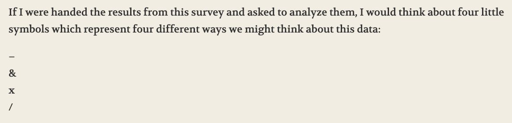

## 

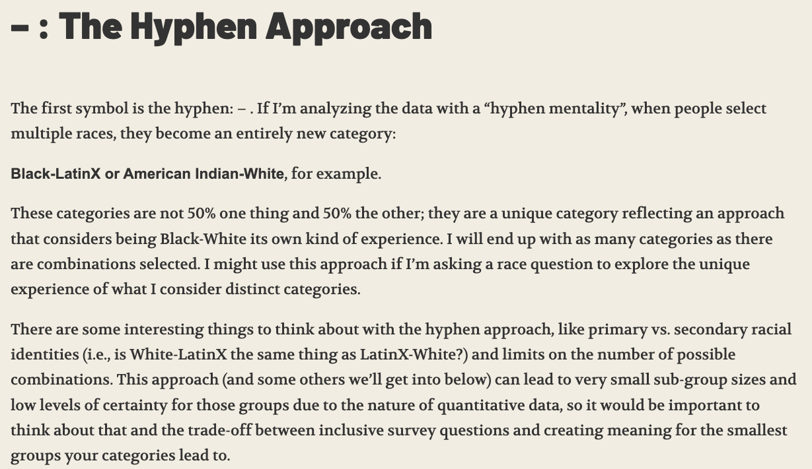

## 

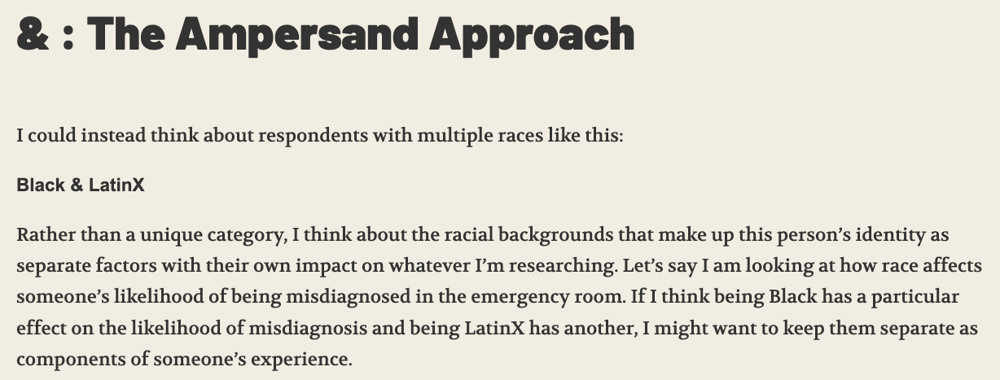

## 

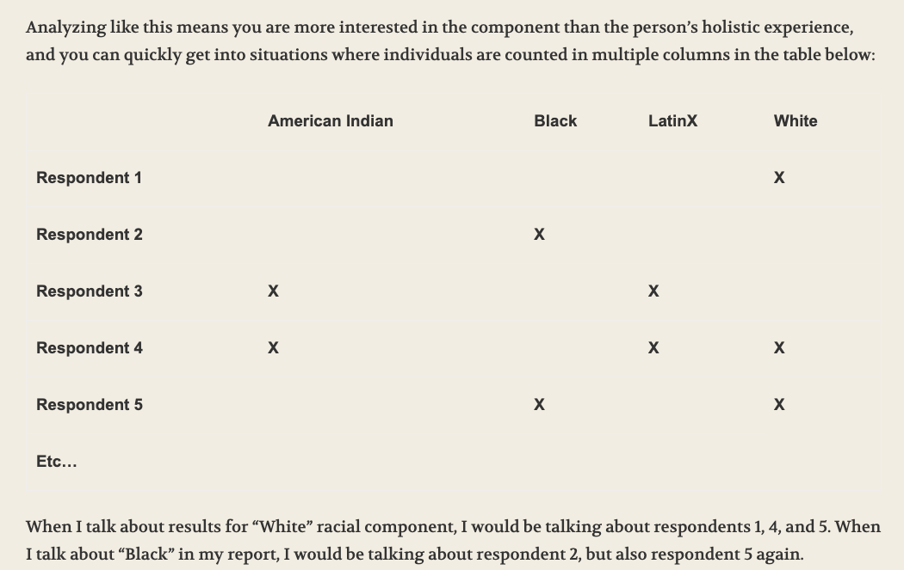

## 

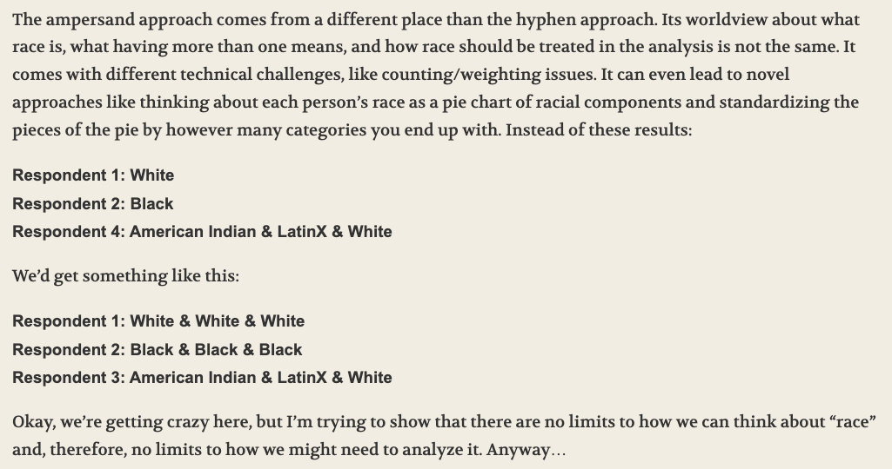

## 

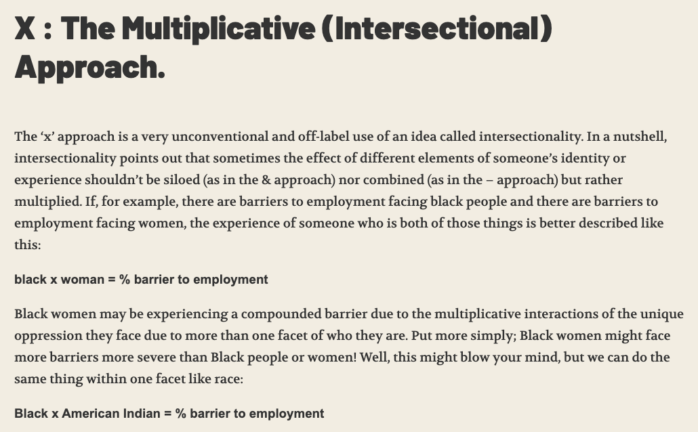

## 

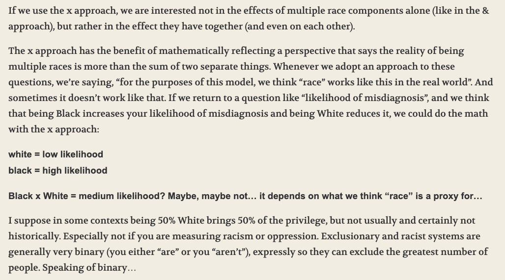

## 

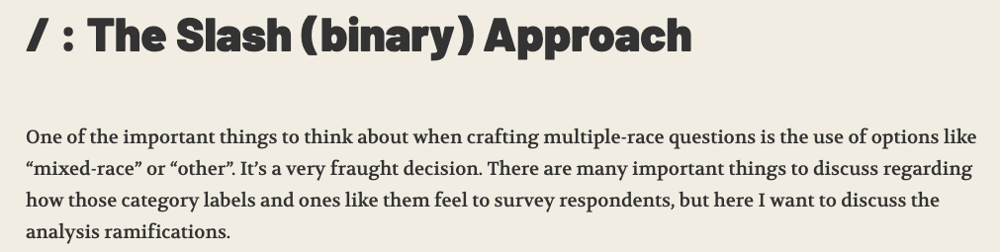

## 

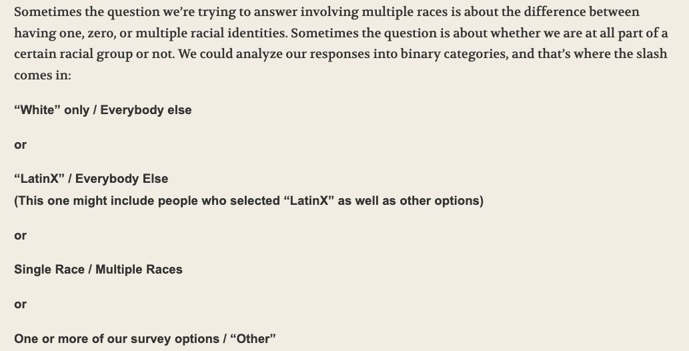

## 

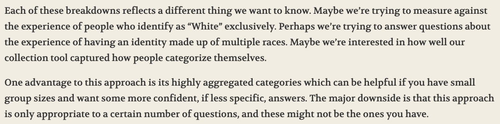

## 

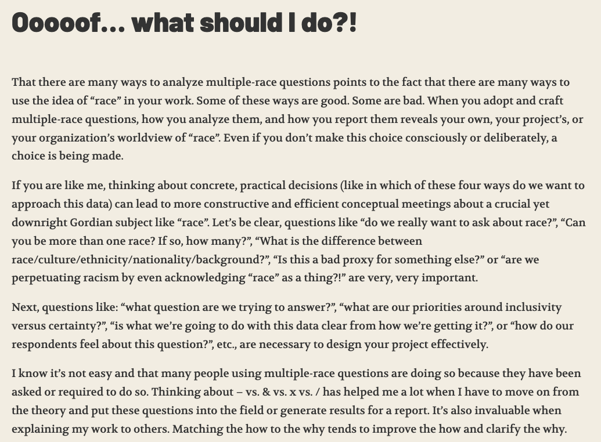

## Final notes

- For now, I suggest the binary approach!
  - This is the perfect level of pushing ourselves coding wise and thinking critically about these multi-response variables
  - This is what the dataset gives you!!
  
 
  
- Take a look at this article: <https://doi.org/10.1016/j.socscimed.2017.12.026>
  - It gets into some of the considerations and uses of intersectionality in analyses

## For our 8 variables on race/ethnicity

- Make sure you understand what the indicators mean
  - Each variable is a 0/1 indicator for whether the individual selected that race/ethnicity
    - 0 indicates that they do not identify as that race/ethnicity
    - 1 indicates that they do identify at that race/ethnicity
    - When we go to interpret the coefficient for a specific indicator variable, we will interpret it as the mean difference in IAT score between those who identify as that race/ethnicity and those who do not
    - For example, a coefficient for `re_black` indicates the mean difference in IAT score between those who identify as Black or African American and those who do not identify as Black or African American
  - An individual can select more than one race/ethnicity
  

- **In Lab 1:** Filtering out individuals with missing information on their race/ethnicity
  - I had one way of doing this, but I asked ChatGPT how to do this
  - [Here is what ChatGPT said](https://chatgpt.com/share/6977cab9-e4c0-8006-85c2-458cdc22f86e)

